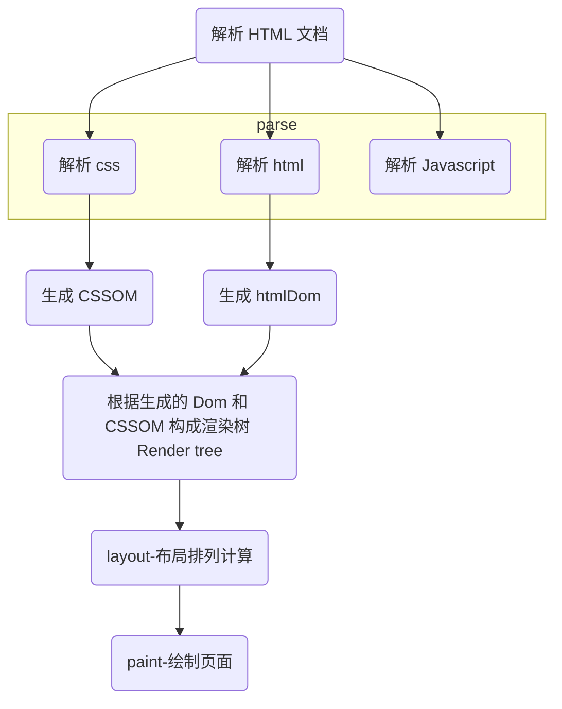

## 浏览器渲染过程

即：html 文档，浏览器解析为 CSSOM + HtmlDom，再由 CSSOM + HtmlDom 构建 renderTree, 浏览器再根据渲染树重新计算、布局，最后渲染到屏幕上。

### 重排
> 浏览器第一次页面渲染后，后续操作引起页面各个元素节点在页面所处位置的重新计算、重新布局的行为叫重排
### 重绘
> 布局计算完成后，页面重新绘制，浏览器遍历渲染树，使用 UI 后端层绘制每个节点，这种行为要重绘

### 引起重排或重绘的一起属性
|Attribute Name|Interetation|
|---|---|
|offsetTop|read-only,当前元素的外边框相对于父级元素内边框的距离|
|offsetLeft||
|offsetWidth||
|offsetHieght||
|scrollTop||
|scrollLeft||
|scrollWidth||
|scrollHeight||
|clientTop||
|clientLeft||
|clientWidth||
|clientHeight||