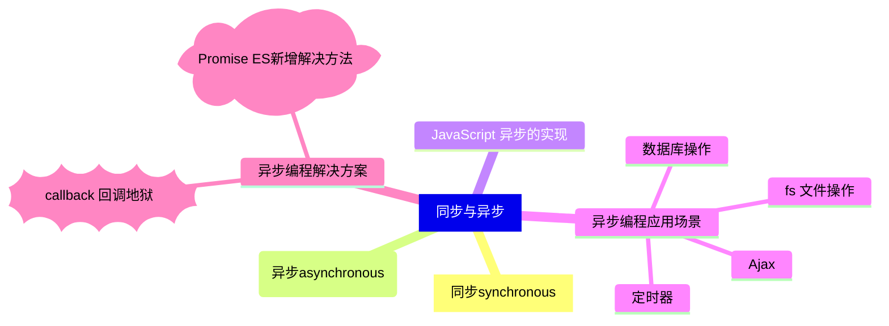
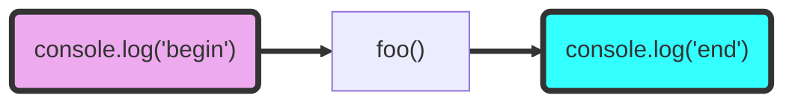

## 同步(synchronous)
> 无论表达式、语句或者函数，都是在定义的任务完成之后，才会往下一个表达式、函数、或语句执行。**这样的流程称为同步**
> <font color="#f33">按顺序执行</font>

```javascript
console.log('start')
foo()
console.log('end')

function foo() {
  console.log('Execute foo function')
}

// start
// Execute foo function
// end
```


<span class='custom-box custom-box-933'>单一流程，.js 从开始到结束只有一个主流程。</span>

## 异步(asynchronous)
> 独立于主程序任务、事件生成，以及事件处理的方式，称为异步

用 setTimeout 模拟异步
```javascript
console.log('start')
foo()
console.log('end')

function foo() {
  setTimeout(console.log, 1000, 'execute function foo')
}

/**
 * start
   end
   execute function foo
 */
```
[异步相关的 webAPI——浏览器工作原理（N）setTimeout 是怎么实现的](https://helenzhanglp.github.io/2021/01/08/%E6%B5%8F%E8%A7%88%E5%99%A8%E5%B7%A5%E4%BD%9C%E5%8E%9F%E7%90%86%E2%80%94%E2%80%94setTimeout%E6%98%AF%E6%80%8E%E4%B9%88%E5%AE%9E%E7%8E%B0%E7%9A%84/)

> <font color="#f33">同步代码按顺序由上到下执行，异步是通过事件或者异步webAPI(setTimeout/xmlHttpRequest)等方式，处理代码的执行时机</font>

## JavaScript 异步的实现
像 Java 这些 Multi-thread 语言，可以通过**多个线程实现异步**。但<font color="#f99">JavaScript 本身不支持多线程，而且 JavaScript 引擎是以单线程方式执行程序代码</font>
> <font color="#f33">JavaScript 执行环境会在事件循环（Event loop），不断地检查事件队列（Event 
> queue），当事件发生时，并不是马上执行指定的函数，而是将事件排入队列，在循环下一轮的检查时，才将队列中事件对应的任务依次执行完成</font>

[浏览器工作原理——消息队列与事件循环](https://helenzhanglp.github.io/2021/01/08/%E6%B5%8F%E8%A7%88%E5%99%A8%E5%B7%A5%E4%BD%9C%E5%8E%9F%E7%90%86%E2%80%94%E2%80%94%E6%B6%88%E6%81%AF%E9%98%9F%E5%88%97%E4%B8%8E%E4%BA%8B%E4%BB%B6%E5%BE%AA%E7%8E%AF/)

```javascript
async function async1() {
    console.log( 'async1 start' )
    await async2()
    console.log( 'async1 end' )
}

async function async2() {
    console.log( 'async2' )
}

console.log( 'script start' )

setTimeout( function () {
    console.log( 'setTimeout' )
}, 0 )

async1();

new Promise( function ( resolve ) {
    console.log( 'promise1' )
    resolve();
} ).then( function () {
    console.log( 'promise2' )
} )

console.log( 'script end' )
```

## 异步编程应用场景
* fs 文件操作 —— 是对计算机磁盘的读写操作
> 使用 Promise 封装文件读取，[DEMO 案例](https://github.com/HelenZhangLP/demo/blob/master/node/src/demo14/index.js)
	```JavaScript
	require('fs').readFile('index.html',(err, data) => {...})
	```
* 数据库操作
* [AJAX](/2016/07/24/JavaScript-Ajax/)
> 使用Promise 封装 AJAX，[DEMO 案例](https://github.com/HelenZhangLP/demo/blob/master/js/AJAX/index.html)
```JavaScript
$.get('server', data => {...})
```
* 定时器
```JavaScript
setTimeout(() => {...}, 1000);
```

## 异步编程解决方案：
* callback
* [Promise](/2017/02/14/JavaScript-Promise/)(新的解决方案)