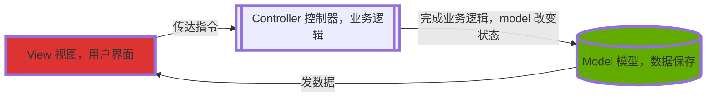
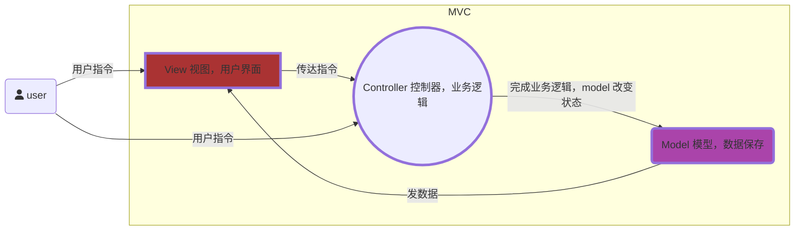

## MVC(Model-View-Controller)
MVC(Model-View-Controller)是一种代码结构组织方式。用于合理组织代码，降低代码耦合，降低代码重绘，重排，提高性能。
> 1. View层 用户看到，并用于交互的视图界面，React 中采用 jsx 语法来构建视图；
> 2. Controller 处理用户交互的部分，负责视图数据读取，控制用户输入，并向模型发送数据
> 3. Model 应用程序中处理数据逻辑的部分，构建数据模型

---
两种方式接收用户指定：
1、view 层接收用户指定，传递给 controller
2、controller 层直接接受用户指令

## MVVM 双向数据驱动

# 双向数据绑定的几种模式
> - 脏数据检测 ---- angular
> - 发布者 & 订阅者模式----backbone
> - 数据劫持----vue

[参考](https://segmentfault.com/a/1190000006599500#articleHeader0)