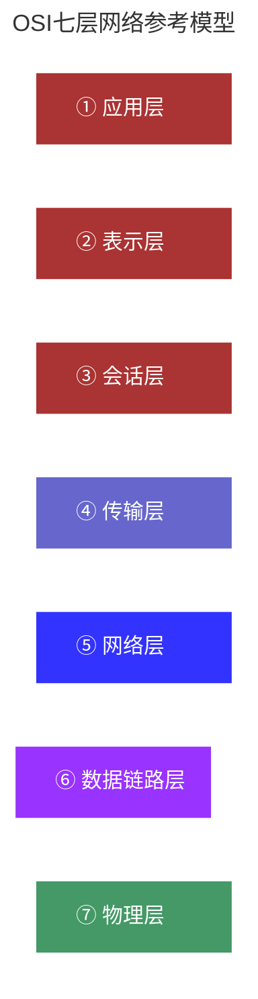
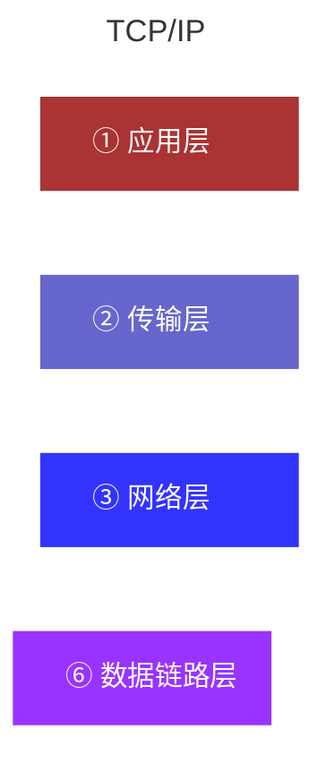
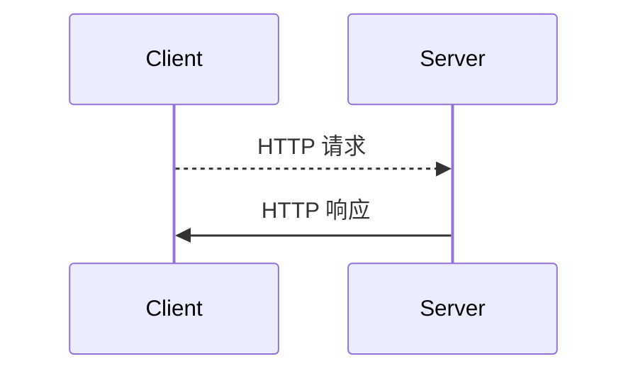
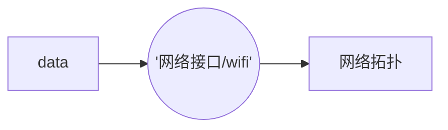
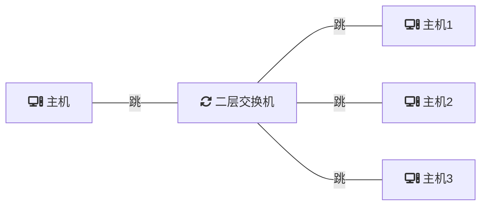
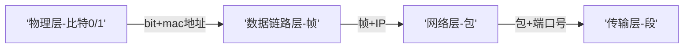

> OSI(Open System Interconnection) 七层网络参考模型。是用于计算机或通信系统间互联的标准体系。 通俗的讲就是为了解决主机之间的网络通信。

> TCP/IP(Transmission Control Protocol/Internet Protocol),传输控制协议/因特网互联协议。网络通讯协议。当今互联网广泛采用。

## 应用层
应用之间的沟通方式，常见的应用层协议是 HTTP 。开发者根据 HTTP 协议编写应用程序，使得应用之间实现沟通。
最靠近用户的那一层，逻辑上把两个应用连通。

## 物理层
实际物理上的连通是需要物理层，物理层沟通的语言是 0/1，叫比特。
物理层将bit(比特，二进制数据)通过不同的媒介（如：电、光或其它形式的电磁波来表示和传输的信号）传输出去。

`中继器和集线器`

### 网络拓扑

## 数据链路层
需要高层的网络模型进行数据定向

`mac 地址存在于网卡之上，是网卡的唯一标识，mac 地址也称为物理地址，全球唯一`。
二层交换机（存储发送端和接收端mac地址）帮助应用程序，通过 mac 地址对不同设备进行数据传输。

物理层在传输 bit 数据时，会进行差错比对和一定的差错纠正。
设备间的传输能力与接收能力不同，可能传输端喷水式传输，另一端夹逢式接收，需要使用流控制避免这种不对称

## 网络层
互联网中用唯一的 mac 地址寻址是不科学的。如果 mac 地址差别较小，但两台通信主机距离较远，仅通过 mac 地址很难快速定位。这时需要 IP 地址帮助寻址和路由选择。
IP 地址实现的是端对端的数据传输，而不是数据链路层那样地址间跳到跳的传输。
除了寻址外，还有路由选择，路由器也是网络层的核心

## 传输层
mac地址 + IP 地址可以到达对方主机，对主主机可能运行着多个软件进程，这时就需要端口号准确定位到具体的软件应用。

传输层在端到端的基础上实现了服务进程到服务进行间的传输。

