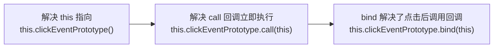

## 事件绑定
```JavaScript
import React from "react";

export default class Demo extends React.Component {
    state = {
        x: 0
    }

    clickEventPrototype() { // Demo 类的原型方法，相当于 Demo.prototype => Demo.prototype.handle = function handle() {}
        console.log('clickEvent',this) // undefined
    }

    render() {
        console.log('render', this) // Demo {props: {…}, context: {…}, refs: {…}, updater: {…}, state: {…}, …}
        return <>
            <button onClick={this.clickEventPrototype()}>btn</button>
        </>
    }
}
```
> `this` 需要指向 Demo 实例，获取 state。<span class='custom-box custom-box-933'>通过 call 或 bind 让 this 指向当前对象</span>

### 通过 bind() 继承 Demo 实例属性，方法
```JavaScript
import React from "react";

export default class Demo extends React.Component {
    state = {
        x: 0
    }

    clickEventPrototype() {
        console.log('clickEvent',this) // Demo {props: {…}, context: {…}, refs: {…}, updater: {…}, state: {…}, …} 
    }

    render() {
        console.log('render', this) // Demo {props: {…}, context: {…}, refs: {…}, updater: {…}, state: {…}, …}
        return <>
            <button onClick={this.clickEventPrototype.call(this)}>btn</button>
        </>
    }
}
```
> `this.clickEventPrototype.call(this)` 立即调用，`bind` this 预处理，运行后返回回调函数，点击后执行回调事件。
```JavaScript
import React from "react";

export default class Demo extends React.Component {
    state = { x: 0 }

    clickEventPrototype(x, y, evt) {
        console.log('clickEvent',this) // Demo {props: {…}, context: {…}, refs: {…}, updater: {…}, state: {…}, …} 
    }

    render() {
        console.log('render', this) // Demo {props: {…}, context: {…}, refs: {…}, updater: {…}, state: {…}, …}
        return <>
            <button onClick={this.clickEventPrototype.bind(this, 1, 2)}>btn</button>
        </>
    }
}
```

### 箭头函数继承 this 实例属性，方法
```JavaScript
import React from "react";

export default class Demo extends React.Component {
    state = { x: 0 }

    // 原型属性
    clickEventPrototype() {
        console.log('clickEvent',this) // Demo {props: {…}, context: {…}, refs: {…}, updater: {…}, state: {…}, …} 
    }

    // 实例属性
    eventArrowFn = () => {} // Demo {context : {} eventArrowFn : () => { console.log(this, 'eventArrowFn'); }[ props : {} refs : {} state : {x: 0} updater : {isMounted: ƒ, enqueueSetState: ƒ, enqueueReplaceState: ƒ, enqueueForceUpdate: ƒ} _reactInternalInstance : {_processChildContext: ƒ} _reactInternals : FiberNode {tag: 1, key: null, stateNode: Demo, elementType: ƒ, type: ƒ, …} isMounted : (...) replaceState : (...) [[Prototype]] : Component clickEventPrototype : ƒ clickEventPrototype()

    render() {
        console.log('render', this) // Demo {props: {…}, context: {…}, refs: {…}, updater: {…}, state: {…}, …}
        return <>
            <button onClick={this.clickEventPrototype.bind(this)}>btn</button>
        </>
    }
}
```

## 合成事件[SyntheticBaseEvent]
它是围绕浏览器的原生事件，充当**浏览器包装器对象**；<u>它们将不同浏览器的行为合并为一个 API，为了确保事件在不同浏览器中显示一致的属性。</u>
