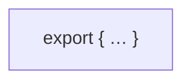
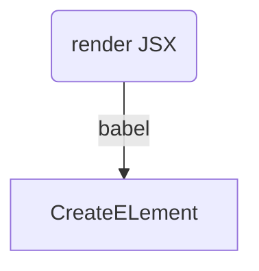

[gitHub 库，react 的入口文件](https://github.com/facebook/react/blob/master/packages/react/src/React.js)



## 核心 API
* Component
* createElement

```JavaScript
// .../src/React.js
export {
    Component,
    createElement
}
```

## JSX —— JavaScript XML
```React
// JSX
import React, { Component } from 'react'

function App() {
  return <div>JavaScript XML</div>  
}

// createElement
function App() {
  return React.createElement(
    "div",
    null,
    "JavaScript XML"  
  )
}

export default App
```
babel 将 JSX 最终编译为 React.createElement。更多介绍见[react-jsx](/2021/03/03/React-jsx/)

## handwriting react
[demo-1 源码](https://github.com/HelenZhangLP/handwriting-react/tree/main/src/handwritingReact)



```