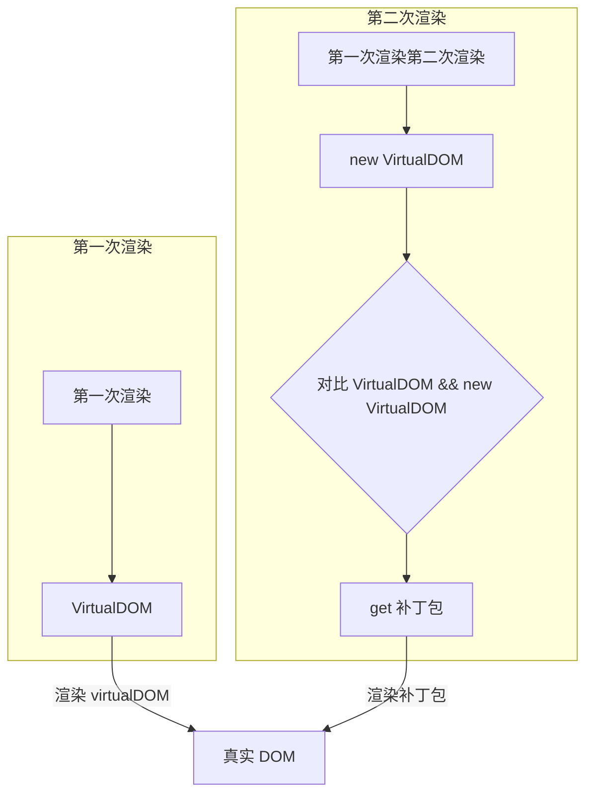

## JSX 底层处理机制

> 第一次渲染页面直接从 vitureDom --> 真实 Dom；第一次以后更新需要 DOM-DIFF 对比，计算出PATCH（两次视图差异），渲染 Patch。

## Virtural DOM 的工作原理
由 ReactNode 节点元素组成的树，一个 ReactNode 实例表示一个轻量的、无状态的、不可变的虚拟 DOM 元素。
虚拟 DOM 树，最终由 ReactDOM.render 函数最终渲染到浏览器 DOM 树上，形成最终的界面效果。

React 中最主要的类型就是 ReactElement，是 ReactNode 的主要数据来源。
React Element 四个属性：`type , key, props, ref`

虚拟 dom 的 diff 算法复杂度 $O(n^3)$，经过优化，最终把复杂度降低到 On

## React Virtural DOM key 属性的作用
