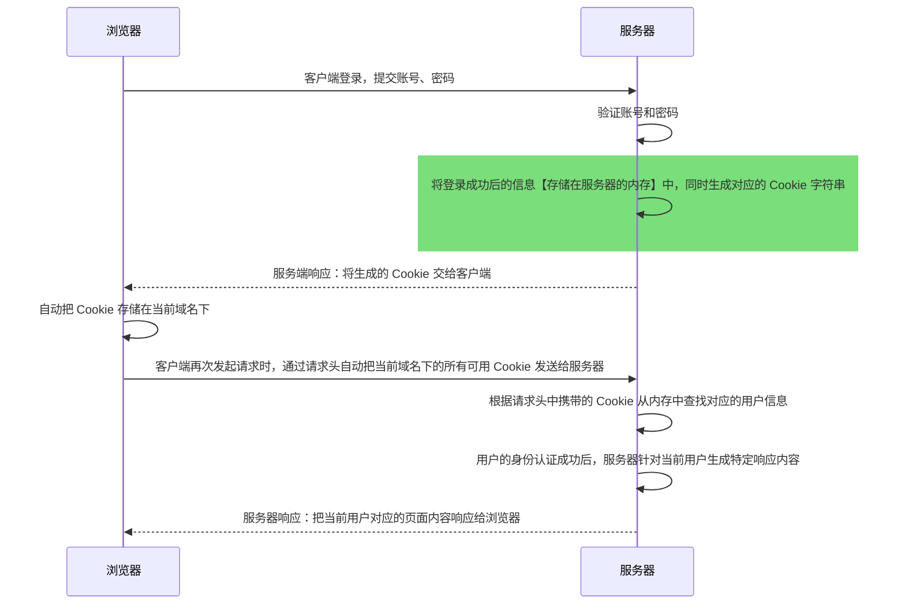
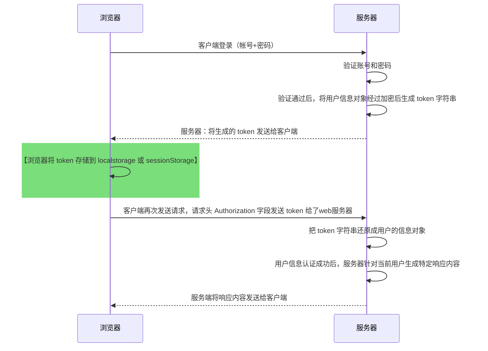

web(World Wide Web) 全球广域网，万维网。
广域网（Wide Area Network）又称外网，公网。连接不同地区的局域网或城域网的计算机通信的远程网络。

## Web 开发模式
### 基于服务渲染的传统 Web 开发模式
> 服务器发送给客户端 HTML 页面，是在服务器通过字符串的拼接动态生成的。客户端不需要使用 AJAX 技术，额外请求页面数据。

#### 服务端渲染的优缺点
优点：
*   前端耗时少：服务端负责动态生成 html 内容，浏览器只需要渲染，对移动端友好，省电；
*   有利于 SEO：服务器端响应是完整的 html 页面内容，爬虫更容易爬取信息，有利于 SEO.
缺点：
*   占用服务器端资源，请求较多时，会对服务器造成一定压力。
*   不利前后端分离，开发效率低，无法进行前后端合作，尤其对于前端复杂度高的项目，不利于高效开发。

### 基于前后端分离的新型 Web 开发模式 
依赖于 AJAX 技术的广泛应用，后端只负责提供 API 接口，前端使用 Ajax 调用接口的开发模式。

#### 前后端分离的优缺点
优点：
*   开发体验好，前端只专注于 UI 页面开发，后端专注于 api 开发，前端对于框架技术选择性更高。
*   用户体验好，AJAX 技术的广泛应用，极大提高了用户的体验，可以轻松实现页面局部刷新。
*   减轻服务器端的渲染压力 —— 页面是在每个用户的浏览器中生成的
缺点：
*   不利于 SEO. 完整的 HTML 页面需要在客户端动态拼接完成，所以爬虫无法爬取页面的有效信息。（SSR SERVER SIDE RENDER）技术可以很好的解决 SEO 问题。

### 关于选择 Web 开发模块
企业级网站，主要功能是展示，没有复杂的交互，且需要良好的 SEO，使用服务器端渲染
后台管理，交互性强。不需要 SEO，使用前后端分离开发模式。

具体使用哪种开发模式并不绝对，为了同时兼顾首页渲染速度与前后端分离开发效率，一些网站采用首屏服务器渲染，其他页面前后端分离。

## 身份认证
身价认证（Authentication）即“身份验证”、“鉴权”。指通过一定手段，完成对用户身份的确认。

身份认证是为了确认当前所声称为某种身份的用户，确实是所有声称的用户。

### web 端的身份认证
> 服务端渲染推荐使用 session 认证机制
> 前后端分离，使用 JWT 认证机制

### Session 认证机制
1. HTTP 协议的无状态性
> 客户端每次 HTTP 请求都是独立的，连续多个请求之间没有直接关系。服务端不会主动保留每次 HTTP 请求的状态
> web 开发中，Cookie 标识用户身份。存储在用户浏览器中不超过 4KB 的字符串。由名称（Name）、值（Value）和其它几个用于控制 Cookie 有效期、安全性、使用范围的可选属性。

不同域名下的 Cookie 各自独立，每当客户端发起请求时，会自动把当前域名下所有未过期的 Cookie 一同发送到服务器。

Cookie 的几大特性
自动发送，域名独立，过期时限，4kb 限制

Cookie 在身份认证中的作用
<span class='custom-box custom-box-933'>客户端第一次请求服务器的时候</span>，服务器通过 <span class='custom-box custom-box-933'>响应头</span> 的形式，向客户端发送一个身份认证相关的 Cookie。客户端保存 Cookies，随后浏览器通过 <span class='custom-box custom-box-393'>请求头</span>  的形式发送给服务器，服务器即可验明客户端的身份。

Cookie 不具备安全性
由于 Cookie 是存储在浏览器中的，而且浏览器也提供了读写 Cookie 的 API，因此 Cookie 很容易被伪造，不具有安全性，不建议服务器将重要的隐私数据，通过 Cookie 形式发送给浏览器。

Session 工作原理


<span class='custom-box custom-box-939'>Session 认证机制需要配合 Cookie 才能实现。由于 Cookie 默认不支持跨域访问，所以当涉及到前端跨域请求后端接口时，需要做很多额外配置，实现跨域 Session 认证 。<u>当前端请求接口不存在跨域问题时，推荐使用 session 身份认证机制。</u></span>

### JWT 认证机制
JWT（JSON Web Token）是目前最流行的跨域认证解决方案。

JWT 工作原理


JWT 的组成部分
JWT 通常由 3 部分组成，Header(头部)、Payload(有效荷载)、Signature(签名)，三者用 . 分隔
> Header.Payload.Signature

Payload 是真正的用户信息，是用户信息经过加密后生成的字符串。
Header 与 Signature 是安全性相关部分，只是为了保证 token 的安全性

JWT 使用方式
客户将 token 存储在 localstorage 或 sessionStorage 中，之后客户端与服务器端通信时带 token 从而进行身份认证。使用方法如下：
```JavaScript
Authentization: token
``` 

## WEB 表单数据验证
> 表单验证的原则，前端验证为辅，后端验证为主。<span class='custom-box custom-box-933'>后端永远不要相信前端提交的任何内容。</span>
实际开发中，前后端都需要对表单数据进行合法性检验，后端是数据合法性检验的最后一个关口，在拦截数据方面起到至关重要的作用。使用第三方数据验证模块，降低出错率，提高验证效率与可维护性。

### @hapi/joi 为表单携带的数据定义验证规则
<font color='red'>This package has been deprecated</font>已经废弃！
[]()

### joi
[joi](https://www.npmjs.com/package/joi)
JavaScript 最强大的描述语言和数据的验证器，允许使用简单、直观、可读的语言描述你的数据。
> npm install joi
```JavaScript

```

### @escook/express-joi 自动对表单数据进行验证功能