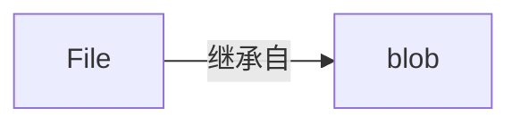

## Blob(Binary large Object)
> 二进制大对象，即 JavaScript 中的一个对象，用于存储大量二进制编码格式的数据
> 是一个不可变的、原始数据的类文件对象。
> 它的数据可以按文本或二进制的格式读取，也可以转换成 `ReadableStream` 来用于数据操作

<div style="background-color: #fff">

</div>

```JavaScript
/**
 * array: 由ArrayBuffer, ArrayBufferView, Blob, DOMString 等对象构成的 Array。或其他类似对象的混合体，它将会被放进 Blob。DOMStrings 会被编码为 UTF-8。
 * options: 是一个可选的 BlobPropertyBag 字典，它可能会指定如下两个属性:
 * type，默认值为 ""，它代表了将会被放入到 blob 中的数组内容的 MIME 类型。
 * endings，默认值为"transparent"，用于指定包含行结束符\n的字符串如何被写入。它是以下两个值中的一个："native"，代表行结束符会被更改为适合宿主操作系统文件系统的换行符，或者 "transparent"，代表会保持 blob 中保存的结束符不变 非标准
 */
var blob = new Blob( array, options );
```
### Demo
```JavaScript
var domStr = ["<h1>你好，Blob</h1>"]
var blob = new Blob(domStr, {type: 'text/html'})
```
blob 实例属性 `{size: 22,type: "text/html"}` 中文汉字占3个字节，中文标点占2个字节
* Blob.prototype.size Blob 对象中所包含数据的大小（字节）。
* Blob.prototype.type 一个字符串，表明该 Blob 对象所包含数据的 MIME 类型。如果类型未知，则该值为空字符串。

## ArrayBuffer 
表示通用的、固定长度的**原始二进制数据缓冲区**，是一个字节数组
类型化数组对象 或 DataView 对象操作会将缓冲区的数据表示为特定的格式，并通过这些格式来读写缓冲区的内容

ArrayBuffer() (en-US) 构造函数创建一个以字节为单位的给定长度的新 ArrayBuffer。你也可以从现有的数据（例如，从 Base64 字符串或者从本地文件）获取数组缓冲区。
```JavaScript
const buffer = new ArrayBuffer(8);
const view = new Int32Array(buffer);
```


## ArrayBufferView —— TypedArray 类型数组
> 一个 TypedArray 对象描述了底层二进制数据缓冲区的类数组视图。
没有称为 TypedArray 的全局属性，也没有直接可用的 TypedArray 构造函数。但是，有很多不同的全局属性，其值是指定元素类型的类型化数组构造函数，如下所列。在接下来的页面，你将找到可以与包含任意类型元素的任意类型化数组一起使用的常见属性和方法。
### TypedArray 子类
|类型|字节大小|描述|
|--|--|--|
|Int8Array|1|8 位有符号整型（补码）<br/>二进制补码 8 位有符号整数的数组|

## URLSearchParams
接口定义了一些实用的方法来处理URL的查询字符串

