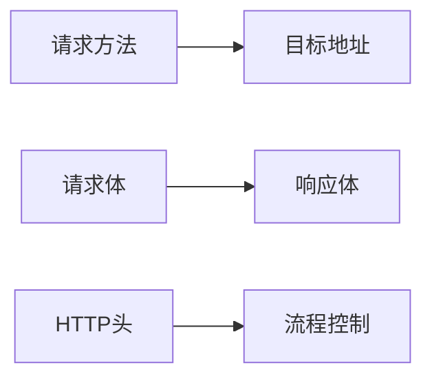
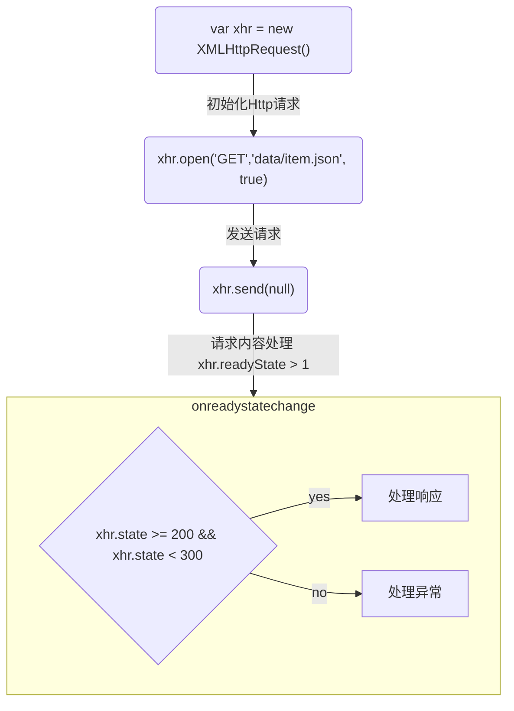

## 网络请求
### 网络请求的包含项

### HTTP
### fetch api
是对 XMLHttpRequest 的一层替代

## AJAX
AJAX(Asynchronous JavaScript and XML) 使用 XMLHttpRequest 构建的网页编程实践。
AJAX 本身不是一种技术，<u>是一种将一些现有技术(HTML/XHTML,CSS,JavaScript,DOM,XML,XSLT,XMLHttpRequest)结合起来使用的方法。</u>
AJAX 使得页面不需要重载，且能更快的回应用户操作。
AJAX 只允许更新一个 html 中的部分 dom。不需要加载整个页面。
AJAX 还允许异步工作，这意味着当网页的一部分正试图重新加载时，您的代码可以继续运行
（相比之下，同步会阻止代码继续运行，直到这部分的网页完成重新加载）。
通过交互式网站和现代 Web 标准，AJAX 正在逐渐被 JavaScript 框架中的函数和官方的 Fetch API 标准取代。

### AJAX 核心 - XMLHttpRequest
> 通过使用 XMLHttpRequest 发送 Http 请求，实现浏览器网页端与服务器端的数据交换
```JavaScript
// 通过构造函数 XMLHttpRequest，创建 xhr 实例
var xhr = new XMLHttpRequest()
// 初始化请求
xhr.open('GET','data/item.json', true)
// 发送请求
xhr.send(null)
// 请求内容处理
xhr.onreadystatechange = function() {
	console.log(xhr.readystate) // 请求代理当前所处的状态
}
```
|方法|定义|
|---|---|
|xhr.open(method,url,async,user,password)|初始化 xhr 请求<br/> **method**: 要使用 http 请求方法 put/delete/get/post；<br/>**url**: 目标地址 url<br/>**async**: 是否执行异步操作，默认异步操作<br/>**user**: 可选用户名，用于认证用途<br/>**password**: 可选密码，同样用于认证用途|
|xhr.send(body)|发送http请求，发送请求体<br/>异步请求：请求发送后立即返回<br/>同步请求：响应到达后返回<br/>**body**:请求主体，get或head请求，请求主体为 null|
|xhr.readyState|xhr 代理当前所处的状态 <br/> 0 UNSENT 代理被创建，但尚未调用 open() 方法。<br/> 1 OPENED open() 方法已经被调用。<br/>2 HEADERS_RECEIVED send() 方法已经被调用，并且头部和状态已经可获得。<br/>3 LOADING 下载中；responseText 属性已经包含部分数据。<br/>4 DONE 下载操作已完成。|


[具体DEMO](https://github.com/HelenZhangLP/demo/blob/master/js/AJAX/index.html)

### axios
是 AJAX 请求库，对底层网络请求的一层封装
Promise based HTTP client for the browser and node.js
基于 Promise 的 HTTP 客户端，用于**浏览器**和**node.js**

#### Request Config
There are the available config options for making request, Only the url is required. Requests will default to GET if method is not specified.
发送请求的可用配置项，只有 url 是必须的。请求方法不指定默认为 GET

```JavaScript
{
	url: '/user', // server url that will be used for the request
	method: 'get', // default
	baseURL: 'https://some-domain.com/api/', // baseurl will be prepended to 'url' unless 'url' is absolute. (baseurl 相对于 url 前置，除非 url 是绝对路径) It can be convenient to set 'baseURL' for an instance of axios to pass relative URLs to methods of that instance（传递相对 url 给实例方法）
	transformRequest: [],
	transformResponse: [],
}
```

#### Response Schema
```JavaScript
{
	data: {}, // the response that was provided by the server / 服务端提供的响应数据
	headers: {}, // the server responded with All header names are lowercase and can be accessed using the bracket notation 请求头名称小写且可以使用括号（response.headers['content-type']）访问
	request: {} // It is the last ClientRequest instance in node.js(in redirects) an XMLHttpRequest instance in the browser node.js 中最后一个 ClientRequest 实例和浏览器端一个 XMLHttpRequest 实例
	config: {},
	status: 200,
	statusText: 'OK'
}
```

Make XMLHttpRequest from the browser 浏览器端发出的 AJAX 请求；
Make HTTP requests from the node.js node.js 发出的 http 请求；
Supports the Promise API 支持 Promise API；
Intercept request and response 拦截请求和响应；