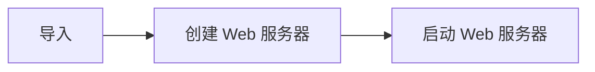
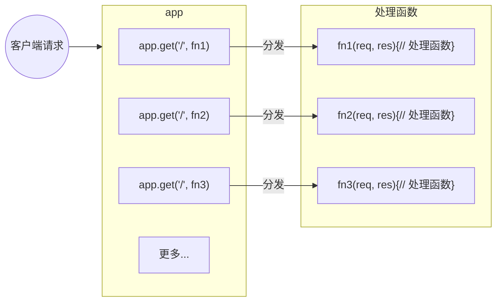
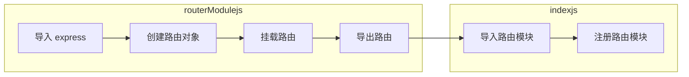
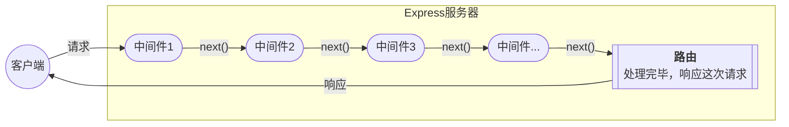

[Express 中文网](expressjs.com.cn)，是用于开发 <span class='custom-box custom-box-393'>Web 网站服务器</span> 与 <span class='custom-box custom-box-393'>API 接口服务器</span>
## 认识 `express`
> <span class='custom-box custom-box-933'>基于 Node.js 平台</span><span class='custom-box custom-box-339'>快速、开放、极简</span>的 <span class='custom-box custom-box-933'>Web 开发框架。</span>
是 npm 上的第三方包，提供了快速创建 Web 服务器的便捷方法，类似于 NodeJs 中内置的 http 模块，<span class='custom-box custom-box-933'>专门用来创建 Web 服务器的</span>

### 安装 express
```bash
$ npm i express@4.17.1
```

### 使用 `express` 创建 web 服务器

---
```JavaScript
// 1. 导入 express
const express = require('express')
// 2. 创建 web 服务器
const app = express()
// 3. 启动 web 服务
express.listen(80, ()=>{
    console.log('express server running at http://127.0.0.1')
})
```
### Express 的基本使用
#### 1. 监听 GET 请求 
通过 app.get(url, function(req, res){}) 方法，监听客户端的 GET 请求
```JavaScript
...
/**
 * 参数1：客户端请求的 URL 地址
 * 参数2：请求对应的处理函数
 *  req: 请求对象
 *  res: 响应对象
 */ 
app.get('请求 URL', function(req, res){})
...
```
#### 2. 监听 POST 请求
```JavaScript
/**
 * 参数1：客户端请求 URL
 * 参数2：请求对应的处理函数
 *  req: 请求对象
 *  res: 响应对象
 */ 
app.post('请求 URL', function(req, res) {})
```
#### 3. SEND 将处理好的内容发送给客户端
```JavaScript
app.get('/user/:id', (req, res) => {
    res.send({...}) // 向客户端发送请求内容
})
app.post('/user', (req, res) => {
    res.send('success') // 向客户端发送文本信息
})
```

#### 4. 请求参数
<span class='custom-box custom-box-393'>查询参数</span> 通过 req.query 获取客户端（/user/age=15&gender=male）
<span class='custom-box custom-box-393'>查询动态参数</span>  通过 req.params 获取客户端（/user/1），动态参数可以是多个

```JavaScript
// 注意 url 参数要加 ?(?age=15&gender=male) 【clientUrl http://127.0.0.1:9000/users/?age=15&gender=male】
app.get('/users/?age=15&gender=male', (req, res) => {
    console.log(req.query, 'req.query') // { age: '15', gender: 'male' } req.query
    res.send({id: 1})
})

// req.params 获取动态参数 /user/:id 【clientUrl http://127.0.0.1:9000/user/1】
app.get('/user/:id/:name', (req, res) => {
    console.log(req.params, 'req.params')
    res.send({id:1})
})
```
## 能够使用 `express.static()` 快递托管静态资源
<span class='custom-box custom-box-393'>express.static() 用于创建静态资源服务器</span> 

```JavaScript
...
// 可以将 public 目录下的图片、CSS文件、JavaScript 文件对外开放访问
app.use(express.static('public'))
...
```
### 托管多个静态资源
多次调用 `express.static()` 函数，托管多个静态资源目录。
<span class='custom-box custom-box-933'>访问静态资源时，多个目录中有相同名称的资源时，`express.static()` 函数会根据目录的添加顺序查找所需的文件</span>

```JavaScript
...
app.use(express.static('public'))
app.use(express.static('files'))
```
### 挂载路径前缀
在托管的静态资源访问路径前 <span class='custom-box custom-box-393'>挂载路径前缀</span>，避免因挂载顺序问题，导致不能访问到指定资源的问题。
```JavaScript
...
app.use('/public',express.static('public'))
```
### nodemon
<span class='custom-box custom-box-933'>问题：</span>在编写 `node.js` 项目时，修改项目代码后，需要 `ctrl+c` 停止项目，再重启。
[nodemon](https://www.npmjs.com/package/nodemon)工具，可以监听项目变化，项目代码修改后，nodemon 自动重启项目，方便开发调试。
```bash
$ npm install -g nodemon
```

### pm2
服务持久化管理的 <span class='custom-box custom-box-939'>即使终端关闭，服务器也在，电脑重启后，服务器关闭。</span>
```bash
$ npm i pm2 -g #安装 pm2
$ pm2 start server.js --name TASK #启动
$ pm2 restart TASK #重启
$ pm2 stop TASK #暂停
$ pm2 delete TASK #删除
```
## `express` 路由
路由指的是 <span class='custom-box custom-box-393'>映射关系</span>，在 Express 中，路由指的是 <span class='custom-box custom-box-393'>客户端请求与服务器处理函数的**<u>映射关系</u>**</span>
Express 中路由由 <span class='custom-box custom-box-393'>请求类型(METHOD:POST/GET),请求 URL 地址（PATH）, 处理函数（HANDLE）</span>组成。
```JavaScript
...
app.METHOD(PATH, HANDLE)
...
```
### 路由的匹配过程
当请求到服务器之后，需要经过路由的匹配，匹配成功后，才会调用对应的处理函数
匹配时，按照路由的顺序进行，请求类型与请求 URL 匹配成功，Express 将请求转交给 handle 函数。


### 模块化路由
为了方便对路由进行模块化管理，<span class='custom-box custom-box-933'>Express 不建议将路由直接挂载在 app 上，推荐将路由抽离为单独的模块</span>
#### 创建路由模块

```JavaScript
// routerModule.js
// 1. 导入 express
// 2. 创建路由对象
// 3. 挂载路由
// 4. 导出路由 
```
#### 使用路由模块
```JavaScript
// index.js
...
const router = require('./routerModule.js')
app.use('/api', router) // 注册路由模块
...
```
## 能够使用 `express` 路由精简项目结构
## `express` 中间件
### 什么是中间件
中间件（Middleware），业务流程的**中间处理环节**。
### 中间件的处理流程
当一个请求到达 Express 服务器之后，可以连续调用多个中间件，从而 <span class='custom-box custom-box-393'>对这次请求进行<u>预处理</u></span>。

### Express 中间件的格式
Express 中间件，<span class='custom-box custom-box-393'>本质上是一个带有 `next` 参数的 funtion 处理函数</span>
```JavaScript
var express = require("express")
var app = express()

/**
 * 挂载中间件
 * app.get http method for which the middleware function applies
 * '/' Path(route) for which the middleware function applies
 * function(req, res, next){} the middleware function
 *  req http request argument to the middleware function,called 'req' by convention
 *  res http response argument to the middleware function, called 'res' by convention
 *  next callback argument to the middleware funtion, called 'next' by convention
 */ 
app.get('/', function(req, res, next){
    // next 函数是实现多个中间件连续调用的关键，它表示把流转关系转交给下一个中间件或路由
    next()
})
```
<span class='custom-box custom-box-933'>中间件函数的形参列表中，必须包含一个 next 参数。</span>路由处理函数中只包含 req 和 res。
## 能够使用常见的 `express` 中间件
## 使用 `express` 写接口
## 能够使用 `express` 创建 API 接口
## 能够使用 `express` 中启用 cors 跨蹃资源共享
