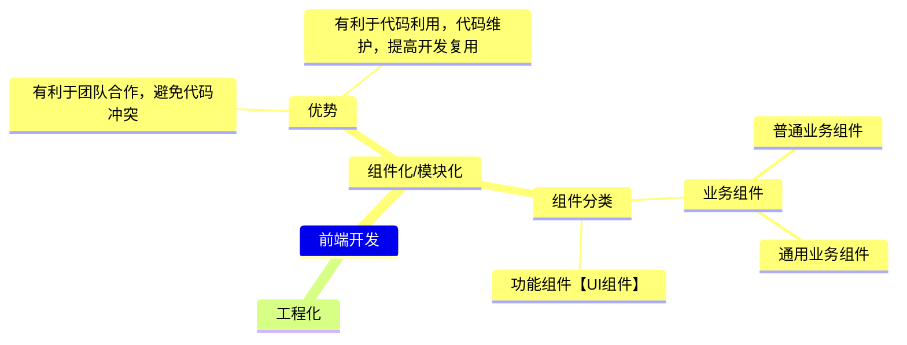
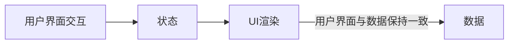

## react 基础知识

## react 中的组件化开发
* 业务组件
  ** 普通组件
  ** 通用业务组件
* 功能组件【适用于多个项目】，如 UI 组件库等通用功能组件。

## React 工程化
基于 webpack/vite/rollup/turbopack 打包，用于实现组件合并、压缩、打包；代码编译、兼容、校验等。
使用 `create-react-app` 构建 React 工程化项目

### 通过 `yarn create react-app my-app` 创建 react 应用

```json
// package.json
  "pravite": true, //私有包，避免将包发到 npm 公网
  "dependencies": {
    "@testing-library/jest-dom": "^5.14.1",
    "@testing-library/react": "^13.0.0",
    "@testing-library/user-event": "^13.2.1",
    "react": "^18.2.0", // react 核心依赖包
    "react-dom": "^18.2.0", // react 视图渲染核心
    // "react-native": 用于构建和渲染 APP
    "react-scripts": "5.0.1",
    "web-vitals": "^2.1.0" // 性能检测工具
    "babel-preset-react-app": "", // 对 @babel/preset-env 语法包的重写，重写的目的：让语法包可以识别 react 语法，实现代码转换。ES6 转为 ES5
  },
  "scripts": { // 打包命令，打包命令是基于 "react-scripts" 处理
    "start": "react-scripts start", // 生产环境，在本地启动 web 服务器，预览打包内容
    "build": "react-scripts build", // 生产环境：将打包部署的内容输出到 dist 目录中
    "test": "react-scripts test", // 单元测试
    "eject": "react-scripts eject" // 暴露 webpack 配置规则
  },
  /**
   * 词法检测：
   * 1. 词法错误，不符合标准规范
   * 2. 符合代码标准，但不符合 ESLINT 标准
   */
  "eslintConfig": {
    "extends": [
      "react-app",
      "react-app/jest"
    ]
  }, //webpack 中 ESLINT 词法检测的相关配置
  "browserslist": {
    "production": [ // 生产环境兼容情况
      ">0.2%", // 使用率超过 0.2% 的浏览器
      "not dead", // 不考虑 IE
      "not op_mini all" // 不考虑 open 浏览器
    ],
    "development": [ // 开发环境浏览器兼容情况
      "last 1 chrome version",
      "last 1 firefox version",
      "last 1 safari version"
    ]
  } // 基于 browserslist 规范，设置浏览器的兼容情况
```
> `react-scripts` 脚手架中对于打包命令的封装，基于 `react-scripts` 的打包，会调用 `node_modules` 中的 webpack 进行处理。
脚手架为了让项目目录看起来干净，将 webpack 打包规则及相关的插件/loader 隐藏到 `node_modules`目录中。

### 暴露 webpack 配置项
```bash
  $ yarn eject
```
<span class='custom-box custom-box-993'>Are you sure you want to eject? This action is permanent...</span>
<span class='custom-box custom-box-933'>Remove untracked files, stash or commit any changes, and try again.</span>
缓存区存在未跟踪文件需要隐藏或提交修改文件。<span class='custom-box custom-box-393'>弹出配置前需要保证 git 空间干净，避免代码冲突</span>

## react 项目目录
```
├── README.md
├── node_modules // 第三方依赖包
│   ├── @aashutoshrathi
│   ├── ...
├── public // 模板文件夹
│   ├── index.js
├── package.json // 包配置文件
|—— src // 业务文件夹
|   |—— index.js
|—— build // 生产打包文件夹
|   |—— static
|   |   |—— main.***.js
|—— config
|   |—— jtest
|   |   |—— ...
|   |—— webpack/persistentCache
|   |   |—— ...
|   |—— env.js
|   |—— getHttpsConfig.js
|   |—— modules.js
|   |—— paths.js // 打包中需要的一些路径配置
|   |—— webpack.config.js // 脚手架默认的 webpack 打包规则配置
|   |—— webpackDevServer.config.js // 开发环境打包预览服务配置
|—— scripts // 后期执行相关打包命令的入口文件
|   |—— build.js 
|   |—— start.js
|   |—— build.js
```


## 入口文件——index.jsx 
vscode 支持 jsx 方法高亮，快捷输入，emmet
### React-16
```JavaScript
import React from 'react' // React 语法核心库
import ReactDOM from 'react-dom' // 构建 HTML(WebApp) 的核心
ReactDOM.render(<>React16 入口文件</>, document.getElementById('root'))
```
### React-18
```javaScript
// index.jsx
import React from 'react' // React 语法核心库
import ReactDOM from 'react-dom/client' // 构建 HTML(WebApp) 的核心

// 获取模板中 #root 容器，作为 根 容器
const root = ReactDOM.createRoot(document.getElementById('root'))
// 基于 render 方法渲染视图
root.render(
  <div> hello React </div>
)
```

## problem
### react 渲染实体字体 &#247; &#215;
```JavaScript
{key: String.fromCharCode(215), id: 'times'},
```
### react Error(1)
<font color="red">Warning: render(): Rendering components directly into document.body is discouraged, since its children are often manipulated by third-party scripts and browser extensions. This may lead to subtle reconciliation issues. Try rendering into a container element created for your app</font>
> 是在创建ReactDOM.render()时,放置的容器使用了document.body || document.getElementsByTagName('body')[0]等引起的错误，这样写会把第三方其他js给覆盖掉。
**public/index.html 里面加入一个 div, 给出唯一的 id，避免覆盖，webpack 中 htmlWebpackPlugin 中加入这个模板**
<span class='custom-box custom-box-933'>ReactDOM.createRoot() 不能把HTML/BODY 作为根容器，必须额外指定一个盒子</span>

### react Error(2)
<font color="red">Adjacent JSX elements must be wrapped in an enclosing tag. Did you want a JSX fragment <>...</>?</font>
> 每一个构建视图只能有一个根节点，可以使用 React.Fragment 空文档标签 <></>，不增加新的 html 结构

### react Error(3)
<font color="red">Objects are not valid as a React child (found: object with keys {}). If you meant to render a collection of children, use an array instead.</font>
> 表达式不能使用普通对象

### react Error(4) —— 表达式不能使用函数 
<font color="red">Warning: Functions are not valid as a React child. This may happen if you return a Component instead of <Component /> from render. Or maybe you meant to call this function rather than return it</font>
```javaScript
{fn()}
<Fn />
```

### react Error(5) —— 不能修改 props 属性值
<font color="red">Cannot assign to read only property 'title' of object '#<Object>'</font>

```javaScript
// 返回 JSX 视图
function demo1(props) {
    props.title = 'modify props attribute'
    // props.title = 'modify props attribute'
    /**
     * {
            "value": "function component demo",
            "writable": false,
            "enumerable": true,
            "configurable": false
        }
     */
    console.log(Object.getOwnPropertyDescriptor(props, 'title'))
    console.log(Object.isFrozen(props)) // true
    console.log(Object.isExtensible(props)) // false
    console.log(Object.isSealed(props)) // true
    return <>
        <h3>这是一个函数组件</h3>
    </>
}
export default demo1
```
> props.title 不可重写，不能枚举，也不能配置。props 已冻结，已密封，不能扩展
[关于对象属性，参考](/2019/03/21/JavaScript-Object-Oriented/)

## React 列表渲染
### keys
React 中使用 keys 标识列表中元素的删除、添加或移除。React Diff 算法中借助 key 标识同级元素是新增还是移动，避免不必要的渲染。

```JavaScript
  items.map((item, index) => {
    <li key={item.id}>{item.text}</li>
    {/* <li key={index}>{item.text}</li> 没有 id 用索引赋 key */}
  })
```
`注意：`最好不要用索引（index）作 key 值，因为一旦有新增、删除或移动等变化，会导致大量元素失效。进而造成不必要的重新渲染，损耗性能。可以使用 item.id 作为 key 值

### React state
React 中把组件看成一个状态机（state machines）。React 中，constructor 是最先执行，且执行一次。state 在 constructor 构造函数中初始化。其它地方采用 `this.setState()` 更新组件状态。
React 里，通过更新组件 state 重新渲染用户界面，不需要操作 DOM，类组件使用 props 调用基础构造函数。
```JavaScript
import React, {Component} from 'react';

export default class Test extends Component {
  constructor(super) {
    super();
    // 初始化 state
    this.state = {}
  }
}
```


this.setState 之后发生了什么？
调用 setState 函数后，React 将 setState 参数与组件当前状态合并，触发调和过程（Reconciliation）. 经过调和过程，React 会以相对高效的方式构建 React Dom 树，得到 Dom 树后，React 会将新树与老树进行对比，找出差异节点，从而根据差异最小化渲染。

重新构造 dom ，并将新老状态进行对比，最小化渲染。

### React 生命周期渲染
```mermaid
graph TM;
  componentWillMount-->render;
  render-->componentDidMount;
  componentDidMount-->render
```
