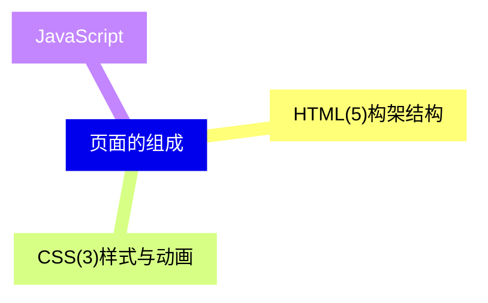
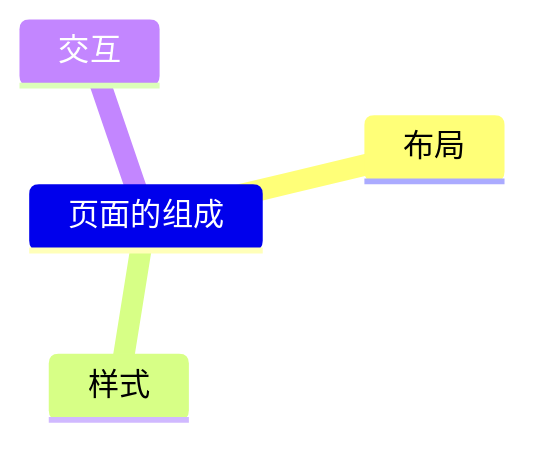
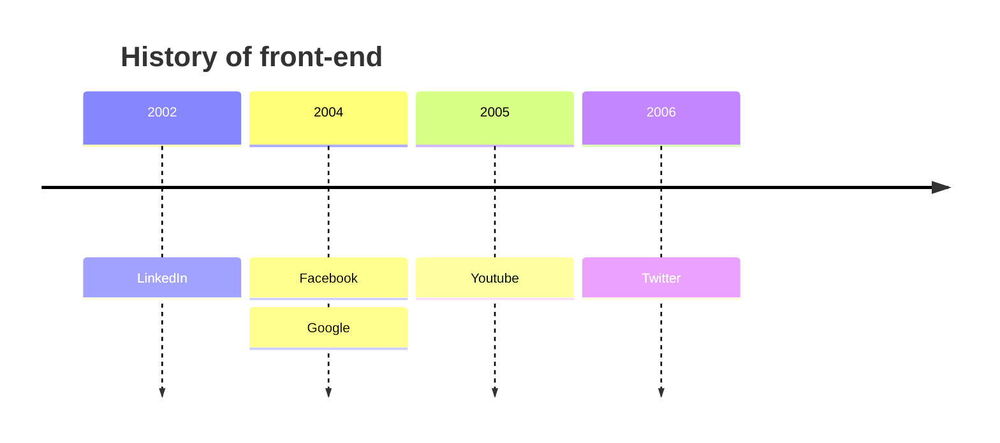

# 页面的组成

```mermaid
 mindmap
  root[页面的组成]
   html["HTML(5)构架结构"]
   css["CSS(3)样式与动画"]
   js[JavaScript]
```

```mermaid
 mindmap
 页面的组成
  布局
  样式
  交互
```

```mermaid
 timeline
    title History of front-end
    2002 : LinkedIn
    2004 : Facebook
         : Google
    2005 : Youtube
    2006 : Twitter
```