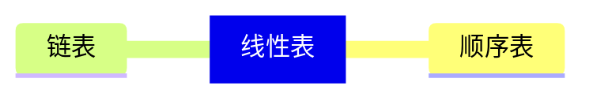
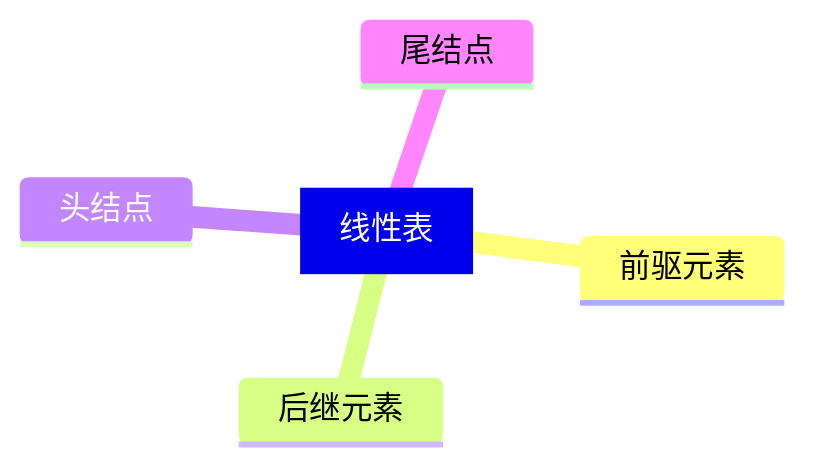

线性表中数据存储方式可是顺序存储，也可以是链式存储，按照数据的存储方式不同，可以把线性表分为顺序表和链表。

## 线性表
线性表元素之间有一种“一对一”的逻辑关系。除了第一个元素和最后一个元素，其它元素都有前驱元素和后继元素。

> 线性表：一个线性表是 n 个具有相同特性的数据元素的有限序列。
  前驱元素：若 A 元素在 B 元素的前面，则 A 元素为 B 元素的前驱元素。
  后继元素：若 A 元素在 B 元素的前面，则 B 元素为 A 元素的后继元素。
  头结点：第一个元素没有**前驱元素**，第一个元素称为**头结点**。
  尾结点：最后一个元素没有**后继元素**，最后一个元素称为**尾结点**。

### 顺序表
> 顺序表是在计算机内存中以数组的形式保存的线性表，线性表的顺序存储是用一组地址连续的<u>存储单元</u>，依次存储线性表中的各个元素，使得线性表中在逻辑结构上相邻的数据元素存储在相邻的物理存储单元中，即<u>数据元素物理存储的相邻关系来反映数据元素之间逻辑上的相邻关系</u>。

#### 顺序表 API 设计
|类名|SequenceList<t>|
|--|--|
|构造方法|SequenceList(init capacity) 容量为 capacity 的 sequenceList 对象|
|成员方法|public void clear() 清空线性表 public boolean isEmpty() 判断线性表是否为空，是返回 true，否返回 false public int length() 获取线性表中元素的个数 public T get(init i)读取并返回线性表中第 i 个元素的值|
#### 顺序表可遍历
#### 顺序表容量可变

### 链表
### 栈
### 队列