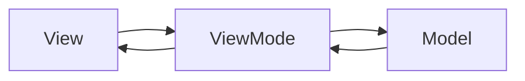

## MVC
Backbone 为复杂 JavaScript 应用程序提供模型、集合、视图的**结构**。是一套基于 jQuery、zepto、Underscore 的前端 mvc 框架。
Underscore.js 是一个 JavaScript 实用库，为了解决早期 js 语言对数据处理的薄弱，是一套函数式编程库。
Model: key-value 绑定及自定义事件，根据现实数据建立抽象。
Conllection:
View:
Router:
大量逻辑耦合在 c 层

## MVVM 架构

model
view
viewModel 简单了 controller 这一层。

### view 层
#### Vue
vue 是一款用于**构建用户界面**的 JavaScript 框架（方法被动被别人调用）。
v-model 实现双向绑定，视图影响数据。
指令和组件划分清晰，指令只用于封装 DOM，组件代表一个独立的单元。
vue 基于依赖追踪的观察系统并且异步队列更新，所有的数据变化是独立触发的。
Vue 模板对于视图和设计更友好

#### React
React 是用于**构建用户界面** JavaScript 库（用户主动调用库里面的方法）。
与 vue 相同，都提供数据驱动、可组合搭建视图组件。
virtual DOM 是在内存中描述 DOM 树状态的数据。状态发生变化时，React 重新渲染 virtual dom，进而给真实 DOM 打补丁。

#### Angular
规则 脏检查

#### Ember
#### Ploymer
#### Riot
