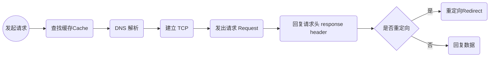

浏览器的页面模块，页面是浏览器的核心，浏览器中的所有功能点都服务于页面
chrome 工具是调试页面的核心工具

## Chrome 开发者工具（DevTools）
> 是一组网页制作和调试的工具，内嵌在 Gooogle Chrome 浏览器中。
  最新版本 [Chrome Canary]()

页面源头
网络数据的接收

|名称|描述|
|---|----|
|Elements 面板|1.可以查看DOM结构 2.编辑CSS样式 3.测试页面布局 4.设计页面|
|Console 面板|1.可以执行 JavaScript 脚本（JavaScript Shell） 2.通过 Console 和页面中的 JavaScript 对象交互|
|Sources 面板|1.查看 Web 应用加载的所有文件；  2.编辑CSS和JavaScript文件内容； 3.将打乱的CSS文件或者JavaScript 文件格式化； 4.支持 JavaScript 的调试功能； 5.设置工作区，将更改的文件保存到本地文件夹中|
|NetWork 面板|展示了页面中所有的请求内容列表，可以查看请求行、请求头、请求体、时间线以及网络请求瀑布图等信息|
|Performance 面板|记录和查看 Web 应用生命周期内的各种事件，并用来分析在执行过程中一些影响性能的要点|
|Memory 面板|用来查看运行过程中的JavaScript 占用内存情况，追踪是否存在内存泄漏的情况等|
|Application 面板|1.查看应用程序的存储情况 2.PWA的基础数据 3.IndexedDB: Web SQL;本地和会话存储；Cookie；应用程序缓存；图像；字体和样式等|
|Security 面板|显示当前页面一些基础的安全信息|
|Audits 面板|会对当前网页进行网络利用情况、网页性能方面的诊断、并给出一些优化建议|
|Layers 面板|展示一些渲染过程中分层的基础信息|

### 网络面板
网络面板由控制器、过滤器、抓图信息、时间线、详细列表和下载信息概要这 6 个区域构成的

### NetWork 面板 —— 控制器

> 解释：

1.  开始或停止抓包：控制面板中●
2.  打开左边全局搜索功能：<u>可以在所有下载资源中搜索相关内容，还可以快速定位到某几个你想要的文件</u>
3.  禁止从 Cache 中加载资源：Disable cache 开启，会影响到网络性能测试的结果
4.  模拟 2G/3G 网络限制网速：online，可以限制带宽，模拟弱网情况下页面的展现情况，然后你就可以根据实际展示情况来动态调整策略，以便让 Web 应用更加适用于这些弱网

### NetWork 面板 —— 过滤器
有时一个页面有太多内容在详细列表区域中展示，但你可能只想查看 JavaScript 或 CSS 文件，可以通过过滤器模块来筛选你想的文件类型

### NetWork 面板 —— 抓图信息
用来分析用户等待页面加载时间内所看到的内容，分析用户实际的体验情况，如：页面加载 1s 多之后屏幕还是白屏状态，（Capture screenshots）启用屏幕截图）分析网络原因还是代码问题

### NetWork 面板 —— 时间线
主要用来展示 HTTP/HTTPS/WebSocket 加载的状态和时间的关系，用于直观感受页面的加载过程。如果竖线堆叠在一起，说明这些资源同时被加载。至于具体到每个文件的加载信息，还需要用到详细列表

### NetWork 面板 —— 详细列表
详细记录了每个资源从发起请求到完成请求这中间所有过程和状态，以及最终请求完成的数据信息。
1.  列表属性
可以按照列表属性给列表排序，默认情况下列表是按发起请求的时间排序的，也可以按照状态码（status）、请求类型（Type）、请求时长（Time）、内容大小（Size）等属性排序。
2.  详细信息

点击请求列表中的任一项，可以查看请求行、请求头、响应行、响应头、响应体
可以判断你的业务逻辑是否正确或逆向推导别人的网站业务逻辑
3.  单个资源的时间线

**认识时间线面板**

Queuing: 排队，当浏览器发起一个请求时，会有很多原因致该请求不能被立即执行，需要排队等待。导致排队等待的原因如下
* 页面中的资源是有优先级的，如 css/html/JavaScript 等都是页面中的核心文件，所以优先级最高；图片、视频、音频这类资源不是核心资源，优先级较低。后者遇到前者时需要排队
* 浏览器为每个域名最多维护 6 个 tcp 连接，发起一个 HTTP 请求时，这 6 个 TCP 连接都处于忙碌状态，那么这个请求就会处于排队状态。
* 最后，网络进程在为数据分配磁盘空间时，新的 http 请求也需要短暂等待磁盘分配结束。

排队完成后，进入发起连接状态了。不过在发起连接之前，还有一些原因可能导致连接过程被推迟。表现在面板中的 Stalled 上，它表示停滞意思

如果使用了代理服务器，还会增加一个 Proxy Negotiation 阶段，也就是代理协商阶段，它表示代理服务器连接协商所用的时间。

Initial connection/ssl 阶段，和服务器建立连接的阶段，包括建立 TCP 连接所花费的时间；
如果用了 HTTPS 协议，还需要一个额外的 SSL 握手时间，这个过程主要是用来协商加密信息。

Request sent 阶段，和服务器建立好连接之后，网络进程会准备请求数据，并将其发送给网络。这个阶段非常快，只需要把浏览器缓冲区的数据发送出去，不需要判断服务器是否接收到。通常时间不到 1ms

Waiting(TTFB) 第一字节时间，是反应服务端响应数据的重要指标，对服务器来说，TTFB 时间越短，说明服务器响应越快

Content Download 阶段，意味着从第一个字节时间到接收到全部响应数据所用的时间。进入接收完整数据的阶段

### NetWork 面板 —— 下截信息概要
DOMContentLoaded 和 Load 两个事件，以及这两个事件完成的时间
* DOMContentLoaded 该事件触发后，说明页面已经构建好 DOM 了，意味着构建 DOM 所需要的 HTML 文件、JavaScript 文件、CSS 文件都已经下载完成
* Load 说明浏览器已经加载了所有资源（图像、样式表等）

## 优化线上耗时项
### 1.  排队（Queuing）时间过久
大概率是因为浏览器为每个域名最多维护 6 个连接导致的。
可以让一个站点下面的资源放在多个域名下面，采用域名分片技术。把站点升级到 http2 (HTTP2 已经没有每个域名最多维护 6 个 TCP 链接的限制)

### 2.  第一字节时间（TTFB）时间过久
这可能的原因有如下：
* 服务器生成页面数据的时间过久。对于动态网页来说服务器收到用户打开的第一个页面的请求时，首先要从数据库中读取该页面需要的数据，然后把这些数据传入模板中，模板渲染后，再返回给用户。服务器在处理这个数据的过程中，可能某个一节出问题了。
> 增加缓存的技术，提高服务器的处理速度

* 网络原因。如使用了低带宽的服务器，或者本来用的是电信的服务器，可联通的网络用户要访问你的服务器，这样也会拖慢网速
> 使用 CDN 来缓存一些静态文件；

* 发送请求时带上了多余的用户信息 如不必要的 cookie 信息，服务器接收到这些 Cookie 信息后可能需要对每一项都做处理，加大了服务器的处理时长
> 在发送请求时就去尽可能的减少一些不必要的 cookie 信息

### 3.  Content Download 时间过久
如果单个请求的 Content Download 花费了大量时间，可能是字节数太多的原因导致的
需要减少文件大小，如压缩、去掉源码中不必要的注释等
