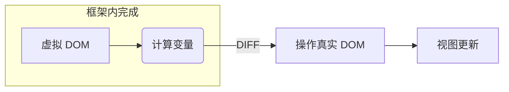

## 操作 DOM（Document Object Model） 的几种方式
### JavaScript 原生获取 DOM
```JavaScript
document.getElementById('id')
document.querySelector('#id')
document.getElementsByName('user')
```
[更多 Javascript 获取 DOM方式](/2021/06/11/JavaScript-Docment-Object-Model/)

### jQuery 获取 DOM
```JavaScript
$('#id')
$('.class')
$('div')
```

> 以上两种方式都是直接**操作 DOM 元素**<u>达到视图更新的效果</u>

## Vue 更新视图的方式
```Vue
<template>
  <div id="app">
    <h1>name: {{name}}</h1>
  </div>
</template>

<scirpt>
  export default {
    data() {
      return {
        name: 'helen'
      }
    },
    methods: {
      changeName() {
        this.name = 'zhangLP'
      }
    }
  }
</scirpt>
```
> Vue 改变数据 `this.name = 'zhangLP'` 触发视图改变

## React 更新视图
```React
import React, {useState} from 'react'

function App() {
  // useState(initialState) 返回一个数组，第一个是状态值，第二个是更新状态函数 setState。下例中将setState 函数解构出赋值给 setOn
  const [on, setOn] = useState(false)
  return (<>
    <div onClick={setOn(!on)}>{on ? '开' : '关'}</div>
  </>)
}

export default App
```
> React 通过 setState() 更新状态，改变数据，触发视图更新

**React + Vue ** 两个框架都是通过操作虚拟 DOM，完成视图更新的，具体如下**


## what's the Virtual DOM
```html
<body style="background-color: rgb(255, 255, 255);">
    <h3>模拟虚拟 DOM</h3>
    <ul>
        <li>js 生成虚拟DOM</li>
        <li>计算变更</li>
    </ul>
</body>
```
用 JS 模拟 DOM 生成的 DOM 结构
```JavaScript
{
    tag: 'body',
    props: {
        style: 'background-color: rgb(255, 255, 255)'
    },
    children: [
        {
            tag: 'h1',
            children: [
                {text: '模拟虚拟 dom'}
            ]
        },
        {
            tag: 'ul'
            children: [
                {
                    tag: 'li',
                    children: [
                        {text: 'js 生成虚拟 DOM'}
                    ]
                },
                {
                    tag: 'li',
                    children: [
                        {text: '计算变更'}
                    ]
                }
            ]
        }
    ]
}
```