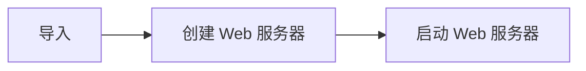
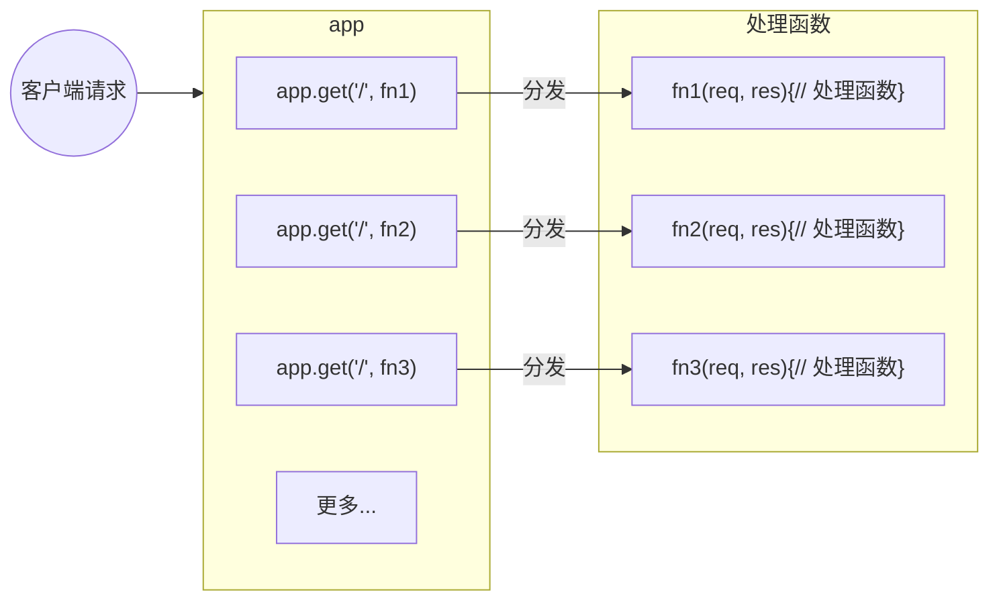
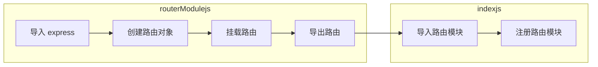
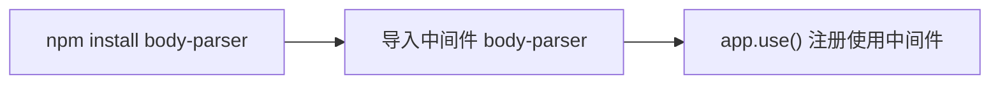
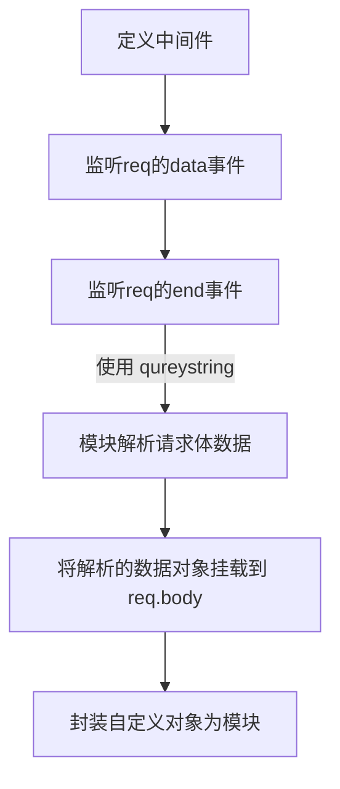
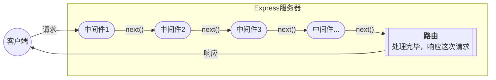
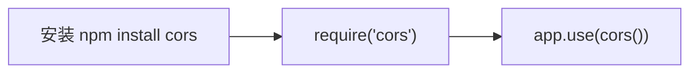

[Express 中文网](expressjs.com.cn)，是用于开发 <span class='custom-box custom-box-393'>Web 网站服务器</span> 与 <span class='custom-box custom-box-393'>API 接口服务器</span>
## 认识 `express`
> <span class='custom-box custom-box-933'>基于 Node.js 平台</span><span class='custom-box custom-box-339'>快速、开放、极简</span>的 <span class='custom-box custom-box-933'>Web 开发框架。</span>
是 npm 上的第三方包，提供了快速创建 Web 服务器的便捷方法，类似于 NodeJs 中内置的 http 模块，<span class='custom-box custom-box-933'>专门用来创建 Web 服务器的</span>
Express is a routing and middleware web framework that has minimal functionality of its own
Express 是一个路由和中间件 web 框架，本身功能很少。
<font color='red'>An Express application is essentially a series of middleware function calls.
<u>**Express 应用程序本质上是一系列中间件函数调用。**</u></font>

### 安装 express
```bash
$ npm i express@4.17.1
```

### 使用 `express` 创建 web 服务器

---
```JavaScript
// 1. 导入 express
const express = require('express')
// 2. 创建 web 服务器
const app = express()
// 3. 启动 web 服务
express.listen(80, ()=>{
    console.log('express server running at http://127.0.0.1')
})
```
### Express 的基本使用
#### 1. 监听 GET 请求 
通过 app.get(url, function(req, res){}) 方法，监听客户端的 GET 请求
```JavaScript
...
/**
 * 参数1：客户端请求的 URL 地址
 * 参数2：请求对应的处理函数
 *  req: 请求对象
 *  res: 响应对象
 */ 
app.get('请求 URL', function(req, res){})
...
```
#### 2. 监听 POST 请求
```JavaScript
/**
 * 参数1：客户端请求 URL
 * 参数2：请求对应的处理函数
 *  req: 请求对象
 *  res: 响应对象
 */ 
app.post('请求 URL', function(req, res) {})
```
#### 3. SEND 将处理好的内容发送给客户端
```JavaScript
app.get('/user/:id', (req, res) => {
    res.send({...}) // 向客户端发送请求内容
})
app.post('/user', (req, res) => {
    res.send('success') // 向客户端发送文本信息
})
```

> 请求参数
<span class='custom-box custom-box-393'>查询参数</span> 通过 req.query 获取客户端（/user/age=15&gender=male）
<span class='custom-box custom-box-393'>查询动态参数</span>  通过 req.params 获取客户端（/user/1），动态参数可以是多个

```JavaScript
// 注意 url 参数要加 ?(?age=15&gender=male) 【clientUrl http://127.0.0.1:9000/users/?age=15&gender=male】
app.get('/users/?age=15&gender=male', (req, res) => {
    console.log(req.query, 'req.query') // { age: '15', gender: 'male' } req.query
    res.send({id: 1})
})

// req.params 获取动态参数 /user/:id 【clientUrl http://127.0.0.1:9000/user/1】
app.get('/user/:id/:name', (req, res) => {
    console.log(req.params, 'req.params')
    res.send({id:1})
})
```
#### 能够使用 `express.static()` 快速托管静态资源
<span class='custom-box custom-box-393'>express.static() 用于创建静态资源服务器</span> 

```JavaScript
...
// 可以将 public 目录下的图片、CSS文件、JavaScript 文件对外开放访问
app.use(express.static('public'))
...
```
> 托管多个静态资源
多次调用 `express.static()` 函数，托管多个静态资源目录。
<span class='custom-box custom-box-933'>访问静态资源时，多个目录中有相同名称的资源时，`express.static()` 函数会根据目录的添加顺序查找所需的文件</span>

```JavaScript
...
app.use(express.static('public'))
app.use(express.static('files'))
```
> 挂载路径前缀
在托管的静态资源访问路径前 <span class='custom-box custom-box-393'>挂载路径前缀</span>，避免因挂载顺序问题，导致不能访问到指定资源的问题。
```JavaScript
...
app.use('/public',express.static('public'))
```

## `express` 路由
路由指的是 <span class='custom-box custom-box-393'>映射关系</span>，在 Express 中，路由指的是 <span class='custom-box custom-box-393'>客户端请求与服务器处理函数的 **<u>映射关系</u>**</span>
Express 中路由由 <span class='custom-box custom-box-393'>请求类型(METHOD:POST/GET),请求 URL 地址（PATH）, 处理函数（HANDLE）</span>组成。
```JavaScript
...
app.METHOD(PATH, HANDLE)
...
```
### 路由的匹配过程
当请求到服务器之后，需要经过路由的匹配，匹配成功后，才会调用对应的处理函数
匹配时，按照路由的顺序进行，请求类型与请求 URL 匹配成功，Express 将请求转交给 handle 函数。


### 模块化路由
为了方便对路由进行模块化管理，<span class='custom-box custom-box-933'>Express 不建议将路由直接挂载在 app 上，推荐将路由抽离为单独的模块</span>
#### 创建路由模块

```JavaScript
// routerModule.js
// 1. 导入 express
// 2. 创建路由对象
// 3. 挂载路由
// 4. 导出路由 
```
#### 使用路由模块
```JavaScript
// index.js
...
const router = require('./routerModule.js')
app.use('/api', router) // 注册路由模块
...
```
## `express` 中间件
### 什么是中间件
> 中间件（Middleware），业务流程的<u>**中间处理环节**</u>。
Middleware functions are functions that have access to the request object(req)、response object(res), and the next middleware function in the application's request-response cycle. the next middleware function is commonly denoted by a variable named next.
中间件函数可以访问请求对象、响应对象以及在请求响应周期内的下一个中间件函数。下一个中间件函数通常由一个变量名 next 表示。 

You can load application-level and router-level middleware with an optional mount path. 
你可以加载带有可选装载路径的应用级别中间件路由级别中间件。

### 中间件的作用
<span class='custom-box custom-box-933'>多个中间件之间，共享同一份 req 和 res</span>。基于这个特性，<u>**我们可以在上流的中间件中，统一为 req 或 res 对象添加自定义的属性或方法，供下游的中间件或路由进行使用。**</u>

```JavaScript
// 中间件与路由之间共享 req/res 实例
app.use((req, res, next)=>{
    req.receivedTime = Date.now()
    next()
})

app.get('/', (req, res) => {
    console.log('请求到达服务器的时间：', req.receivedTime)
})
```

### 定义一个中间件
Express 中间件，<span class='custom-box custom-box-393'>本质上是一个带有 `next` 参数的 funtion 处理函数</span>
<span class='custom-box custom-box-933'>中间件函数的形参列表中，必须包含一个 next 参数</span>。路由处理函数中只包含 req 和 res。

```JavaScript
var express = require("express")
var app = express()

/**
 * 挂载中间件
 * app.get http method for which the middleware function applies
 * '/' Path(route) for which the middleware function applies
 * function(req, res, next){} the middleware function
 *  req http request argument to the middleware function,called 'req' by convention
 *  res http response argument to the middleware function, called 'res' by convention
 *  next callback argument to the middleware funtion, called 'next' by convention
 */ 
app.get('/', function(req, res, next){
    // next 函数是实现多个中间件连续调用的关键，它表示把流转关系转交给下一个中间件或路由
    next()
})
```

#### 定义全局生效的中间件
客户端发起的任何请求，到达服务器之后，都会触发的中间件，叫做全局生效的中间件。
<span class='custom-box custom-box-393'>通过 `app.use()` 中间件函数，可定义一个全局生效的中间件</span>

```JavaScript
    // 定义中间件函数
    cont middleware = (req, res, next) {
        // 流转关系转交给下一个中间件或路由
        next()
    }
    // 注册全局生效的中间件函数
    app.use(middleware)
```
中间件简化形式
```JavaScript
// 全局中间件的简化形式
app.use((req, res, next) => {
    next()
})
```
#### 定义局部生效的中间件
> 不使用 app.use() 定义的中间件为局部生效中间件。
```JavaScript
const middleware = function(req, res, next) {
    console.log(`this is a locally effective middleware`)
    next()
}

app.get('/', middleware, function(req, res) {
    res.send('Index')
})
```

---
You can load a series of middleware functions together,which creates a sub-stack of the middleware system at a mount point.
你可以一起加载多个中间件函数，将会在挂载点创建中间件子堆栈。
---
#### 定义多个中间件
```JavaScript
 app.use((res, req, next) => {console.log('第一个中间件')})
 app.use((res, req, next) => {console.log('第二个中间件')})
 app.get('/', (req, reqs) => {console.log('请求路由')})
 // 第一个中间件 --> 第二个中间件 --> 请求路由
```
#### 多个局部生效的中间件
```JavaScript
    const middleware1 = function(req, res, next) {
        console.log(`this is the first locally effective middleware`)
        next()
    }
    const middleware2 = function(req, res, next) {
        console.log(`this is the second locally effective middleware`)
        next()
    }

    /**
     * 以下两种写法都可以使用局部中间件
     */ 
    app.get('/', middleware1, middleware2, function(req, res) {
        console.log('Index')
    })
    app.get('/users', [middleware1, middleware2], function(req, res) {
        console.log('Index')
    })
```

### 中间件使用注意事项
*   一定要在路由之前注册中间件；
*   客户端发送过来的请求，可以连续调用多个中间件进行处理；
*   执行完中间件的业务代码后，不要忘记调用 next() 函数；
*   为了防止代码逻辑混乱，调用 next() 函数之后不要再写其它代码；
*   连续调用多个中间件时，多个中间件之间，共享 req 和 res;

### 中间件的分类
1.  应用级别中间件(Application-level middleware)
> 通过`app.use()`或`app.get()`或`app.post()`，<span class='custom-box custom-box-933'>绑定到 app 实例上的中间件</span>，称为应用级别中间件。
2.  路由级别中间件(Router-level middleware)
> 绑定到 `express.Router()` 实例上的中间件，叫做路由级别中间件。<span class='custom-box custom-box-933'>注意：应用级别中间件是绑定在 `app` 上，路由级别中间件绑定在 `express.Router()` 实例上。</span>
3.  错误级别中间件(Error-level middleware)
> 错误级别中间件的作用：捕获整个项目中发生的异常错误，从而防止项目异常崩溃。<span class='custom-box custom-box-933'>错误级别中间件必须在所有路由之后注册</span>
4.  Express 内置中间件(Built-in middleware)
    *   express.static 快速托管静态资源的内置中间件；
    *   express.json 解析 JSON 格式的请求体数据；[demo for express.json](https://github.com/HelenZhangLP/demo/blob/master/node/src/demo9/index.js)
    *   express.urlencoded 解析 URL-encoded 格式的请求数据;[demo for express.urlencoded](https://github.com/HelenZhangLP/demo/blob/master/node/src/demo10/index.js)
    > 其中 `express.json` 和 `express.urlencoded` 只能在 4.16.0+ 以后的版本中使用
5.  第三方中间件(Third-party middleware)

### 应用级别中间件(Application-level middleware)
Bind application-level middleware to an instance of the app object by using the app.use() and app.METHOD functions, where METHOD is the HTTP method of the request that the middleware function handles (such as GET,PUT,POST) in lowercase. 
通过使用 `app.use()`和`app.METHOD()` 函数绑定应用级别中间件到应用程序对象实例。其中，`METHOD` 是 中间件函数以小写形式处理的 `HTTP 请求 method`（如：GET,PUT,POST）

#### 不带挂载路径的中间件，每次 app 接受请求时执行
```JavaScript
// 导入 express 
var express = require('express')
var app = express()

app.use(function(req, res, next){
    console.log('define application-level middleware')
})
```
#### 带有挂载路径的中间件函数，任何类型的 http 请求当前路径中间件都会被执行
```JavaScript
app.use('/user/:id', function(req, res, next){
    consolt.log('request type', req.method)
    next()
})
```
#### 
#### 带有中间件子堆栈的数组，处理 get 请求
```JavaScript
function lg(req, res, next) {console.log('lg');next()}
function log(req, res, next) {console.log('log');next()}

let stuff = [lg, log]
app.get('/user/:id', stuff, function(req,res,next){
    res.send('userInfo')
})
```

### 错误级别中间件
> 错误级别中间件的 function 中，<span class='custom-box custom-box-339'>必须包含4个形参，</span>分别是 err,req,res,next 
```JavaScript
// 1 导入 express 模块
const express = require('express')
// 2 创建 express 服务器实例
const server = express()

// 4 定义路由
server.get('/', (req, res) => {
    // 定义错误
    throw new Error('服务器错误')
    res.send('响应请求')
})

// 5 中件间捕获整个项目中发生的异常错误，从而防止项目异常崩溃。
server.use((err, req, res, next) => {
    console.log('错误：' + err.message)
    res.send('Error：' + err.message )
})

// 3 调用 app.listen 方法，指定端口号启动 web 服务器
server.listen(8090, function() {
    console.log(`Express server running at http://127.0.0.1:8090`)
})
```

### Express 内置中间件
Express 4.16.0 版本开始，Express 内置了 3 个常用中间件
*   `express.static` 快速托管静态资源（html,css,图片等）的内置中间件；
*   `express.json` 解析 JSON 格式的请求体数据（4.16.0+ 可用）;

```JavaScript
// post 请求，body 中带请求体
app.get('/getUser',(req, res)=>{
    // req.body 接收客户端传过来的数据
    console.log(req.body) // undefined，默认情况下，没有配置解析表单数据中间件，req.body = undefined
})
```
---
```JavaScript
// 配置解析 application/json 格式数据的内置中间件
app.use(express.json())
// post 请求，body 中带 json 格式请求数据
app.get('/getUser',(req, res)=>{
    console.log(req.body) // {id: 'u12950'}
})
```
*   `express.urlencoded` 解析 URL-encoded 格式的请求体数据（4.16.0+ 可用）

```JavaScript
// post 请求，body 中带 x-www-form-urlencoded 格式数据
app.get('/getUser',(req, res)=>{
    // req.body 接收客户端传过来的数据
    console.log(req.body) // {}，默认情况下，没有配置解析表单数据中间件，req.body = undefined
})
```
---
```JavaScript
// 解析 application/x-www/form-urlencoded 格式数据中间件
app.use(express.urlencoded({extended: false}))
// post 请求，body 中带 x-www-form-urlencoded 格式数据
app.get('/getUser',(req, res)=>{
    // req.body 接收客户端传过来的数据
    console.log(req.body) // {id: 'u12950'}，默认情况下，没有配置解析表单数据中间件，req.body = {}
})
```
这些中间件，极大的提高了 Express 项目的开发效率及体验。

### 第三方中间件
第三方中间件可按需下载配置，从而提高开发效率。

#### 第三方中间件 body-parser
body-parser 用于解析请求体数据，在 express@4.16.0 之前经常使用

[demo for body-parser](https://github.com/HelenZhangLP/demo/blob/master/node/src/demo11/index.js)

### 自定义中间件
<span class='custom-box custom-box-939'>手动模拟 express.urlencoded 中间件，解析 POST 提交到服务器的表单数据</span>

---

```JavaScript
// bodyparse.js
// 自定义中间件
const qs = require('qureystring')
function middleware(req, res, next) {
    // 监听 req 对象的 data 事件，获取客户端发送到服务器的数据
    // 数据量大时，无法一次性发送完毕，客户端会进行数据切割，分批发送到服务器。req 的 data 事件可能会触发多次，需要每次触发 data 事件时，获取到的数据只是完整数据的一部分，需要手动拼接接收的数据

    let str = '' // 存储客户端发送过来的请求体
    // 监听 req 的 data 事件，拼接客户端发送回来的数据
    req.on('data', (chunk) => {
        str += chunk
    })

    // 监听 req 的 end 事件；TODO：把字符串格式的请求体数据，解析成对象格式
    req.on('end', () => {
        const body = qs.parse(str)
        req.body = body;
        next()
    })
}
module.exports = middleware

// ---------- next page ----------
// index.js
const bodyparse = require('./bodyparse')
// 注册使用中间件
app.use(bodyparse)
```
### 中间件的处理流程
当一个请求到达 Express 服务器之后，可以连续调用多个中间件，从而 <span class='custom-box custom-box-393'>对这次请求进行<u>预处理</u></span>。


### 跨域（Cross-Origin Resource Sharing）中间件
[更多关于跨域...](/2019/02/22/跨域/#跨域资源共享（CORS）当前主流解决方案)


### 在 Express 中使用 session 认证
#### 安装 express-session 中间件
```bash
$ npm install express-session
```
#### 配置和使用 express-session 中间件
> express-session 中间件配置成功后，可通过 req.session 来访问和使用 session 对象。进而可以向 session 中存数据
> req.session.destory() 函数 清空服务器保存的 session 信息
```JavaScript
// 1. 导入 session 中间件
const session = require('express-session')
// 2. 配置 session 中间件
app.use(session({
    secret: '', // secret 属性的值可以为任意字符串
    resave: false,
    saveUninitialized: true
}))
// 3. 向 session 中存储数据
app.post('/api/login', (req, res) => {
    // 判断客户端是否提交正确的信息
    const {userName, password} = req.body
    if(userName !== 'admin' || password !== '123') return res.send({status: 1, msg: '用户名或密码错误！'})

    // session 存储数据
    req.session.user = req.body // 将用户信息存储到 session
    req.session.isLogin = true // 将用户登录状态存储到 session

    // 返回结果给客户端
    res.send({status:0, msg: '登录成功'})
})
// 4. 获取 session 中存储的数据
app.get('api/user', (req, res) => {
    const {user} = req.session
    if (user) {
        res.send({status: 0, user})
    }
    res.send({status: 1, msg: '没有该用户'})
})
// 5. req.session.destory() 函数，清空服务器信息
app.post('/api/logout', (req, res) => {
    // 清空服务器 session 
    req.session.destory()
    res.send({
        status: 0,
        msg: '退出登录'
    })
})
```

### Express 中使用 JWT 身份认证
#### 安装 JWT 包
```bash
$ npm install jsonwebtoken express-jwt
```
* jsonwebtoken 用于生成 JWT 字符串
* express-jwt 将 JWT 字符串解析还原成 JSON 对象

#### 定义 secret 密钥
为了保证 JWT 字符串的安全性，防止 JWT 字符串在网络传输过程中被人破解，我们需要专门定义一个用于加密和解密的 secret 密钥。
生成 JWT 字符串时，需要使用 secret 密钥对用户信息进行加密，最终得到加密好的 JWT 字符串
当把 JWT 字符串解析还原成 JSON 对象时，需要使用 secret 密钥进行解密
secret 密钥本质是任意字符串

#### 生成 JWT 字符串
调用 jsonwebtoken 包提供的 sign() 方法，将用户的信息加密成 JWT 字符串，响应给客户
```JavaScript
cont jwt = require('jsonwebtoken')

// 三个参数：用户信息，加密密钥，配置对象
const token = jwt.sign(user, secretKey, {expiresIn: '30s'})
```

#### JWT 还原为 JSON 对象
客户端访问权限接口时，需要主动通过请求头中的 Authorization 字段将 Token 字符串发送到服务器进行身份认证。
服务器可以通过 express-jwt 中间件，自动将客户端发送的 Token 解析还原成 JSON 对象
```JavaScript
// app.use() 注册中间件
// expressJWT() 解析 Token 中间件
// unless() 指定不需要鉴权的接口
app.use(expressJWT({secret: secretKey}).unless({path: [/\^/api\/\/]}))
```

#### 捕获解析 JWT 失败后产生的错误
当使用 express-jwt 解析 token 字符串时，如果客户端发送过来的 Token 字符串不合法或过期，会产生解析失败的错误，影响项目正常运行，我们可以通过 Express 错误中间件，捕获并进行错误处理
```JavaScript
app.use((err, req, res, next) => {
    // token 解析失败
    if (err.name === 'UnauthorizedError') {
        return res.send({status: 401, message: '未知错误'})
    }

    // 其它原因导致错误
    res.send({status: 500, message: '服务器错误'})
})
```