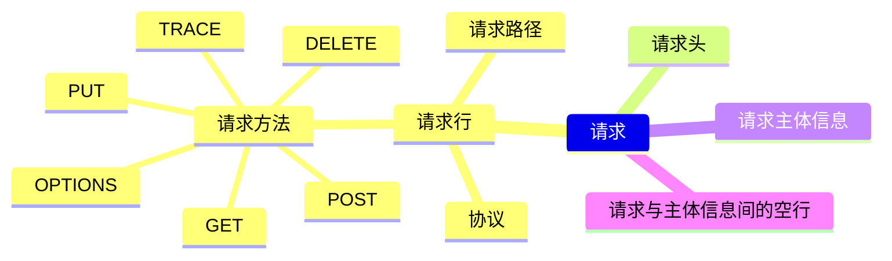

## Idempotent Method
A request method is considered "idempotent"
一个请求方法被认为**幂等**
as the effect for a single such request
作为单个此类请求的效果
幂等（idempotent）：同样的请求被执行一次与连续执行多次的效果是一样的，服务器的状态也是一样的。幂等方法不应该有副作用。
GET, HEAD, PUT, DELETE 等方法都是幂等的，所有 safe 方法都是幂等的。

## HTTP(HyperText Transfer Protocol)
> HTTP(HyperText Transfer Protocol) 超文本传输**协议**，协议规定了浏览器与服务器之间通信的规则。
  H - Hypertext 超文本，T - Transfer 传输，P - Protocol 协议
  用在计算机世界里的协议，用于<font color="orange">两点(请求方和响应方)</font>之间<font color="skyblue">**传输**文字、图片、音频、视频等超文本数据</font>的**约定和规范(protocol)**
  HTTP 是一个应用层协议，基于 TCP/IP，在网络的任意两点（请求方和应答方）间传输超文本（图片、文字、视频、音频等）
  HTTP 协议中的两个端点**请求方**和**应答方**
  请求方 —— web 浏览器 user agent
  应答方 —— web 服务器 存储着网络的静态与动态资源
  HTTP 需要 TCP/IP 实现寻址、路由和可靠的数据传输
  HTTP 需要 DNS 协议实现对互联网上主机的定位、查找
  HTTP over TCP/IP
  HTTP over SSL/TLS
  HTTP 有多个版本，目前应用最广的是 HTTP/1.1，但 HTTP/1.1 性能难以满足高流量网站，于是推出了 HTTP/2 HTTP/3

### 请求报文
```
请求行 POST /S?ie=utf-8 HTTP/1.2
请求头 HOST: babycoding.asia
      Cookie: name=mouses
      Content-type: application/x-www-form-urlencoded
      user-Agent: chrome 83
空行
请求体 username=admin&password=123456
```
### 响应报文
```
响应行 HTTP/1.1 200 OK
响应头 Content-type: text/html;charset=utf-8
      Content-length: 2048
      Content-encoding: gzip
空行
体  <html> 
      <body>
        ...
      </body>
    </html>
```

HTTP 响应状态码用来表明特定 HTTP 请求是否成功完成。分五类：
* 信息响应（100-199）
* 成功响应（200-299）
* 重定向消息
* 客户端错误响应
* 服务端错误响应

## http 请求状态码
|状态码|描述|更多|
|--|--|--|
|200 OK|请求成功|默认情况下响应可以缓存|
|201 Created|成功的应答状态码，请求已被成功处理且创建了新资源|常规使用场景是 `POST` 请求返回值|
|202 Accepted|服务端收到了请求信息，但尚未处理|将请求交给另外一个服务器或进行处理，**对请求进行批处理**|
|203 Non-Authoritative Infomation|服务器成功处理了请求，但实体头部元信息不是在原始服务器上有效的确定集合，是来自本地或第三方拷贝。当前信息是原始版本的子集或超集。|此状态码不是必须的，而且只有在响应不使用此状态码便会返回 200 ok 的情况下才合适|

### [http 请求状态码 200](https://developer.mozilla.org/zh-CN/docs/Web/HTTP/Status/200)

> 请求成功，默认状态下 200 响应可以被缓存

#### 不同请求方式，请求成功的意义不同
|请求方式|意义|
|---|---|
|GET|已经取得资源，并将资源添加到响应的消息体中|
|POST|响应的消息体中包含此次请求的结果|

> - HEAD: 响应的消息体为头部信息。
> - TRACE: 响应的消息体中包含服务器接收到的请求信息。
> - PUT 和 DELETE 的请求成功通常并不是响应 200 OK 的状态码，而是 204 No Content 表示无内容(或者 201 Created表示一个资源首次被创建成功)。

# [http 请求状态码 206](https://developer.mozilla.org/zh-CN/docs/Web/HTTP/Status/206)

> HTTP 206 Partial Content 成功状态响应代码表示请求已成功，并且主体包含所请求的数据区间，该数据区间是在请求的 Range 首部指定的。

> ```
> Response Headers
> Accept: */*
> Accept-Encoding: identity;q=1, *;q=0
> Accept-Language: zh-CN,zh;q=0.9
> Connection: keep-alive
> Host: cktvideo-1252817906.cos.ap-guangzhou.myqcloud.com
> If-Range: "640f0886f386c9c253a95c5d1c01ca16-163"
> **`Range: bytes=9895936-170855393`**
> Referer: https://cktvideo-1252817906.cos.ap-guangzhou.myqcloud.com/gaokeyan1.mp4
> User-Agent: Mozilla/5.0 (iPhone; CPU iPhone OS 11_0 like Mac OS X) AppleWebKit/604.1.38 (KHTML, like Gecko) Version/11.0 Mobile/15A372 Safari/604.1
> ```

> 如果只包含一个数据区间，那么整个响应的 Content-Type 首部的值为所请求的文件的类型，同时包含 Content-Range 首部。

> ```
> Response Headers(10)
> Accept-Ranges: bytes
> Connection: keep-alive
> Content-Length: 170855394
> ** Content-Range: bytes 0-170855393/170855394
> ** Content-Type: video/mp4
> Date: Wed, 12 Jun 2019 02:34:48 GMT
> ETag: "640f0886f386c9c253a95c5d1c01ca16-163"
> Last-Modified: Sun, 30 Dec 2018 17:44:16 GMT
> Server: tencent-cos
> x-cos-request-id: NWQwMDY0YzhfMWNiMjk0MGFfNThlZl83YTg5NWY=
> ```

# [http 请求状态响应码 304](https://developer.mozilla.org/zh-CN/docs/Web/HTTP/Status/304)

> 无需再次传输请求的内容，也就是说可以使用缓存的内容。这通常是在一些安全的方法（safe），例如 GET 或 HEAD 或 在请求中附带了头部信息： If-None-Match 或 If-Modified-Since。

> ```
> Accept: text/html,application/xhtml+xml,application/xml;q=0.9,image/webp,image/apng,*/*;q=0.8,application/signed-exchange;v=b3
> Accept-Encoding: gzip, deflate, br
> Accept-Language: zh-CN,zh;q=0.9
> Cache-Control: max-age=0
> Connection: keep-alive
> Host: cktvideo-1252817906.cos.ap-guangzhou.myqcloud.com
> ** If-Modified-Since: Sun, 30 Dec 2018 17:44:16 GMT
> ** If-None-Match: "640f0886f386c9c253a95c5d1c01ca16-163"
> Range: bytes=0-1048575
> Upgrade-Insecure-Requests: 1
> User-Agent: Mozilla/5.0 (iPhone; CPU iPhone OS 11_0 like Mac OS X) AppleWebKit/604.1.38 (KHTML, like Gecko) Version/11.0 Mobile/15A372 Safari/604.1
> ```

# [http 请求响应码 401](https://developer.mozilla.org/zh-CN/docs/Web/HTTP/Status/401)

> 状态码 401 Unauthorized(未授权)代表客户端错误，指的是由于缺乏目标资源要求的身份验证凭证，发送的请求未得到满足。 这个状态码会与 WWW-Authenticate 首部一起发送，其中包含有如何进行验证的信息。 这个状态类似于 403， 但是在该情况下，依然可以进行身份验证。

> ```
> Request URL: https://api.github.com/user
> Request Method: GET
> Status Code: 401 Unauthorized
> Remote Address: 54.169.195.247:443
> Referrer Policy: no-referrer-when-downgrade
> ```

# [http 请求响应码 404](https://developer.mozilla.org/zh-CN/docs/Web/HTTP/Status/404)

> 状态码 404 Not Found 代表客户端错误，指的是服务器端无法找到所请求的资源。返回该响应的链接通常称为坏链（broken link）或死链（dead link），它们会导向链接出错处理(link rot)页面。 404 状态码并不能说明请求的资源是临时还是永久丢失。如果服务器知道该资源是永久丢失，那么应该返回 410 (Gone) 而不是 404 。

> ```
> Request URL: https://api.github.com/repos/helenzhanglp/blog/issues?client_id=8e7e6dda81936172806e&client_secret=97f71b6bbdf731bc650ec39212061882b8f36e71&labels=Gitalk,1863e4a8c0596ce3dfb3ee2f0c838431&t=1560407734937
> Request Method: GET
> Status Code: 404 Not Found
> Remote Address: 54.169.195.247:443
> Referrer Policy: no-referrer-when-downgrade
> ```

# [http 请求响应码 500](https://developer.mozilla.org/zh-CN/docs/Web/HTTP/Status/500)

> 服务器内部错误，是一个通用的全方位响应，有可能是权限或数据库链接错误。设置代理了，也会返回 500 错误

## DNS(Domain Name System)
> DNS(Domain Name System) 域名系统
  用有意义的名字来作为 IP 地址的等价替代

### URI(Uniform Resource Identifier)
URI(Uniform Resource Identifier) 统一资源标识符，可以唯一地标记互联网上的资源
URI 三个基本构成：
1.  协议名 访问该资源应当使用的协议 http
2.  主机名 即互联网上主机的标记，可以是域名(Domain Name)或IP地址
3.  路径 资源在主机上的位置 “/” 分隔多目录

### HTML（HyperText Markup Language）
HTML 运行在浏览器，由浏览器解析
HTML 超文本标语言，描述超文本文档
HTML 两个主要的标准 HTML4 和 HTML5
HTML 广义上是指 HTML/JavaScript/CSS等前端技术的组合，能够实现比传统静态更丰富的动态页面

## 请求方法
###  HTTP PUT  
PUT 创建一个新的资源或用请求的有效载荷替换目标资源的表示。
调用一次与连续调用多次效果是相同的。
`响应` 如果目标资源没有当前的表示，并且 PUT 方法成功创建了资源，那么源服务器必须返回 201 Created 通知用户代理，资源已创建
如果目标资源已存在，并且依照请求中封装的表现形式成功进行了更新，那么，源服务器必须返回 200 OK 或 204 No Content 表示请求成功完成

### HTTP DELETE
HTTP DELETE 方法用于删除指定资源
删除成功的状态码：
* 状态码 202 Accept 请求操作可能会成功执行，但尚未开始执行；
* 状态码 204 No Content 操作已执行，但没有进一步相关信息；
* 状态码 200 OK 操作已执行，并且响应中提供了相关状态的描述信息；