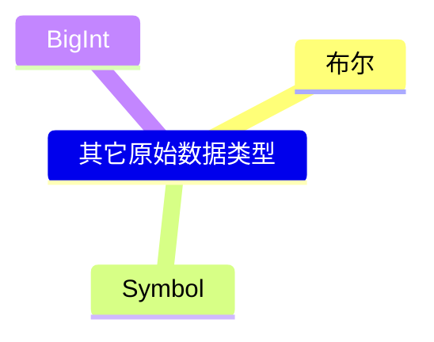

## 布尔类型的值 
> true / false

## 其它类型转换为布尔类型
`Boolean([value])` 或 `!![value]`
> * 只有 0 NaN 空字符串 null undefined 会被转换为 false，其它都会被转换为 true

## Symbol 唯一值
```JavaScript
    Symbol('A') // 参数只是加标识，方便调试
    Symbol() === Symbol() // flase 因为每次调用 Symbol 都是在创建唯一值
    Symbol('a') === Symbol('a') // false
```

## BigInt 大数
> 从服务器获取数据，服务器存储数据的时候，如果用的是大数存储，返回给客户端的信息可能超过最大安全数，这样导致后续计算不准确。
`Number.MAX_SAFE_INTEGER // 最大安全数 9007199254740991`
`Number.MIN_SAFE_INTEGER // 最小安全数 -9007199254740991`

```JavaScript
    BigInt(9007199254740992) // 9007199254740992n
    BigInt(9007199254740992) + 3
```
<font color='red'>Cannot mix BigInt and other types, use explicit conversions(显式转换)</font>
```JavaScript
    BigInt(9007199254740992) + 3n // 9007199254740995n
```