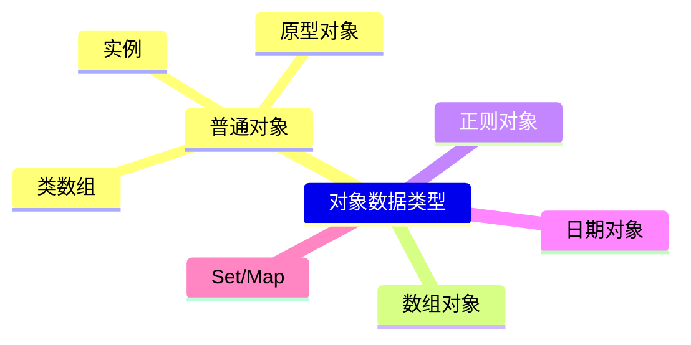

对象数据类型即引用类型


## 创建对象
### 创建字面量(Literal)对象
> 由 0 到 多组<u>键值对(属性名和属性值)</u>组成。
  * 属性名是对象的一个属性；
  * 属性名一般是字符串，也可以是数字、布尔值、undefined、null、Symbol
    <font color='red'>Uncaught SyntaxError: Unexpected number</font> 属性名不可以是 bigInt 类型
  * 如果将属性名设置为 Object 类型，会通过 toString 将属性名转换为 [object Object]
  * 属性名设置为函数，可以正常编译通过。

```JavaScript
let symb = Symbol('bracket')
let myBaby = {
  name: 'Audery',
  0: 111,
  [symb]: 1 // 注意 Symbol 类型的值要用 [] 包裹起来
}
```

### 创建实例对象
```JavaScript
let baby = new Object()
baby.name = 'Audery',
baby.age = 2
```

> 开发过程中实际多采用字面量形式创建对象，<u>字面量对象避端是<font color="#FFD700">产生大量重复代码</font>**</u>

## 对象成员访问
> 获取对象中某个属性名对应的属性值
  * 对象.属性名
    <span class='custom-box custom-box-933'>仅适用于属性名为字符串类型</span>
  * 对象[属性名]
    <span class='custom-box custom-box-393'>注意：这种方式获取属性值时，要特别关注`属性名数据类型`</span>

```JavaScript
  console.log(myBaby.name) // Audery
  console.log(myBaby[0]) // 111
  console.log(myBaby[symb]) // undefined
```


对象内置属性
`__proto__` [[prototype]] 对象属性，对象创建时生成

## 原型和原型链
JavaScript 是基于原型的面向对象语言，对象默认有 prototype，可以将需要共享的实例方法绑在 prototype 上，达到方法共享的目的。对象每个实例都有各自 `__proto__` 属性，该属性指向对象的 prototype 属性上。这种原型链接的关系称为原型链，null 是原型链的最后一个链接。

[继承](https://segmentfault.com/a/1190000015727237)
### JavaScript 继承
* 原型链继承
```JavaScript
function Super() {}
function Son() {}
// 实现继承
Son.prototype = new Super()
```
> 只要把子类的原型指向父类的实例就可以了，再演示一个更丰满的例子

```JavaScript
function Base() {
  this.friends = ['lily', 'lucy', 'coco']
}
function Son(name, age) {
  this.name = name;
  this.age = age
}
// 实现继承
Son.prototype = new Base()

let Audery = new Son('Audery', 2)
let Gulu = new Son('Gulu', 2)

Gulu.friends.push('emily')
console.log(Audery.friends)
```
> 引用类型会出现数组引用多实例因共享导致的相互污染的问题，考虑使用 ** 构造函数继承 ** 实现

* 构造函数继承
```JavaScript
function Base(female) {
  this.sex = female
  this.friends = ['lily', 'lucy', 'coco']
}
function Son(name, age, female) {
  // 对象冒充调用父类方法
  Base.call(this, female); // 子类冒充父类，子类调用父类构造函数。即，子类复制子父类代码
  this.name = name;
  this.age = age
}
let Audery = new Son('Audery', 2)
let Gulu = new Son('Gulu', 2)

Gulu.friends.push('emily')
console.log(Audery.friends)
console.log(Gulu.friends)
```
> 上面说了，通过对象冒充调用父类构造方法，其实就是复制父类构造函数中的属性、方法，到子类构造函数中，原型方法无法继承

* 组合继承
```JavaScript
function Base(female) {
  this.sex = female
  this.friends = ['lily', 'lucy', 'coco']
}

Base.prototype.say = function() {
  return 'I have some friends, they are ' + this.friends.join('、')+' respectively!'
}

function Son(name, age, female) {
  // 对象冒充调用父类方法
  Base.call(this, female); // 子类冒充父类，子类调用父类构造函数。即，子类复制子父类代码
  this.name = name;
  this.age = age
}

// 原型继承父类实例指向子类原型
Son.prototype = new Base()

let Audery = new Son('Audery', 2)
let Gulu = new Son('Gulu', 2)

Gulu.friends.push('emily')
```
> 组合继承实现了：
  - [ ] 属性私有化、方法共享、引用数组间不相互污染

** 以上是原型链继承的周边，不使用 Object.create， 以下是使用 Object.create 方法相关继承的演生 **

* 原型式继承
```JavaScript
function base(o) {
  function F(){}
  F.prototype = o;
  return new F();
}
var baseObj = {
  name: '基类',
  arr: ['array1','array2','array3'],
  fn: function() {
    console.log(this.name, this.arr)
  }
}
var baseInstance1 = base(baseObj)
var baseInstance2 = base(baseObj)
baseInstance2.name = '修改属性值'
baseInstance1.arr.push('array4')
/* === baseInstance2 添加了一个实例属性 === */
```

* 寄生式继承
* 寄生组合继承
* Class extends
> 如果子类中存在构造函数，则需要在使用 this 之前首先调用 super。 与寄生组合继承不同的是，ES6 先将父类实例对象的属性和方法加到 this 上，必须先调用 super 方法，然后再用的子类构造函数修改 this

```JavaScript
/**
 * babel.min.js:2 Uncaught SyntaxError: Inline Babel script: 'this' is not allowed before super()
     3 |   constructor(props) {
      4 |     // super(props);
    > 5 |     this.state = {date: new Date()};
        |     ^
      6 |   }
 */
```
实现原理
```JavaScript
class A {}
class B {}

// 设置一个指定的对象的原型 ( 即, 内部[[Prototype]]属性）到另一个对象或  null。
Object.setPrototypeOf = function (obj, proto) {
  obj.__proto__ = proto;
  return obj;
}

// B 的实例继承 A 的实例
Object.setPrototypeOf(B.prototype, A.prototype);

// B 继承 A 的静态属性
Object.setPrototypeOf(B, A);
```
