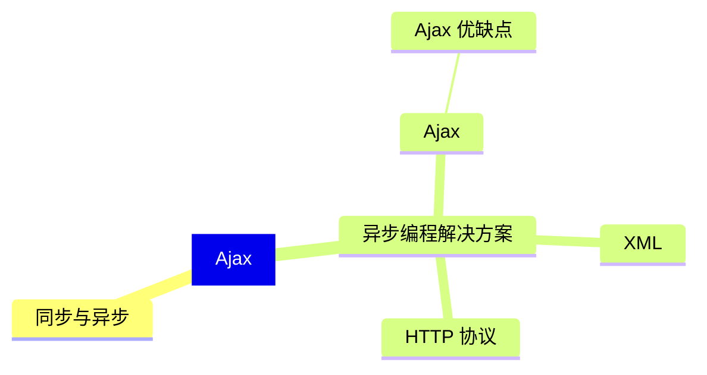
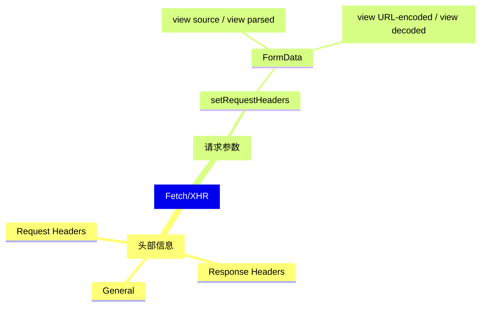
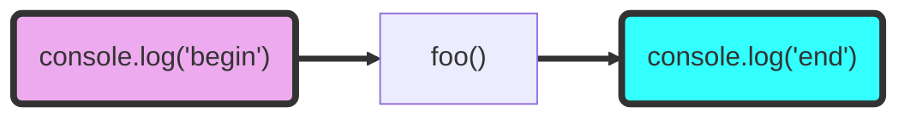

```JavaScript
  function ajax(rMethod, url, callback, params = '') {
    // 1. 创建 ajax 对象
    var xhr = new XMLHttpRequest()
    xhr.responseType = 'json'
    // 2. 初始化 ajax方法和请求地址
    url += Date.now() // 解决 IE 浏览器缓存问题
    xhr.open(rMethod, url)
    // == 设置请求头 ==
    // xhr.setRequestHeader('content-type', 'application/x-www-form-urlencoded')
    xhr.setRequestHeader('name', 'mouses')
    /**
     * 3. 发起 ajax 请求
     * 3.1 设置请求体
     */
    xhr.send(params)
    // 4. 处理响应结果
    xhr.onreadystatechange = function () {
        /**
         * readyState
         * 0 UNSENT 代理创建，但没有通过 open() 初始化请求
         * 1 OPENED 代理初始化，但 send() 没有发送请求
         * 2 HEADERS_RECEIVED 已接收到头部状态
         * 3 LOADING 响应加载中
         * 4 DONE 响应下载完成
         * 
         * =======
         * state 请求状态码
         * 200 请求成功
         */
        let text = json.parsed(xhr.response)
        if (xhr.readyState === 4) {
            if (xhr.status >= 200 && xhr.status < 300) {
                callback(xhr.response.name)
            }
        }
    }
  }
```

## Ajax 
前后端交互的技术实现，用户不需要刷新或跳转页面可查看相关数据信息。

### XML(eXtensible Markup Language)
> XML 可标记语言，用来传输和存储数据，与 HTML(Hyper Text Markup Language) 中的预标签一样，不同的是 HTML 是预定义标签，XML 是自定义标签，用来表示一些数据。如下：

```xml
 <staff>
  <name>Mouses</name>
  <gender>女</gender>
  <department>IT</department>
 </staff>
```

### Ajax 优缺点
* 优点
  * 不需要刷新页面与服务器通信
  * 允许用户根据事件更新页面部分内容
* 缺点
  * 没有浏览历史，页面不能回退
  * 存在跨域问题
  * SEO（Search Enginer Optimization） 不友好，爬虫无法获取页面信息。

### [HTTP](/2018/05/23/http/)

### Chrome 中的 Ajax 开发工具功能点


## <font color='#f33'>Provisional headers are shown</font>
<span class='custom-box custom-box-933'>Access to XMLHttpRequest at 'http://127.0.0.1:8080/server' from origin 'null' has been blocked by CORS policy: Response to preflight request doesn't pass access control check: No 'Access-Control-Allow-Origin' header is present on the requested resource.</span>

> 自定义请求引起的报错，解决方法如下：
```JavaScript
  // 客户端
  ...
    xhr.setRequestHeaders('name', 'mouses')
  ...

  // 服务器端
  ...
    app.all('.../api/...', (request, response) {
      response.setHead('access-control-allow-origin', '*')
      response.setHead('access-control-allow-headers', '*')
    })
  ...
```

## <span class='custom-box custom-box-933'>Uncaught DOMException: Failed to set the 'responseType' property on 'XMLHttpRequest': The response type cannot be set if the object's state is LOADING or DONE.</span>
### readystate 的几种状态
|状态码|解释|
|--|--|
|0|UNSENT 代理创建，但没有通过 open() 初始化请求|
|1|OPENED 代理初始化，但 send() 没有发送请求|
|2|HEADERS_RECEIVED 已接收到头部状态|
|3|LOADING 响应加载中|
|4|DONE 响应下载完成|

> 对象状态是 LOADING 或 DONE 时不能设置响应类型。
  所以 xhr.readystate = 'json' 要写在 xhr.open() 初始化之前

### Ajax 中 IE 缓存问题
IE 浏览器会对 ajax 请求进行缓存
> xhr.open('get', 'http://localhost:8080/getIE?t='+Date.now()) 加时间戳，让浏览器认为每次都是一个新请求
```JavaScript
  function ajax() {
    // 创建 AJAX 请求对象
    var xhr = new XMLHttpRequest()
    // 初始化请求
    xhr.open('get', 'http://localhost:8080/getIE?t='+Date.now())

    // 发起请求
    xhr.send()

    // 处理响应
    xhr.onreadystatechange = function() {
      if(xhr.readyState === 4) {
        if(xhr.state >= 200 && xhr < 300) {
          resultDOM.innerHTML = xhr.response
        }
      }
    }
  }
```

### JavaScript 异步的实现
像 Java 这些 Multi-thread 语言，可以通过**多个线程实现异步**。但<font color="#f99">JavaScript 本身不支持多线程，而且 JavaScript 引擎是以单线程方式执行程序代码</font>
> <font color="#f33">JavaScript 执行环境会在事件循环（Event loop），不断地检查事件队列（Event 
> queue），当事件发生时，并不是马上执行指定的函数，而是将事件排入队列，在循环下一轮的检查时，才将队列中事件对应的任务依次执行完成</font>

[浏览器工作原理——消息队列与事件循环](https://helenzhanglp.github.io/2021/01/08/%E6%B5%8F%E8%A7%88%E5%99%A8%E5%B7%A5%E4%BD%9C%E5%8E%9F%E7%90%86%E2%80%94%E2%80%94%E6%B6%88%E6%81%AF%E9%98%9F%E5%88%97%E4%B8%8E%E4%BA%8B%E4%BB%B6%E5%BE%AA%E7%8E%AF/)

```javascript
async function async1() {
    console.log( 'async1 start' )
    await async2()
    console.log( 'async1 end' )
}

async function async2() {
    console.log( 'async2' )
}

console.log( 'script start' )

setTimeout( function () {
    console.log( 'setTimeout' )
}, 0 )

async1();

new Promise( function ( resolve ) {
    console.log( 'promise1' )
    resolve();
} ).then( function () {
    console.log( 'promise2' )
} )

console.log( 'script end' )
```


## 同步与异步
### 同步(synchronous)
> 无论表达式、语句或者函数，都是在定义的任务完成之后，才会往下一个表达式、函数、或语句执行。**这样的流程称为同步**
> <font color="#f33">按顺序执行</font>

```javascript
console.log('start')
foo()
console.log('end')

function foo() {
  console.log('Execute foo function')
}

// start
// Execute foo function
// end
```



单一流程，.js 从开始到结束只有一个主流程。

### 异步(asynchronous)
用 setTimeout 模拟异步
> 独立于主程序任务、事件生成，以及事件处理的方式，称为异步
```javascript
console.log('start')
foo()
console.log('end')

function foo() {
  setTimeout(console.log, 1000, 'execute function foo')
}

/**
 * start
   end
   execute function foo
 */
```
[异步相关的 webAPI——浏览器工作原理（N）setTimeout 是怎么实现的](https://helenzhanglp.github.io/2021/01/08/%E6%B5%8F%E8%A7%88%E5%99%A8%E5%B7%A5%E4%BD%9C%E5%8E%9F%E7%90%86%E2%80%94%E2%80%94setTimeout%E6%98%AF%E6%80%8E%E4%B9%88%E5%AE%9E%E7%8E%B0%E7%9A%84/)

> <font color="#f33">同步代码按顺序由上到下执行，异步是通过事件或者异步webAPI(setTimeout/xmlHttpRequest)等方式，处理代码的执行时机</font>


## Promise
解决采用 callback 机制产生的如回调地狱一样的潜在问题，允许采用近乎同步的逻辑写异步代码

## async/await 异步编程的终级解决方案

> JavaScript 的 async/await 实现，也离不开 Promise，async 用于申明一个方法是异步的，await 用于等待一个异步方法执行完成。await 只能出现在 async 函数中。

## async 如何处理它的返回值的

```javascript
async function fn() {
    return "hello async";
}

// 返回值
Promise {<resolved>: "hello async"}
__proto__: Promise
[[PromiseStatus]]: "resolved"
[[PromiseValue]]: "hello async"
```

所以 async 函数返回的是一个 Promise 对象，async 会把 return 变量通过 Promise.resolve() 封装成 Promise 对象。可以用 then() 链处理 Promise 对象。

```javascript
async function fn() {
    return "hello async";
}

fn().then(res=>{console.log(res)})

// 返回值
hello async
Promise {<resolved>: undefined}__proto__: Promise[[PromiseStatus]]: "resolved"[[PromiseValue]]: undefined
```

## await

> async 函数返回 Promise, await 可以用于等待 async 异步的完成，异步操作返回的都是 promise, await 按顺序执行。

[更多案例](https://github.com/HelenZhangLP/demo/tree/master/node/node-demo/demo-1)
