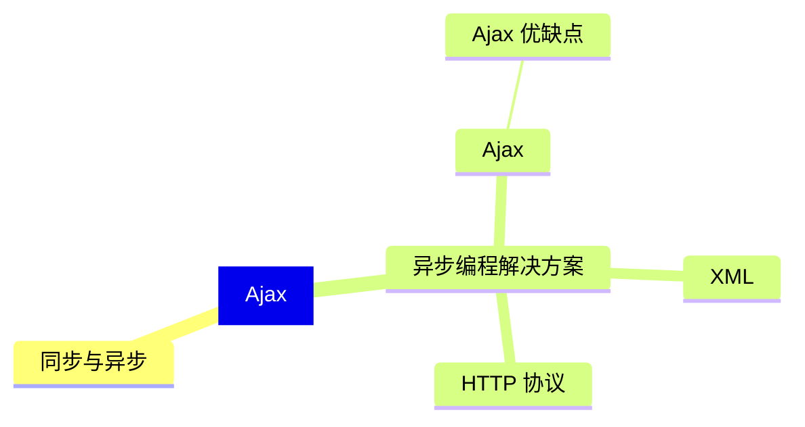
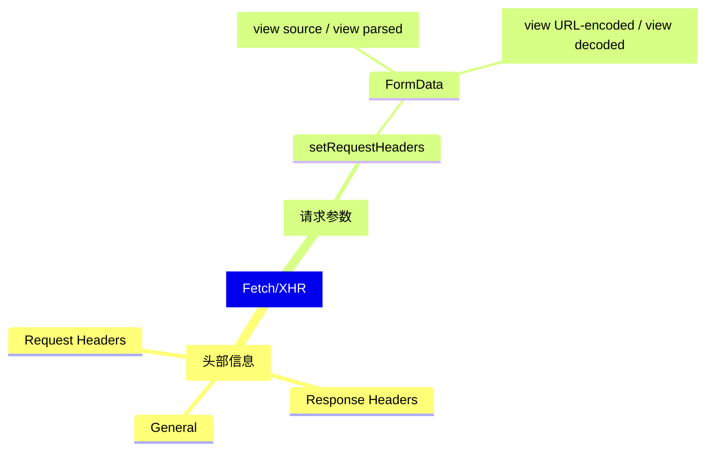

```JavaScript
  function ajax(rMethod, url, callback, params = '') {
    // 1. 创建 ajax 对象
    var xhr = new XMLHttpRequest()
    xhr.responseType = 'json'
    // 2. 初始化 ajax方法和请求地址
    url += Date.now() // 解决 IE 浏览器缓存问题
    xhr.open(rMethod, url)
    // == 设置请求头 ==
    // xhr.setRequestHeader('content-type', 'application/x-www-form-urlencoded')
    xhr.setRequestHeader('name', 'mouses')
    /**
     * 3. 发起 ajax 请求
     * 3.1 设置请求体
     */
    xhr.send(params)
    // 4. 处理响应结果
    xhr.onreadystatechange = function () {
        /**
         * readyState
         * 0 UNSENT 代理创建，但没有通过 open() 初始化请求
         * 1 OPENED 代理初始化，但 send() 没有发送请求
         * 2 HEADERS_RECEIVED 已接收到头部状态
         * 3 LOADING 响应加载中
         * 4 DONE 响应下载完成
         * 
         * =======
         * state 请求状态码
         * 200 请求成功
         */
        let text = json.parsed(xhr.response)
        if (xhr.readyState === 4) {
            if (xhr.status >= 200 && xhr.status < 300) {
                callback(xhr.response.name)
            }
        }
    }
  }
```

## Ajax 
前后端交互的技术实现，用户不需要刷新或跳转页面可查看相关数据信息。

### XML(eXtensible Markup Language)
> XML 可标记语言，用来传输和存储数据，与 HTML(Hyper Text Markup Language) 中的预标签一样，不同的是 HTML 是预定义标签，XML 是自定义标签，用来表示一些数据。如下：

```xml
 <staff>
  <name>Mouses</name>
  <gender>女</gender>
  <department>IT</department>
 </staff>
```

### Ajax 优缺点
* 优点
  * 不需要刷新页面与服务器通信
  * 允许用户根据事件更新页面部分内容
* 缺点
  * 没有浏览历史，页面不能回退
  * 存在跨域问题
  * SEO（Search Enginer Optimization） 不友好，爬虫无法获取页面信息。

### [HTTP](/2018/05/23/http/)

### Chrome 中的 Ajax 开发工具功能点


## <font color='#f33'>Provisional headers are shown</font>
<span class='custom-box custom-box-933'>Access to XMLHttpRequest at 'http://127.0.0.1:8080/server' from origin 'null' has been blocked by CORS policy: Response to preflight request doesn't pass access control check: No 'Access-Control-Allow-Origin' header is present on the requested resource.</span>

> 自定义请求引起的报错，解决方法如下：
```JavaScript
  // 客户端
  ...
    xhr.setRequestHeaders('name', 'mouses')
  ...

  // 服务器端
  ...
    app.all('.../api/...', (request, response) {
      response.setHead('access-control-allow-origin', '*')
      response.setHead('access-control-allow-headers', '*')
    })
  ...
```

## <span class='custom-box custom-box-933'>Uncaught DOMException: Failed to set the 'responseType' property on 'XMLHttpRequest': The response type cannot be set if the object's state is LOADING or DONE.</span>
### readystate 的几种状态
|状态码|解释|
|--|--|
|0|UNSENT 代理创建，但没有通过 open() 初始化请求|
|1|OPENED 代理初始化，但 send() 没有发送请求|
|2|HEADERS_RECEIVED 已接收到头部状态|
|3|LOADING 响应加载中|
|4|DONE 响应下载完成|

> 对象状态是 LOADING 或 DONE 时不能设置响应类型。
  所以 xhr.readystate = 'json' 要写在 xhr.open() 初始化之前

### Ajax 中 IE 缓存问题
IE 浏览器会对 ajax 请求进行缓存
> xhr.open('get', 'http://localhost:8080/getIE?t='+Date.now()) 加时间戳，让浏览器认为每次都是一个新请求
```JavaScript
  function ajax() {
    // 创建 AJAX 请求对象
    var xhr = new XMLHttpRequest()
    // 初始化请求
    xhr.open('get', 'http://localhost:8080/getIE?t='+Date.now())

    // 发起请求
    xhr.send()

    // 处理响应
    xhr.onreadystatechange = function() {
      if(xhr.readyState === 4) {
        if(xhr.state >= 200 && xhr < 300) {
          resultDOM.innerHTML = xhr.response
        }
      }
    }
  }
```