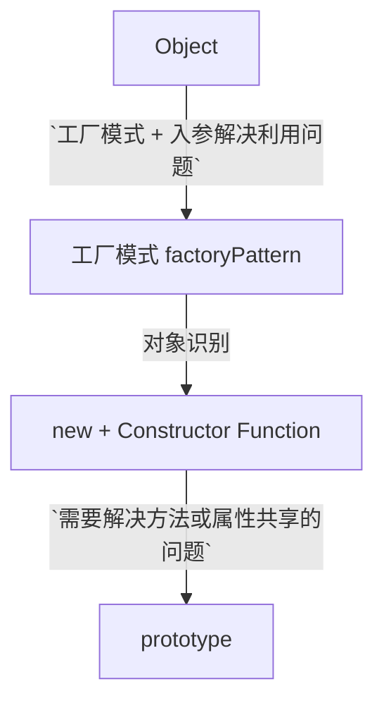
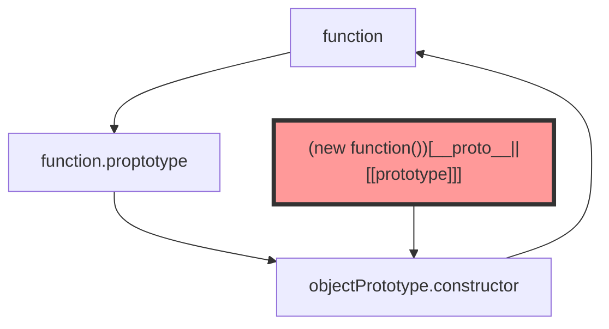

[comment]: <> (constructor 不指向原构造函数的坏处)

## JavaScript 对象与对象属性
```javascript
let obj = {v: 1, o: undefined}
console.log('o' in obj, obj.o) // true undefined
console.log('b' in obj, obj.b) // false undefined
```
<font color="#f33">虽然，属性值都是 undefined，但 **特性名不存在与特性值赋为 undefined 是不同的，** 可以用 `in` 运算符，查看对象是否有某个属性</font>

> JavaScript 通过一些属性时都会带有一些特征值，ECMA-262 定义的，只有内部使用的，外部不能访问的特性，初期是为了实现 JavaScript 引擎使用的。具体如下表

### 数据属性
|characteristic|description|
|----|----|
|[[Configurable]]|能否通过 delete 删除属性，然后重新定义属性，能否修改属性的特性，能否把属性修改为访问器属性|
|[[Enumerable]]|是否可以通过 for-in 循环枚举属性|
|[[Writable]]|能否修改属性的值|
|[[Value]]|包含这个属性的数据值|

<a href="#useDefineProperty"><font color="#f33">**使用 Object.defineProperty 定义属性特性**</font></a>

### 访问器属性
访问器属性不包含数据，只有 getter,setter 函数。读取访问器属性时会调用 getter 函数，这个函数负责返回有效的值，setter 负责写入，处理新数据

|characteristic|description|
|---|----|
|[[Configurable]]|能否通过 delete 删除属性，或修改为数据属性|
|[[Enumerable]]|是否能通过 for-in 枚举属性|
|[[Get]]|读取属性时调用|
|[[Set]]|设置属性时调用|

## 创建对象
### 创建字面量(Literal)对象
```JavaScript
let myBaby = {
  age: 2,
  name: 'Audrey'
}
```

### 创建实例对象
```JavaScript
let baby = new Object()
baby.name = 'Audrey',
baby.age = 2
```

> 开发过程中实际多采用字面量形式创建对象，<u>字面量对象避端是<font color="#FFD700">产生大量重复代码</font>**</u>

## <a id="factoryPattern" href="#factoryPattern">工厂模式——<font color="#f99">解决复用</font></a>
```JavaScript
function baby(name, age) {
  return {
    name,
    age
  };
}

let Audrey = baby('Audrey', 2)
let Gulu = baby('Gulu', 2)

Audrey instanceof baby
// false
Audrey instanceof Object
// true
Object.prototype.toString.call(Audrey)
// {}__proto__: Object
```

## 构造函数 + new——<font color="#f99">解决对象识别问题</font>
> 解决对象识别问题 `Audrey instanceof object` 结果 true，使得 `Audrey instanceof baby` 为 true

ECMASript 中的构造函数可以用来创建指定类型的对象
#### 构建构造函数的理解
对比工厂模式，按以下方式创建一个构造函数：
1.  依照(Object oriented)思想，区别普通函数，方法名首字母大写。如 `Baby`;
2.  不需要 `new object()` 或 声明 `{}`
3.  将**属性和方法**赋值给 `this`。从这里可以看出，`this` 首先是一个对象。[关于 this 的理解，可从 JavaScript 执行上下文的视角看](https://helenzhanglp.github.
    io/2020/11/18/%E6%B5%8F%E8%A7%88%E5%99%A8%E5%B7%A5%E4%BD%9C%E5%8E%9F%E7%90%86%E2%80%94%E2%80%94Javascript%E6%89%A7%E8%A1%8C%E6%9C%BA%E5%88%B6/)
    
4.  不需要 `return` 语句

```JavaScript
function Baby(name, age) {
    this.name = name;
    this.age = age
}
```
#### 构造函数调用 —— 普通调用
```javascript
// 普通调用
Baby('Audery',4)
window.name // Aduery
window.age // 4
```
<font color="#f33">构造函数当普通函数调用时，在 window 环境中调用，this 指向 window 对象，属性绑定在 window 上</font>
#### 构造函数调用 —— call/apply 在部分
```javascript
var Cat = new Object()
Baby.call(Cat, 'Cat', '0.5')
Cat.name // Cat
Cat.age // 0.5
```
<font color="#f33">在局部范围内调用</font>

构造函数调用 —— new 实例
```javascript
// new 关键字实例化构造函数
let Audrey = new Baby('Audrey', 2)
Audrey instanceof Baby // true
Audery instanceof Object // true
/* Baby {name: "Audrey", age: 2}
  age: 2
  name: "Audrey"
    __proto__:
      constructor: ƒ Baby(name, age)
        __proto__: Object */
```
> new 关键字 + 函数（函数名以大写字母开头），为封装对象建构的流程的函数称为 **构造函数**
> this 是 new 关键字的实例，构造函数执行结束后，作为结果 return


构造函数不需要写 return 语句，**如果有写，就返回 return 的值**
像 JavaScript 标准 API 中，像 `Number` 即可以当普通函数 `Number('OxFF')` 调用。
又可以使用构造函数方式调用 `new Number(OXFF)`。
ES6 中，可以使用 **`new. target`** 检测构造函数中是否明确撰写 return <u>使用 new 构建的实例，new.target 代表了构造函数或类本身；否则就是 undefined</u>

<font color="#f33">构造函数的每一个方法都要在新的实例上创建一次</font>



## 原型模式
每个函数都有一个 prototype，它是一个指针，指向一个对象（由特定类型的所有实例**共享**的属性和方法），即函数的原型对象
所有原型对象都会自动获取一个 constructor，constructor 包含一个指向 prototype 属性所在函数的指针
`Audery.constructor === Baby` 对象 constructor 是用来标识对象类型



### 原型相关方法
|API|description|
|---|---|
|Fn.prototype.isPrototypeOf(fn1)|实例 fn1 的原型是不是 Fn.prototype|
|Object.getPrototypeOf(fn1)|返回 Fn.prototype 原型对象|
|fn1.hasOwnProperty('attribute')|检测属性是否存在于实例中，返回 true 表示该属性存在于实例中|
|Object.getOwnPropertyDescriptor()|获取实例属性操作符|
|Object.keys()|返回对象所有可枚举的属性的字符串数组|
|Object.getOwnPropertyNames()|获取所有实例属性，无论是否可枚举|


> 实例和原型中均定义相同属性，实例属性会覆盖原型属性。搜索某个值是先搜索实例属性再搜索原型属性。<u>确实需要访问原型属性，可以用 delete 删除实例属性</u>

### in 操作符
对象能够访问指定属性时返回 true。不管是实例属性还是原理对象属性
```javascript
name in audery // true
```

<font color="#f33">in + fn1.hasOwnProperty 判断属性存在于原型</font>
```javascript
hasOwnProperty(property, newInstance) {
    return property in newInstance && !newInstance.hasOwnProperty(property)
}
```

### for-in 操作符
for-in 操作符，返回所有能够通过对象访问的、可枚举的实例属性和原型属性。<u>覆盖了原型中可枚举的原型属性的实例属性可枚举，可用 for-in 遍历<font color="#f33">IE 早期存在 bug</font></u>

### 构造函数原型的几种写法
```javascript
function Person(){}
Person.prototype.name = 'hel'
Person.prototype.age = 30

console.log((new Person()).__proto__.constructor) // f Person(){}

function Cat(){
    this.gender = 'female'
    let b = '123'
}
Cat.prototype = {
    name: 'hel',
    age: 30
}
let gumi = new Cat()
console.log(gumi.__proto__.constructor) // ƒ Object() { [native code] }
console.log(gumi.gender) //undefined
```
> Cat 实例的写法，导致 constructor 不指向 function Cat()

```javascript
function Cat(){
    this.gender = 'female'
    let b = '123'
}
Cat.prototype = {
    name: 'hel',
    age: 30
}

Object.defineProperty(Cat.prototype,'constructor', {
    emumerable: false,
    value: Cat
})

let gumi = new Cat()
console.log(gumi.__proto__.constructor) 
/* ƒ ƒ Cat(){
this.gender = 'female'
}*/
console.log(gumi.gender) // female
```

## ES6 类模拟
### 模拟 static
常量需要仿 static，如 `Math.PI`

### 模拟 私有属性
JavaScript 没有 private 之类的语法，**可以通过 Closure 模拟**
私有属性只有访问权限，不修改
<font color="#f99">**1. 用 getter 将变量变为私有属性**</font>
```JavaScript
function Account(name, balance) {
    this.getName = () => name;
    this.getBalance = () => balance;
    
    this.getInfo = () => `${name} + ' ' +${balance}`
}

let account = new Account('helen', 3000)
console.log(account.name)   // undefined
console.log(account.getName) // helen
console.log(name in account)    // false
```

<a id="useDefineProperty" color="#f99">**2. 用 `Object.defineProperty()` 定义属性**</a>
> `Object.defineProperty()` 参数一，接收一个对象；参数二，接收想设定的特性名称；参数三是属性描述，采用选项对象的方式来指定属性
> __defineGetter__() 和 __defineSetter__() 兼容 safari3, chrome 1

```JavaScript
function Account(name,balance) {
    Object.defineProperty(this, 'name', {
        get: () => name
    })
    Object.defineProperty(this, 'balance', {
        get: () => balance
    })

    this.withdraw = (money) => {
        if(money > this.balance) console.warn('sorry, your credit is running low')
        balance -= money
    }
    
    this.toString = () => `${this.name}, ${this.balance}`
}

let account = new Account('helen', 1000)
account.withdraw(500)
console.log(account.balance)
```

> `Object.defineProperties()` 设置多个私有属性

```JavaScript
function Account(name, balance) {
    Object.defineProperties(this, {
        name: {
            get: () => name
        },
        balance: {
            get: () => balance
        }
    })
    
    this.withdraw = (money) => {
        if(money > this.balance) console.warn('sorry, your credit is running low')
        balance -= money
    }
    
    this.toString = () => `${this.name}, ${this.balance}`
}

let account = new Account('helen', 1000)
account.withdraw(500)
account.toString()
```

#### 特性描述器
从 ES5 开始，每个特性都由 **value, writable, enumerable, configurable** 4 个特性设定。

|特性|描述|
|---|----|
|value|特性值|
|writable|特性值是否可改|
|enumerable|特性是否可枚举|
|configurable|能否用 `delete` 删除，或用 Object.defineProperty/Object.defineProperties 修改属性|

查询或设定属性时，以上 4 个属性会聚合在对象上，称为特性描述器（Property descriptor）

#### 有关描述器特性的几个 API
|API|描述|
|---|---|
|Object.getOwnPropertyDescriptor()|取特性描述器信息，具体如上表|
|Object.defineProperty()|定义属性，使用见上 demo-Account-1|
|Object.defineProperties()|一次性定义多个属性，使用见上 demo-Account-2|

<br/>

#### 详解对象定义与属性描述器
<font color="#f99">1.   直接对对象新增特性</font>
```JavaScript
let obj = {name: 'helen'}
Object.getOwnPropertyDescriptor(obj, 'name')
```
> {value: "helen", writable: true, enumerable: true, configurable: true}

<font color="#f99">2.   Object.defineProperty 定义特性</font>
```JavaScript
let obj = {}
Object.defineProperty(obj, 'name', {
    value: 'helen'
})
Object.getOwnPropertyDescriptor(obj, 'name')
```
> {value: "helen", writable: false, enumerable: false, configurable: false}

<font color="#f33">
`use strict`+`writable:false` 时，修改变量，引发 TypeError。<br />
`use strict`+`configurable:false`时，删除或使用 Object.defineProperty 等修改时，引发 TypeError。<br /></font>
 
```JavaScript
// Account demo
...
for(let i in account) {
    console.log(i, account[i])
}
{/*VM2619:2 withdraw (money) => {
        if(money > this.balance) console.warn('sorry, your credit is running low')
        balance -= money
    }
VM2619:2 toString () => `${this.name}, ${this.balance}` */}
```
<u>**Object.defineProperty 或 Object.defineProperties 定义的属性，默认 writable: false, enumerable: false, configurable: false 所以，只有方法可枚举**</u>
[利用 writable 属性写一个不可枚举数组，具体代码见 gitHub](https://github.com/HelenZhangLP/demo/blob/draft/js/Object/index.html)

### 扩充、弥封、冻结
|API|Description|
|---|-----------|
|Object.preventExtensions()|限定对象扩充。指定对象，将对象标示为无法扩充，调用传回对象本身|
|Object.isExtensible()|测试对象是否可以扩充。|
|Object.seal()|对象密封，密封对象不能扩充或删除对象上的特性，也不能修改描述器，但可以修改特性值（writable: true）|
|Object.isSeal()|判断对象是否被密封|
|Object.freeze()|解冻对象|
|Object.isFreeze()|判断是否被解冻|

> Object.preventExtensions()，限定扩充的对象只是无法新增。如果对象属性 writable: true ，则可以修改。若 configurable: true，可以使用 delete 删除。<u>设置为无法扩充的对象，则无法重设为可扩充对象</u>

## 原型对象
### 构造函数与 prototype
```JavaScript
function a() {}
a.prototype // {constructor: ƒ a()}
a.prototype.constructor // ƒ a() {}
```
每个函数都有 prototype 特性
`a.prototype instance a` 得到的是 false
`a.prototype instance object` 得到的是 true
<font color="#f33">**那么基本上，函数的 prototype 是 object 的实例**</font>
```JavaScript
let A = new a()
{/*A
a {}
    __proto__: Object
*/}
A instanceof a // true
{/*A.__proto__.constructor: ƒ a()*/}
A.__proto__ === a.prototype // true
```
使用 new 关键字实例函数，将返回一个对象，该对象的 __proto__ 特性 与 该函数的 prototype 共同指向 constructor
<font color="#f33">**实例的 __proto__ 特性用来取函数的原型对象<u>ES5 建议使用 Object.getPrototyepOf() 取实例的原型对象**</u></font>
```JavaScript
A.__proto__ === Object.getPrototypeOf(A) // true
A.__proto__ === a.prototype // true
```
[参考实例，符合内建 API 惯例的实例](https://github.com/HelenZhangLP/demo/blob/draft/js/Object/standObjectModule.js)
> hasOwnProperty() 判断实例本身是否具有某个属性

[comment]: <> (### __proto__ 与 Object.create&#40;&#41;)

[comment]: <> (### 原型链)

[comment]: <> (#### ** 构造函数 ** 中引用类型与函数)

[comment]: <> (```JavaScript)

[comment]: <> (function Baby&#40;name, age&#41; {)

[comment]: <> (  this.name = name;)

[comment]: <> (  this.age = age;)

[comment]: <> (  this.walk =  function &#40;&#41; {)

[comment]: <> (    console.log&#40;this.name + 'is learning to walk'&#41;)

[comment]: <> (  })

[comment]: <> (})

[comment]: <> (let Audrey = new Baby&#40;'Audrey', 2&#41;)

[comment]: <> (let Gulu = new Baby&#40;'Gulu', 2&#41;)

[comment]: <> (Audrey.walk&#40;&#41;)

[comment]: <> (Gulu.walk&#40;&#41;)

[comment]: <> (Audrey.walk == Gulu.walk)

[comment]: <> (// false)

[comment]: <> (```)

[comment]: <> (> 两个对象未指向同一个函数引用，应该是创建了两个函数)

[comment]: <> (#### ** 构造函数 + 原型方法 **)

[comment]: <> (```JavaScript)

[comment]: <> (function Baby&#40;name, age&#41; {)

[comment]: <> (  this.name = name;)

[comment]: <> (  this.age = age;)

[comment]: <> (})

[comment]: <> (Baby.prototype.walk =  function &#40;&#41; {)

[comment]: <> (  console.log&#40;this.name + 'is learning to walk'&#41;)

[comment]: <> (})

[comment]: <> (```)

[comment]: <> (> 如上，就能保证引用类型数据独立，方法共享)

[comment]: <> (### 基于原型的继承)

[comment]: <> (### 重新定义方法)

[comment]: <> (## 类语法)

[comment]: <> (```mermaid)

[comment]: <> (graph TD)

[comment]: <> (Constructor[构造函数&#58;来初始化相关特性&#44;对象特性因对象传参而异&#44;可能包含私有属性])

[comment]: <> (Prototype&#40;原型上定义共有属性&#41;)

[comment]: <> (style Prototype fill: aliceblue)

[comment]: <> (```)

