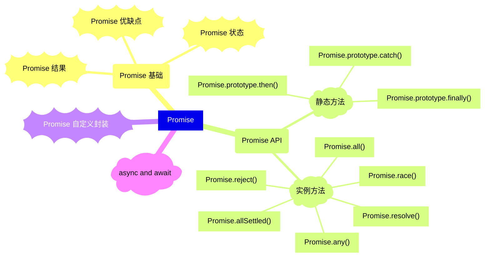
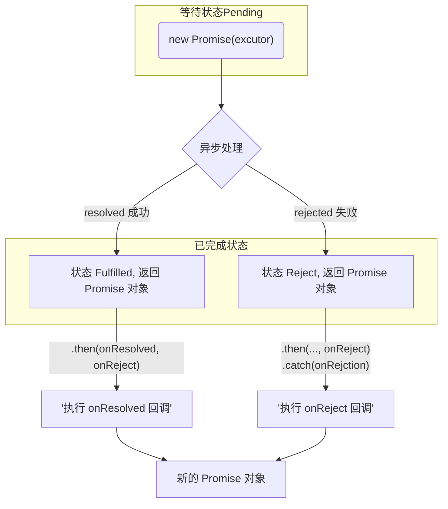
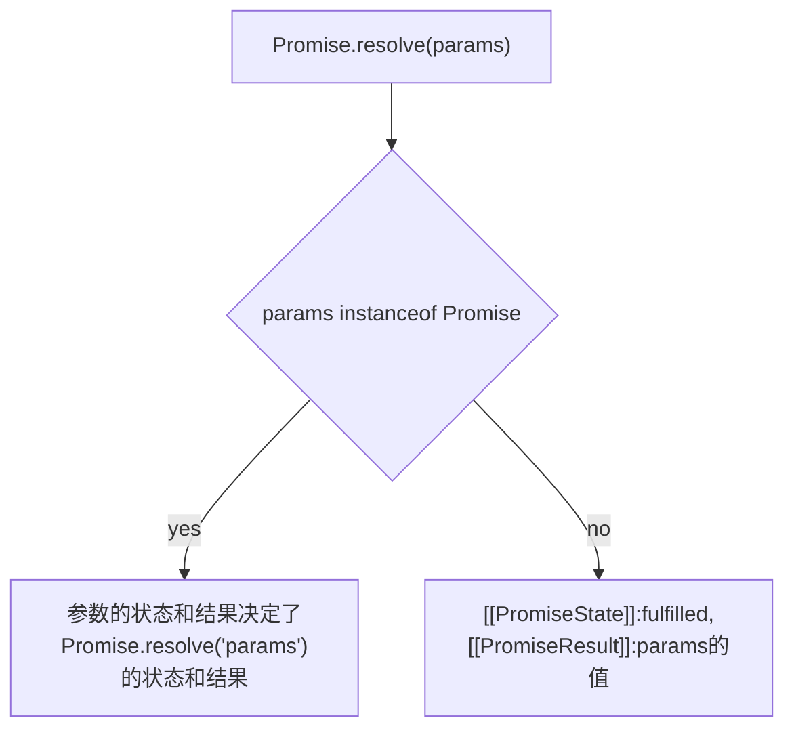
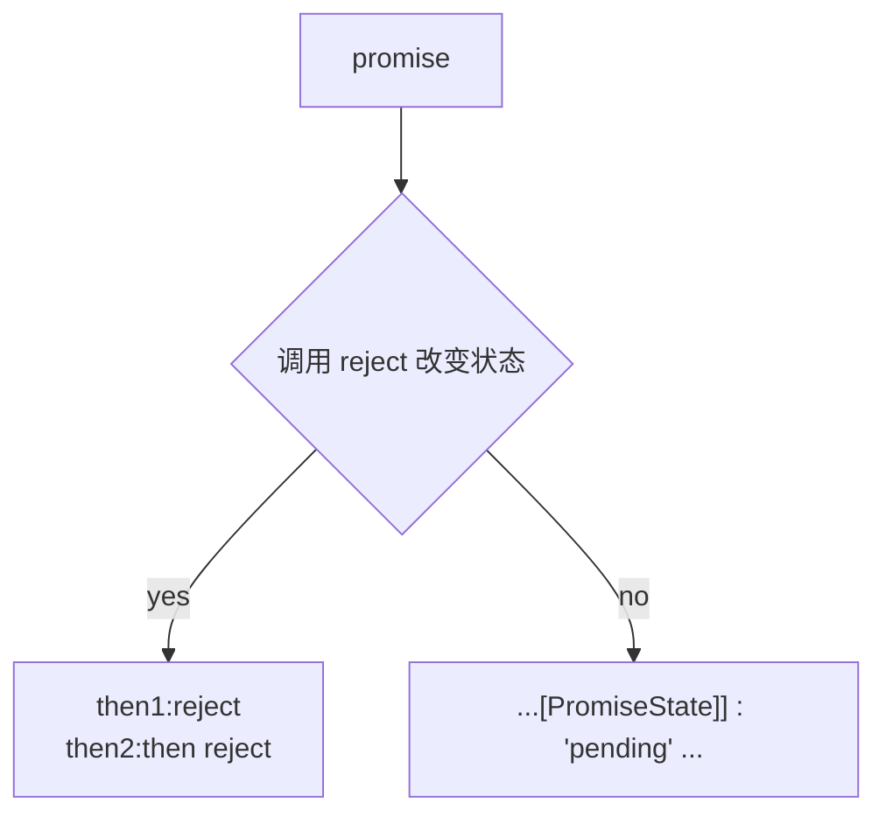
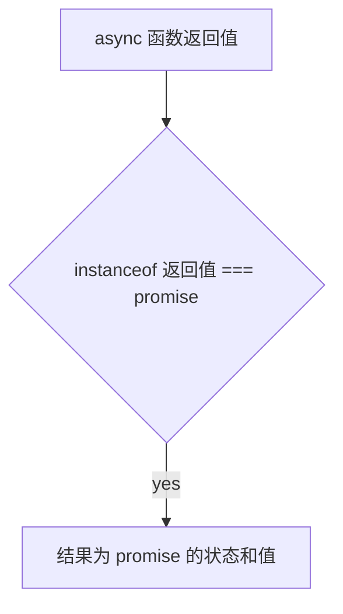

> Promise 是 ES6 规范新增技术，是<u>用来封装一个异步操作，并获取其成功/失败结果值。</u><span class='custom-box custom-box-933'>是 JS 中进行异步编程的最新解决方案（Promise 之前采用回调函数）</span>

## Promise 基础
### Promise 的优点
* Promise 支持链式调用，解决回调地狱问题
> [回调地狱](/2021/01/13/浏览器工作原理（N）使用Promise，告别回调函数/#新的问题：回调地域) —— 回调函数嵌套调用，外部回调函数异步执行的结果是嵌套的回调执行的条件。
  回调函数不便于阅读；不便于异常处理
* 指定回调函数的方式更加灵活

<div style="display:none">
```JavaScript
{ [Function: Promise]
  [length]: 1,
  [name]: 'Promise',
  [prototype]:
   Promise {
     [constructor]: [Circular],
     [then]: { [Function: then] [length]: 2, [name]: 'then' },
     [catch]: { [Function: catch] [length]: 1, [name]: 'catch' },
     [chain]: { [Function: chain] [length]: 2, [name]: 'chain' },

     [Symbol(Symbol.toStringTag)]: 'Promise' },
  [reject]: { [Function: reject] [length]: 1, [name]: 'reject' },
  [all]: { [Function: all] [length]: 1, [name]: 'all' },
  [race]: { [Function: race] [length]: 1, [name]: 'race' },
  [resolve]: { [Function: resolve] [length]: 1, [name]: 'resolve' },
  [defer]: { [Function: defer] [length]: 0, [name]: 'defer' },
  [accept]: { [Function: accept] [length]: 1, [name]: 'accept' },
  [Symbol(Symbol.species)]: [Getter] }
}
```  
### Demo
```JavaScript
export function asyncRandom() {
    return new Promise((resovle, reject) => {
        setTimeout(()=>{
            let random = rand(1,100)
            if (random >= 30) {
                resovle(random) // [[PromiseState]] ==> rejected，[[PromiseResult]]: 51
            } else {
                reject(random) // [[PromiseState]] ==> fulfilled，[[PromiseResult]]: 17
            }
        }, 1000)
    })
}
```
</div>

* 是一个`构造函数`；
* 用来<span class='custom-box custom-box-933'>封装一个异步操作</span>
* <span class='custom-box custom-box-393'>可以获取成功/失败状态和结果值</span>`PromiseState,PromiseResult`。

> `new Promise(excutor)`
* excutor 函数，是一个执行器 `(resolve, reject) =>{}`。该执行器中封装异步代码。
* resolve 函数，内部定义成功时调用
* reject 函数，内部定义失败时调用

```JavaScript
// 打印 Promise 实例对象
console.log(new Promise((resolve, reject)=>{}))
  /* Promise {<pending>}
     [[Prototype]]: Promise
     [[PromiseState]]: "pending"
     [[PromiseResult]]: undefined
  */
```

### Promise 的状态 [[PromiseState]]
* Promise 的状态有三种：
  * Pending 等待状态
  * 已完成状态
    - Fulfilled
    - rejected

  ```mermaid
  flowchart LR
  subgraph 等待状态
    Pending
  end
  subgraph 已完成状态
    fulfilled
    rejected
    end 
    Pending --> fulfilled
    Pending --> rejected
  ```
* 修改 Promise 状态的几种方式:
  * 调用 resolve `[[PromiseState]]: fulfilled`;
  * 调用 reject `[[PromiseState]]: rejected`;
  * 抛出 Error `throw Error`

  <span class='custom-box custom-box-933'>Promise 状态只能更改一次。</span>

  ```JavaScript
  new Promise((resolve, reject) => {
    // 1 resolve('fulfilled')
    // 2 reject('rejected')
    throw 'error' // Promise {<rejected>: 'error'}[[Prototype]]: Promise[[PromiseState]]: "rejected"[[PromiseResult]]: "error"
  })
  ``` 

### Promise 的值 [[PromiseResult]]
> 保存着异步任务的结果，由 resolve, reject 修改或返回。

### Promise 工作流


## Promise API
### Promise 构造函数
```JavaScript
/**
 * excutor 执行器函数 (resovle, reject) => {} 同步调用
 * resolve 异步操作成功回调
 * reject 异步操作失败回调
 */ 
function Promise(excutor) {}
```

### Promise 实例方法
#### Promise.prototype.then()
```JavaScript
// 根据 PromiseState 调用不同状态的回调函数。
// fulfilled 状态对应 onFulfilled，状态为 rejected 调用 onRejected 
// 返回新的 Promise 对象
Promise.prototype.then(onFulfilled, onRejected)
```

#### Promise.prototype.catch()
> `Promise.prototype.then` 对于失败回调的单独封装
```JavaScript
Promise.prototype['catch'] = function (onRejected) {
  return this.then(null, onRejected);
};
```

#### Promise.prototype.finally()
> 注册一个 promise 状态变化时必须执行的回调函数，无论状态成功还是失败。返回 Promise 对象，支持继续链式调用。 
<font color="#f33">避免在 promise 的 then() 或 catch() 中处理相同的代码</font>


### Promise 静态方法
#### Promise.resolve()
> `Promise.resolve(params)`

---
<center><b>DEMO</b></center>

---

```JavaScript
// value 为数据，返回 状态为 Fulfilled 状态的 Promise 对象
Promise.resolve('resolve')
/**
 * Promise {<fulfilled>: 'resolve'}
	[[Prototype]]: Promise
	[[PromiseState]]: "fulfilled"
	[[PromiseResult]]: "resolve"
*/
// value 为 Promise 实例，并使用 reject 进行状态修改，返回 状态为 rejected 的 Promise 对象
Promise.resolve(new Promise((resolve, reject) => {
	reject('error')
}))
/**
 * Promise {<rejected>: 'error'}
	[[Prototype]] : Promise 
	[[PromiseState]] : "rejected" 
	[[PromiseResult]] : "error"
 */
```
<span class='custom-box custom-box-933'>Uncaught (in promise) error</span>
<span class='custom-box custom-box-393'>[[PromiseState]] : "rejected" ，状态必须被 Promise.catch 捕获</span>

```JavaScript
// value 可以是数据也可以是 Promise 对象
// 返回一个 Promise 对象
Promise.resolve = function (value) {
  if (value instanceof Promise) return value;
 
  if (value === null) return NULL;
  if (value === undefined) return UNDEFINED;
  if (value === true) return TRUE;
  if (value === false) return FALSE;
  if (value === 0) return ZERO;
  if (value === '') return EMPTYSTRING;

  if (typeof value === 'object' || typeof value === 'function') {
    try {
      var then = value.then;
      if (typeof then === 'function') {
        return new Promise(then.bind(value));
      }
    } catch (ex) {
      return new Promise(function (resolve, reject) {
        reject(ex);
      });
    }
  }
  return valuePromise(value);
};
```

#### Promise.reject()
> `Promise.reject(params)`快速返回失败 Promise 对象
```JavaScript
  Promise.reject(Promise.resolve(123))
  /**
   * [[Prototype]] : Promise 
   * [[PromiseState]] : "rejected" 
   * [[PromiseResult]] : Promise
   */ 
```
<span class='custom-box custom-box-393'>无论参数是什么类型，即使参数返回状态为 fulfilled 的 Promise，结果也是失败 rejected。</span>
```JavaScript
Promise.reject = function (value) {
  return new Promise(function (resolve, reject) {
    reject(value);
  });
};
```

#### Promise.all()
> 参数 promises，包含多个 promise 的数组
  返回结果：promises 数组中，所有状态成功，返回数组，数组元素为每个 promise resolve 结果。失败返回结果则为 promises 数组中，第一个 reject 的结果
  
```JavaScript
  Promise.all = function (arr) {
  var args = iterableToArray(arr);

  return new Promise(function (resolve, reject) {
    if (args.length === 0) return resolve([]);
    var remaining = args.length;
    function res(i, val) {
      if (val && (typeof val === 'object' || typeof val === 'function')) {
        if (val instanceof Promise && val.then === Promise.prototype.then) {
          while (val._state === 3) {
            val = val._value;
          }
          if (val._state === 1) return res(i, val._value);
          if (val._state === 2) reject(val._value);
          val.then(function (val) {
            res(i, val);
          }, reject);
          return;
        } else {
          var then = val.then;
          if (typeof then === 'function') {
            var p = new Promise(then.bind(val));
            p.then(function (val) {
              res(i, val);
            }, reject);
            return;
          }
        }
      }
      args[i] = val;
      if (--remaining === 0) {
        resolve(args);
      }
    }
    for (var i = 0; i < args.length; i++) {
      res(i, args[i]);
    }
  });
};
```
---
<center><b>DEMO</b></center>

---
```JavaScript
let p1 = new Promise((resolve, reject) => {
	resolve('resolve p1')
})
let p2 = Promise.resolve('resolve p2')
let p3 = Promise.resolve('resolve p3')
console.log(Promise.all([p1,p2,p3]))
/**
 * Promise {<pending>}
	[[Prototype]] : Promise 
	[[PromiseState]] : "fulfilled" 
	[[PromiseResult]] : 
		Array(3) 0 : "resolve p1" 1 : "resolve p2" 2 : "resolve p3" length : 3
 */

let p4 = Promise.reject('reject p4')
let p5 = Promise.reject('reject p5')
console.log(Promise.all([p1,p2,p3,p4,p5]))
/**
 * Promise {<pending>}[[Prototype]]: Promise[[PromiseState]]: "rejected"[[PromiseResult]]: "reject p4"
 */ 
```

#### Promise.race
> 参数为 Promise 数组，返回结果与状态为数组中第一个返回 Promise 的状态与值
```JavaScript
Promise.race = function (values) {
  return new Promise(function (resolve, reject) {
    iterableToArray(values).forEach(function(value){
      Promise.resolve(value).then(resolve, reject);
    });
  });
};
```
---
<center><b>DEMO</b></center>

---
```JavaScript
let p1 = new Promise((resolve, reject) => {
	setTimeout(()=>resolve('resolve p1'), 1000)
})
let p2 = Promise.resolve('resolve p2')
let p3 = Promise.resolve('resolve p3')
console.log(Promise.race([p1,p2,p3]))
/**
 * Promise {<pending>}[[Prototype]]: Promise[[PromiseState]]: "fulfilled" [[PromiseResult]]: "resolve p2"
 */

let p4 = Promise.reject('reject p4')
let p5 = Promise.reject('reject p5')
console.log(Promise.all([p1,p4,p5,p2,p3]))
/**
 * Promise {<pending>}[[Prototype]]: Promise[[PromiseState]]: "rejected" [[PromiseResult]]: "reject p4"
 */ 
```

## Question
### Q2 - Promise 能否执行多个回调
```JavaScript
let promise = new Promise((resolve, reject) => {
  // reject('reject') 
})

// then 处理 promise 结果
promise.then(null,v=>{console.log(v)}) // reject || Promise {<pending>} [[Prototype]] : Promise [[PromiseState]] : "pending" [[PromiseResult]] : undefined

// then 再次处理 promise 的结果
promise.then(null,v=>{console.log('then', v)}) // then reject
```

> 只要状态发生变化，可以通过 `then` 执行多个回调

### Q3 - 改变 Promise 状态和指定回调函数谁先谁后
...???

### Q4 - promise.then() 返回的 Promise 结果状态由什么决定
> promise.then(onFulfilled, onRejected) 返回的 Promise 状态由 onFulfilled/onRejected 的返回值决定
* onFulfilled/onRejected 返回非 Promise，那么 then() 返回的 Promise 状态为 fulfilled
* onFulfilled/onRejected 抛出异常，那么 then() 返回的 Promise 状态为 rejected
* onFulfilled/onRejected 返回 Promise，那 then() 返回的 Promise 的状态和结果值为，回调函数中返回的 Promise 的状态和结果。
```JavaScript
let promise = new Promise((resolve, reject) => {
  reject('error')
})
console.log(null,promise.then(null,v=>{
  return undefined
})) // Promise {<pending>} [[Prototype]] : Promise [[PromiseState]] : "fulfilled" [[PromiseResult]] : undefined

console.log(null,promise.then(null,v=>{
  throw 'then error'
})) // Promise {<pending>} [[Prototype]] : Promise [[PromiseState]] : "rejected" [[PromiseResult]] : "then error"

console.log(null,promise.then(null,v=>{
  return Promise.reject('promise reject error')
})) // Promise {<pending>}[[Prototype]]: Promise[[PromiseState]]: "rejected"[[PromiseResult]]: "promise reject error"

console.log(null,promise.then(null,v=>{
  return Promise.resolve('promise resolve')
})) // Promise {<pending>} [[Prototype]] : Promise [[PromiseState]] : "fulfilled" [[PromiseResult]] : "promise resolve"
```

### Q5 - promise 如何串连多个操作任务
> promise.then(onFulfilled, onRejected) 返回 Promise 可以链式调用 then(onFulfilled, onRejected)，过程中可以通过修改 onFulfilled, onRejected 回调函数的返回值，从而改变 then 返回的 Promise 的状态和结果值
```JavaScript
let promise = new Promise((resolve, reject) => {
  resolve('ok')
})

promise.then(v=>{
  console.log(v)
  // 思考：是不是可以异步返回一个 promise
  return Promise.resolve('resolve')
}).then(v=>{
  console.log(v)
})
```

### Q6 - promise 异常传透
> promise 链处理过程中，遇到异常或 reject，会跳过中间的 then 链，直接执行 catch 处理异常。
```JavaScript
let promise = new Promise((resolve, reject) => {
  resolve('ok')
})
promise
.then(v=>{console.log(v);throw 'error';})
.then(v=>console.log(333))
.catch(e=>{console.error(e)})
```

### Q7 - 关于中断 promise 链
```JavaScript
let promise = new Promise((resolve, reject) => {
  resolve('ok')
})
// promiseState 处于 pending 态时，promise 链中断
promise.then(v=>{console.log(v); return new Promise(()=>{})})
.then(v=>console.log(v))
```

### Promise.promisify
> NodeJS 的函数风格转换为 Promise 方法，可以认为是一种语法粮。
[Promisify 的源码解析](https://segmentfault.com/a/1190000008479644)

## Promise 的拒绝
显式拒绝 —— 在一个 promise 的执行函数中调用传入的 reject 方法

隐式拒绝 —— 处理的一个 promise 的过程中招聘一个异常

## Promise
解决采用 callback 机制产生的如回调地狱一样的潜在问题，允许采用近乎同步的逻辑写异步代码

## async/await 异步编程的终级解决方案

> JavaScript 的 async/await 实现，也离不开 Promise，async 用于申明一个方法是异步的，await 用于等待一个异步方法执行完成。await 只能出现在 async 函数中。

### async 关键字
用于标记一个函数，该函数返回一个 promise 对象，promise 对象的结果由 async 函数执行的返回值决定。
#### async 如何处理它的返回值的
```javascript
async function fn() {
    return "hello async";
}

// 返回值
Promise {<resolved>: "hello async"}
__proto__: Promise
[[PromiseStatus]]: "resolved"
[[PromiseValue]]: "hello async"
```
> async 函数返回的是一个 Promise 对象，async 会把 return 变量通过 Promise.resolve() 封装成 Promise 对象。可以用 then() 链处理 Promise 对象，进行测试。
```javascript
async function fn() {
    return "hello async";
}

fn().then(res=>{console.log(res)})

// 返回值
hello async
Promise {<resolved>: undefined}__proto__: Promise[[PromiseStatus]]: "resolved"[[PromiseValue]]: undefined
```


## await

> async 函数返回 Promise, await 可以用于等待 async 异步的完成，异步操作返回的都是 promise, await 按顺序执行。

[更多案例](https://github.com/HelenZhangLP/demo/tree/master/node/node-demo/demo-1)