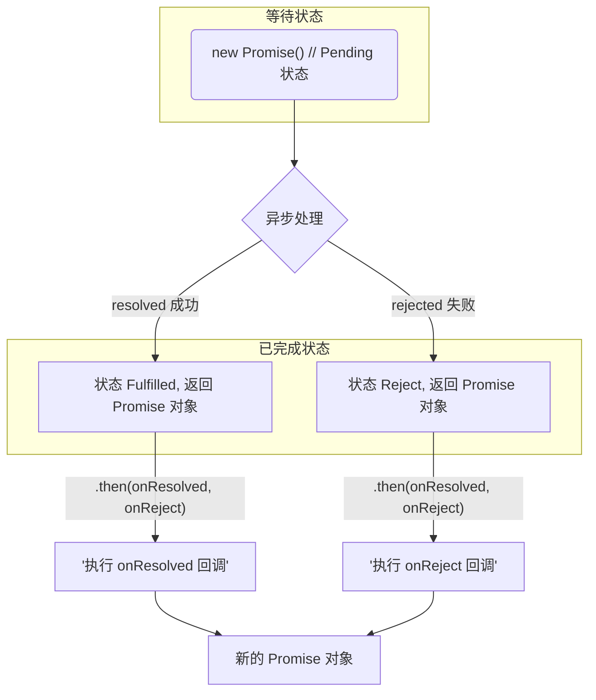

<!-- ## 同步与异步 -->

## 异步编程
* fs 文件操作
> 使用 Promise 封装文件读取，[DEMO 案例](https://github.com/HelenZhangLP/demo/blob/master/node/src/demo14/index.js)
	```JavaScript
	require('fs').readFile('index.html',(err, data) => {...})
	```

* 数据库操作
* AJAX
> 使用Promise 封装 AJAX，[DEMO 案例](https://github.com/HelenZhangLP/demo/blob/master/js/AJAX/index.html)
```JavaScript
$.get('server', data => {...})
```
* 定时器
```JavaScript
setTimeout(() => {...}, 1000);
```

## 异步编程解决方案：
* callback
* Promise(新的解决方案)

## Promise
* 是一个`构造函数`；
* 用来<span class='custom-box custom-box-933'>封装一个异步操作</span>
* <span class='custom-box custom-box-393'>可以获取成功/失败结果和值</span>`PromiseState,PromiseResult`。
```JavaScript
{ [Function: Promise]
  [length]: 1,
  [name]: 'Promise',
  [prototype]:
   Promise {
     [constructor]: [Circular],
     [then]: { [Function: then] [length]: 2, [name]: 'then' },
     [catch]: { [Function: catch] [length]: 1, [name]: 'catch' },
     [chain]: { [Function: chain] [length]: 2, [name]: 'chain' },

     [Symbol(Symbol.toStringTag)]: 'Promise' },
  [reject]: { [Function: reject] [length]: 1, [name]: 'reject' },
  [all]: { [Function: all] [length]: 1, [name]: 'all' },
  [race]: { [Function: race] [length]: 1, [name]: 'race' },
  [resolve]: { [Function: resolve] [length]: 1, [name]: 'resolve' },
  [defer]: { [Function: defer] [length]: 0, [name]: 'defer' },
  [accept]: { [Function: accept] [length]: 1, [name]: 'accept' },
  [Symbol(Symbol.species)]: [Getter] }
}
```

### Demo
```JavaScript
export function asyncRandom() {
    return new Promise((resovle, reject) => {
        setTimeout(()=>{
            let random = rand(1,100)
            if (random >= 30) {
                resovle(random) // [[PromiseState]] ==> rejected，[[PromiseResult]]: 51
            } else {
                reject(random) // [[PromiseState]] ==> fulfilled，[[PromiseResult]]: 17
            }
        }, 1000)
    })
}
```
### Promise 支持链式调用
> 可以解决回调地狱[关于回调地狱](/2021/01/13/浏览器工作原理（N）使用Promise，告别回调函数/#新的问题：回调地域)

### Promise 的状态 [[PromiseState]](Promise 的实例属性)
* Pending 等待状态
* 已完成状态
	- Fulfilled
	- rejected

### Promise 的值 [[PromiseState]](Promise 的实例属性)
> 保存着异步任务的结果，由 resolve, reject 修改或返回

### Promise 工作流


### Promise API
#### Promise 构造函数
```JavaScript
/**
 * excutor 执行器函数 (resovle, reject) => {} 同步调用
 * resolve 异步操作成功回调
 * reject 异步操作失败回调
 */ 
function Promise(excutor) {}
```
#### Promise.prototype.then
```JavaScript
// 根据 PromiseState 调用不同状态的回调函数。
// fulfilled 状态对应 onFulfilled，状态为 rejected 调用 onRejected 
// 返回新的 Promise 对象
Promise.prototype.then(onFulfilled, onRejected)
```
#### Promise.prototype.catch
> `Promise.prototype.then` 对于失败回调的单独封装
```JavaScript
Promise.prototype['catch'] = function (onRejected) {
  return this.then(null, onRejected);
};
```
<!-- #### Promise.prototype.all -->
#### Promise.resolve
```JavaScript
// value 可以是数据也可以是 Promise 对象
// 返回一个 Promise 对象
Promise.resolve = function (value) {
  if (value instanceof Promise) return value;
 
  if (value === null) return NULL;
  if (value === undefined) return UNDEFINED;
  if (value === true) return TRUE;
  if (value === false) return FALSE;
  if (value === 0) return ZERO;
  if (value === '') return EMPTYSTRING;

  if (typeof value === 'object' || typeof value === 'function') {
    try {
      var then = value.then;
      if (typeof then === 'function') {
        return new Promise(then.bind(value));
      }
    } catch (ex) {
      return new Promise(function (resolve, reject) {
        reject(ex);
      });
    }
  }
  return valuePromise(value);
};
```
---
<center><b>DEMO</b></center>

--- 
```JavaScript
// value 为数据，返回 状态为 Fulfilled 状态的 Promise 对象
Promise.resolve('resolve')
/**
 * Promise {<fulfilled>: 'resolve'}
	[[Prototype]]: Promise
	[[PromiseState]]: "fulfilled"
	[[PromiseResult]]: "resolve"
*/
// value 为 Promise 实例，并使用 reject 进行状态修改，返回 状态为 rejected 的 Promise 对象
Promise.resolve(new Promise((resolve, reject) => {
	reject('error')
}))
/**
 * Promise {<rejected>: 'error'}
	[[Prototype]] : Promise 
	[[PromiseState]] : "rejected" 
	[[PromiseResult]] : "error"
 */
```

#### Promise.reject
> 快速返回失败 Promise 对象
```JavaScript
Promise.reject = function (value) {
  return new Promise(function (resolve, reject) {
    reject(value);
  });
};
```
#### Promise.all
> 参数 promises，包含多个 promise 的数组
  返回结果：promises 数组中，所有状态成功，返回数组，数组元素为每个 promise resolve 结果。失败返回结果则为 promises 数组中，第一个 reject 的结果
  
```JavaScript
  Promise.all = function (arr) {
  var args = iterableToArray(arr);

  return new Promise(function (resolve, reject) {
    if (args.length === 0) return resolve([]);
    var remaining = args.length;
    function res(i, val) {
      if (val && (typeof val === 'object' || typeof val === 'function')) {
        if (val instanceof Promise && val.then === Promise.prototype.then) {
          while (val._state === 3) {
            val = val._value;
          }
          if (val._state === 1) return res(i, val._value);
          if (val._state === 2) reject(val._value);
          val.then(function (val) {
            res(i, val);
          }, reject);
          return;
        } else {
          var then = val.then;
          if (typeof then === 'function') {
            var p = new Promise(then.bind(val));
            p.then(function (val) {
              res(i, val);
            }, reject);
            return;
          }
        }
      }
      args[i] = val;
      if (--remaining === 0) {
        resolve(args);
      }
    }
    for (var i = 0; i < args.length; i++) {
      res(i, args[i]);
    }
  });
};
```
---
<center><b>DEMO</b></center>

---
```JavaScript
let p1 = new Promise((resolve, reject) => {
	resolve('resolve p1')
})
let p2 = Promise.resolve('resolve p2')
let p3 = Promise.resolve('resolve p3')
console.log(Promise.all([p1,p2,p3]))
/**
 * Promise {<pending>}
	[[Prototype]] : Promise 
	[[PromiseState]] : "fulfilled" 
	[[PromiseResult]] : 
		Array(3) 0 : "resolve p1" 1 : "resolve p2" 2 : "resolve p3" length : 3
 */

let p4 = Promise.reject('reject p4')
let p5 = Promise.reject('reject p5')
console.log(Promise.all([p1,p2,p3,p4,p5]))
/**
 * Promise {<pending>}[[Prototype]]: Promise[[PromiseState]]: "rejected"[[PromiseResult]]: "reject p4"
 */ 
```
#### Promise.race
> 参数为 Promise 数组，返回结果与状态为数组中第一个返回 Promise 的状态与值
```JavaScript
Promise.race = function (values) {
  return new Promise(function (resolve, reject) {
    iterableToArray(values).forEach(function(value){
      Promise.resolve(value).then(resolve, reject);
    });
  });
};
```
---
<center><b>DEMO</b></center>

---
```JavaScript
let p1 = new Promise((resolve, reject) => {
	setTimeout(()=>resolve('resolve p1'), 1000)
})
let p2 = Promise.resolve('resolve p2')
let p3 = Promise.resolve('resolve p3')
console.log(Promise.race([p1,p2,p3]))
/**
 * Promise {<pending>}[[Prototype]]: Promise[[PromiseState]]: "fulfilled" [[PromiseResult]]: "resolve p2"
 */

let p4 = Promise.reject('reject p4')
let p5 = Promise.reject('reject p5')
console.log(Promise.all([p1,p4,p5,p2,p3]))
/**
 * Promise {<pending>}[[Prototype]]: Promise[[PromiseState]]: "rejected" [[PromiseResult]]: "reject p4"
 */ 
```

### Promise.promisify
> NodeJS 的函数风格转换为 Promise 方法，可以认为是一种语法粮。
[Promisify 的源码解析](https://segmentfault.com/a/1190000008479644)

## Promise 的拒绝
显式拒绝 —— 在一个 promise 的执行函数中调用传入的 reject 方法

隐式拒绝 —— 处理的一个 promise 的过程中招聘一个异常