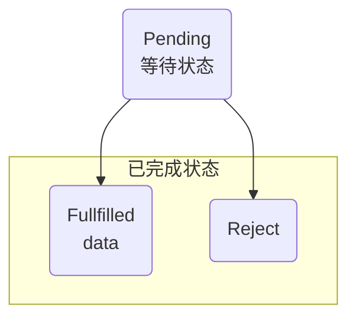

## Promise
异步任务结果的占位符。
```JavaScript
// 通过内置 Promise 构造函数创建一个对象 promise
// Promise 需要传递两个回调函数 resolve, reject

var promise = new Promise(resolve, reject) {
	// resolve() 成功回调
	// reject() 失败回调
}
```

## Promise 生命周期
<div style="background-color: #fff">

</div>

## Promise 的执行顺序
## Promise 的拒绝
显式拒绝 —— 在一个 promise 的执行函数中调用传入的 reject 方法

隐式拒绝 —— 处理的一个 promise 的过程中招聘一个异常