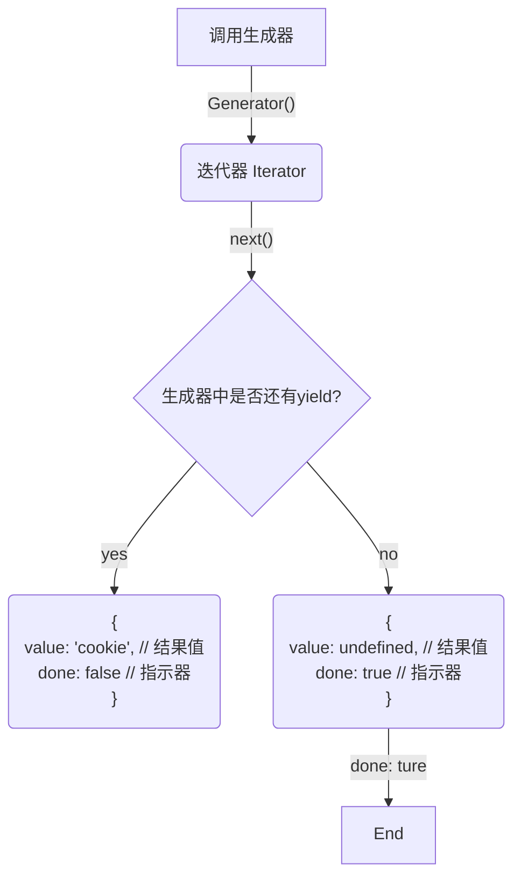

## 生成器函数
JavaScript 依赖于单纯程执行模型，导致的问题是服务请求未完成前，UI 页面都在等待渲染状态，用户看到是空白页面。
生成器函数能生成一组值的序列，每个值的生成都是基于每次请求，并不同于标准函数那样立即生成。
> yield 用于生成独立的值
```javascript
// 创建一个生成器函数
function* SnacksGenerator() {
	yield 'cookie';
	yield 'dried fruit';
	yield 'chips'
}

// for-of 循环取出生成的值序列
for (let snack of SnacksGenerator()) {
	console.log(snack)
}
```
> yield* 把执行权交给下一个生成器
```javascript
// 定义生成器一
function* Ingredient() {
	yield 'chilies';
	yield* SnacksGenerator(); // 执行权交给 SanacksGenerator
	yield 'mushroom';
	yield 'lamb';
	yield 'sesame sauce';
	yield 'peppercorns';
}

// 定义生成器二
function* SnacksGenerator() {
	yield 'cookie';
	yield 'dried fruit';
	yield 'chips'
} 

for(var item of Ingredient()) {
	assets('assets', item !== null, item)
}
```
> for-of 循环取出生成器中生成的值序列，迭代器进行迭代的语法糖
```javascript
// 定义一个生成器，可生成 ingredient 序列
function* Ingredient() {
	yield 'chilies';
	yield 'mushroom';
	yield 'lamb';
	yield 'sesame sauce';
	yield 'peppercorns';
}

/**	
* 调用生成器 ingredient 创建一个迭代器 _ 以下是 for-of 的实现
let IngredientIterator = Ingredient()
let item; // 保存生成器产生的值

// 迭代器进行迭代的语法糖 
while(!(item = IngredientIterator.next()).done) {
	assets('assets', item !== null, item.value)
}
*/

// 这里 for-of 注意是遍历生成器的值的序列，并不是迭代器哦
for(item of Ingredient()) {
	assets('assets', item !== null, item.value)
}
```

<font color='#a33'>调用生成器，不会直接执行生成器，而是产生一个迭代器对象与生成器通信。迭代器对象暴露的最基本的接口是 `next`，`next` 用来向生成器求一个值，从而控制生成器，遇到 `yield` 返回中间对象。多次循环，直至 `{value: undefined, done: true}`</font>
### 生成器与迭代器工作流
<div style="background: #fff">

</div>

### 生成器与迭代器通信
#### yield / next  
```JavaScript
	// 生成器传参
	function* Generator(param){
		yield param
	}
	
	// 为生成器提供一个初始值 initialValue
	let Iterator = Generator('initialValue')
	// 用 next 方法向生成器请求一个值
	Iterator.next() 
	// 可以用 next 方法为等待中的 yield 表达式提供值
	Iterator.next('is wait yield?')
```
> next 方法可以为等待中的 yield 提供值，所以第一个 next 方法传参无效，因为第一次执行生成器代码，没有等待中的 yield.

#### try-catch
迭代器通过 throw 方法向生成器抛出异常
```JavaScript
 // 创建生成器
 function* Generator() {
	 try {
		 yield 'try-catch'
	 }catch(e) {
		 console.log(e)
	 }
 }
 
 let Iterator = Generator()
 Iterator.next()
 Iterator.throw('throw an exception')
```
### 生成器的执行状态
```JavaScript
function* GeneratorFn(name) {
	yield name + ' Suspended'
	yield name + ' Executing'
}
let iterator = GeneratorFn()
iterator.next()
iterator.next()
```

(*) --> "Suspended Start"
note right
const Iterator = Generator(generator) 
====
<b>创建生成器，生成器处于挂起状态</b>
end note
-->[iterator.next()] "executing"
note top
itera tor.next()
===
激活生成器，从挂起状态转为执行状态，执行到 "yield name + ' Suspended'" 语句，状态挂起
---
返回 "{value: 'generator Suspended', done: flse}"
end note
-->[Yield reached] "Suspended Yield"
-->[iterator.next()] "executing"
note right
iteractor.next()
===
激活生成器，从挂起状态转为执行状态，执行到 "yield name + ' Executing'" 语句，状态挂起
---
返回 "{value: 'generator Executing', done: true}"
end note
--> Completed


### 执行上下文跟踪生成器函数
```JavaScript
// 创建一个生成器函数
function* generator(snack) {
	yield snack + 'Production'
}
var iterator = generator('chips')
```
#### 调用生成器函数之前的应用状态
>

<style>
class {
	lineStyle dotted
	backgroundColor lightGreen
}
card {
	backgroundColor yellowGreen
	fontColor #fff
	fontSize 12
	lineColor transparent
}
</style>
stack 调用栈 {
	card GlobalContext as "全局执行上下文" {
	}
}
class GlobalEnviroment as "全局词法环境" << (E, #337700) Enviroment >>  {
	iterator : undefined
	----
	generator
}
storage generatorFn as "function* (){}" {
}
GlobalContext -right-> GlobalEnviroment
GlobalEnviroment::generator -right-> generatorFn

---
#### 调用生成器函数之后的应用状态
>

<style>
class {
	backgroundColor lightgreen
	lineStyle dotted
}
card {
	backgroundColor yellowGreen
	fontColor #fff
	fontSize 12
	lineColor transparent
}
agent {
	backgroundColor #699
	fontColor #fff
}
</style>
allowmixing
class GlobalEnviroment as "全局词法环境" << (E, #337700) Enviroment >>  {
	iterator
	----
	generator
}
class GeneratorEviroment as "函数词法环境" <<(E, #337700) Enviroment>> {
	snack: 'chips'
}

agent iterator

storage generatorFn as "function* (){}" {
}

stack 调用栈 {
	card GlobalContext as "全局执行上下文" {
	}
	card GeneratorContext as "函数执行上下文" {
	}
	
	GeneratorContext -[hidden]-> GlobalContext
}

GlobalContext -right-> GlobalEnviroment
GeneratorContext -right-> GeneratorEviroment
iterator --> GeneratorContext
GlobalEnviroment::generator -right-> generatorFn
GlobalEnviroment::iterator --> iterator

---
#### 生成函数执行之后
> 生成函数执行之后，generator 函数执行上下文出栈，但不被销毁，因为 iterator 保持着对 generator 函数执行上下文的引用

<style>
class {
	backgroundColor lightgreen
	lineStyle dotted
}
card {
	backgroundColor yellowGreen
	fontColor #fff
	fontSize 12
	lineColor transparent
}
agent {
	backgroundColor #699
	fontColor #fff
}
</style>
allowmixing
class GlobalEnviroment as "全局词法环境" << (E, #337700) Enviroment >>  {
	iterator
	----
	GeneratorFn
}
class GeneratorEviroment as "函数词法环境" <<(E, #337700) Enviroment>> {
	snack: 'chips'
}

agent iterator

storage generatorFn as "function* (){}" {
}

stack 调用栈 {
	card GlobalContext as "全局执行上下文" {
	}
}

card GeneratorContext as "函数执行上下文" {
}
note right of GeneratorContext: generator 函数执行上下文已出栈

GlobalContext -left-> GlobalEnviroment
iterator -right-> GeneratorContext
GlobalEnviroment::GeneratorFn -left-> generatorFn
GlobalEnviroment::iterator --> iterator
GeneratorEviroment --> GeneratorContext

---
#### 调用跌代器的 next 方法
```JavaScript
// 创建一个生成器函数
function* generator(snack) {
	yield snack + 'Production'
}
var iterator = generator('chips')
var res = iterator.next()
```
> 再次激活 Generator 执行上下文，并推入栈。从上一次执行位置之后继续执行

<style>
class {
	backgroundColor lightgreen
	lineStyle dotted
}
card {
	backgroundColor yellowGreen
	fontColor #fff
	fontSize 12
	lineColor transparent
}
agent {
	backgroundColor #699
	fontColor #fff
}
</style>
allowmixing
class GlobalEnviroment as "全局词法环境" << (E, #337700) Enviroment >>  {
	iterator
	----
	result: undefined
	----
	GeneratorFn
}
class GeneratorEviroment as "函数词法环境" <<(E, #337700) Enviroment>> {
	snack: 'chips'
}

agent iterator

storage generatorFn as "function* (){}" {
}
stack 调用栈 {
	card GlobalContext as "全局执行上下文" {
	}
	card GeneratorContext as "函数执行上下文" {
	}
	
	GeneratorContext -[hidden]-> GlobalContext
}
GlobalContext -left-> GlobalEnviroment
iterator -right-> GeneratorContext
GlobalEnviroment::GeneratorFn -left-> generatorFn
GlobalEnviroment::iterator --> iterator
GeneratorEviroment --> GeneratorContext

----
#### iterator.next() 执行之后
> 生成器挂起，返回生成器表达式的值与生成器状态值对象

<style>
class {
	backgroundColor lightgreen
	lineStyle dotted
}
card {
	backgroundColor yellowGreen
	fontColor #fff
	fontSize 12
	lineColor transparent
}
agent {
	backgroundColor #699
	fontColor #fff
}
</style>
allowmixing
class GlobalEnviroment as "全局词法环境" << (E, #337700) Enviroment >>  {
	iterator
	----
	result: {value: 'chips Production', done: false}
	----
	GeneratorFn
}
class GeneratorEviroment as "函数词法环境" <<(E, #337700) Enviroment>> {
	snack: 'chips'
}

agent iterator

storage generatorFn as "function* (){}" {
}
stack 调用栈 {
	card GlobalContext as "全局执行上下文" {
	}
}
card GeneratorContext as "函数执行上下文" {
}
GlobalContext -left-> GlobalEnviroment
iterator -right-> GeneratorContext
GlobalEnviroment::GeneratorFn -left-> generatorFn
GlobalEnviroment::iterator --> iterator
GeneratorEviroment --> GeneratorContext

----
最后再执行 `iteractor.next()` 没有 `yield` 表达式，`return {value: undefined, done: true}` 生成器进入结束状态。
