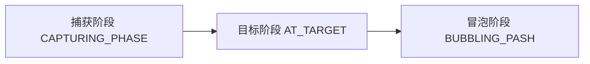

## 事件
事件是浏览器赋予元素的默认行为
> 事件具有传播机制，事件流描述从页面中接受事件的顺序。
> 1.    捕获阶段(CAPTURING_PHASE 1)，从外层到最内层一一查的；
> 2.    目标阶段(AT_TARGET 2)，触发事件源的点击行为；
> 3.    冒泡阶段(BUBBLING_PASH 3)，按捕获阶段分析出来的路径，从内到外触发每个元素的点击事件

## 事件绑定
事件绑定是给浏览器赋予元素默认行为绑定一个方法。即使没有绑定方法，点击元素也会触发相应的事件。

## 事件传播（事件冒泡与事件捕获）

当一个元素接收到事件时，会把它接收到的事件逐级向上传播给它的祖先元素，一直传到【顶层对象】
> IE9以上、Chrome、Safari 事件冒泡顶层对象是 window
IE7/IE8 事件冒泡顶层对象是 Document
事件冒泡对所有浏览器默认存在，且由元素 html 结构决定。<span class='custom-box custom-box-339'>所以即使定位或浮动脱离文档流的元素也是存在冒泡现象的</span>

```html
<div id="root">
    <div id="outer">
        <div id="inner"></div>
    </div>
</div>

<script type="text/javascript">
    var html = document.getElement,
        body = document.body,
        root = document.getElementById('root'),
        outer = document.getElementById('outer'),
        inner = document.getElementById('inner')

        inner.addEventListener('click', function(){
            console.log('inner click 冒泡')
        })
        inner.addEventListener('click', function(){
            console.log('inner click 捕获')
        },true)

        outer.addEventListener('click', function() {
            console.log('outer click 冒泡')
        })
        outer.addEventListener('click', function() {
            console.log('outer click 捕获')
        },true)

        root.addEventListener('click', function() {
            console.log('root click 冒泡')
        })
        root.addEventListener('click', function() {
            console.log('root click 捕获')
        },true)
</script>
```
<span class='custom-box custom-box-393'>`window 捕获` --> `document 捕获` --> `html 捕获` --> `body 捕获` --> `root 捕获` --> `outer 捕获` --> `inner 捕获`</span><span class='custom-box custom-box-339'> --> 目标阶段 --> </span> <span class='custom-box custom-box-993'>`inner 冒泡` --> `outer 冒泡` --> `root 冒泡` --> `body 冒泡` --> `html 冒泡` --> `document 冒泡` --> `window 冒泡`</span>

使用事件源对象的事件属性绑定事件函数及使用html标签事件属性绑定事件函数的事件流都是冒泡

### event.stopPropagation()——阻止事件传播
```html
<script type="text/javascript">
    ...
        inner.addEventListener('click', function(event){
            event.stopPropagation()
            console.log('inner click 冒泡')
        })
        ...
</script>
```
> `root 捕获` --> `outer 捕获` --> `inner 捕获` --> `inner 冒泡`
inner 以后的事件不再传播

### event.stopImmediatePropagation ——— 立即阻止事件传传播
```html
<script type="text/javascript">
    ...
        root.addEventListener('click', function() {
            event.stopImmediatePropagation()
            console.log('root click 捕获')
        },true)
</script>
```
> `root 捕获`
   立即阻止事件传播，包括当前 dom 绑定的未执行的其它方法

## 事件委托
利用事件传播机制，实现的一套 <span class='custom-box custom-box-393'>事件绑定处理方案</span>
<span class='custom-box custom-box-933'>要求当前事件必须支持事件传播机制（如：mouseenter,mouseleave）；某事件单独做了事件绑定，并阻止了事件传播，事件委托不生效</span>

### 事件委托的优点：
* 提高 JS 代码运行的性能，并且把处理的逻辑都集中在一起
* 给动态绑定的元素做事件绑定
* 除某些元素外的其它元素的事件处理，需要基于事件委托来做

```html
     <script type="text/javascript">
        var html = document.getElement,
            body = document.body

            body.addEventListener("click", function(evt) {
                let id = evt.target.id
                if (id === 'inner') {
                    console.log('do something')
                    return;
                }

                console.log('do other thing')
            })
    </script>
```

## <font color='red'>document.body.addEventListener('click', function() {...} 无响应)</font>
<span class='custom-box custom-box-933'>Reason: document.clientHeigyt = 0，body 没有高度。引起 body 没有高度的原因可能是子元素脱离文档流。</span>

## <font color='red'>The path property of Event objects is non-standard.浏览器新的标准采用Event.composedPath()</font>
> 当对象数组调用该 侦听器时返回事件路径。

## 事件对象池

## 关于移动端事件对象延迟
<span class='custom-box custom-box-933'>移动端 click 有 300ms 延迟</span>，移动端 click 是单击事件，PC 端 click 为点击事件。
<span class='custom-box custom-box-393'>连点两下，</span>PC 端会触发两次 click，一次 dblclick；移动端只会触发 dblclick。
<span class='custom-box custom-box-339'>移动端单击事件：第一次点击后，监听 300ms，查看是否有第二次点击，有则是双击，没有为单击。</span>

### 移动羰单手指事件模型
```JavaScript
export default class Demo1 extends Component {
    state = {
        touch: {
            isMove: false,
            x: 0,
            y: 0
        }
    }
    touchStart = (evt) => {
        const finger = evt.changedTouches[0] // 手指事件信息
        console.log(evt)
        this.setState({
            isMove: false,
            x: finger.pageX,
            y: finger.pageY
        })
    }
    touchMove = evt => {
        const finger = evt.changedTouches[0] // 手指事件信息
        const {touch} = this.state
        let x =finger.pageX - touch.x,
            y = finger.pageY - touch.y

        if (Math.abs(x) > 10 || Math.abs(y) > 10) {
            this.setState({
                isMove: true
            })
        }
    }
    touchEnd = () => {
        const {touch} = this.state
        if (touch.isMove) return
        console.log('点击按钮了')
    }
    render() {
        return <div>
            <button 
            onTouchStart={this.touchStart}
            onTouchMove={this.TouchMove}
            onTouchEnd={this.touchEnd}>mobileEvent</button>
        </div>
    }
}
```

### FastClick 解决移动端使用 click 点击事件 300ms 延迟问题