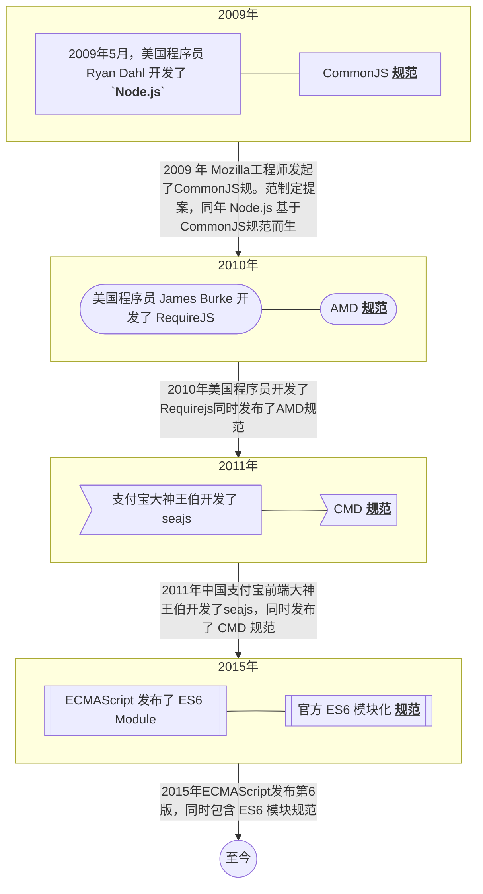
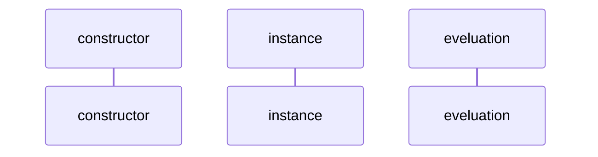

## 无模块化时期
JavaScript 起初只为了验证表单，后来加入了动画、交互等功能。实现只需要在 html 中添加 `<script></script>` 标签即可。随着前端复杂度的提高，对于前端代码的`可读性、可扩展性、可复用`就有较高的要求，就需要分多模块。这一阶段就是无模块化阶段：
无模块化阶段代码如下：
```html
<script src="jquery.js"></script>
<script src="jquery_scroller.js"></script>
<script src="main.js"></script>
```
> 无模块化带来的问题：
1.  变量、对象、函数均绑在全局，<span class='custom-box custom-box-933'>污染全局作用域</span> 会出现命名冲突的问题。
2.  <span class='custom-box custom-box-933'>依赖关系不明显</span>，开发手动处理各模块依赖，维护成本加大。

## 模块化时期
### 模块化的发展史

在这种百家争鸣的背景下，每种工具产生的背景以及原因又是什么的？
> 美国程序员程序员 Ryan Dahl，开创了 JavaScript 在浏览器中运行的先河。开发了 NodeJs 同时给出了 CommonJS 规范
CommonJS 规范模块加载是<span class='custom-box custom-box-933'>同步的（Synchronous）</span>。服务器端加截的模块从内存或磁盘中加载，耗时基本可忽略。<span class='custom-box custom-box-393'>浏览器端需要从网络加载资源，存在延迟及多个 js 前后依赖，很难保证加载顺序，文件依赖就存在问题。</span><span class='custom-box custom-box-933'>结论：CommonJS 不适用于浏览器端。</span>

因为浏览器加载资源需要异步（Asynchronous），如从不同的服务器（不同源）或 cnd 获取脚本。AMD 应运而生。
> 2010年，这位程序员同样来自美国，James Burke 开发了 RequireJS。同样也给到自己的规范 AMD(Asynchronous Module Definition)。<span class='custom-box custom-box-393'>AMD 适用于浏览器，是异步加载规范。</span> <u>RequireJS 是一个 js 文件，同时也是一个 模块加载器。</u> 可以在浏览器端开发中解决文件加载顺序带来的依赖问题。

CMD(Common Module Define) 同样适用浏览器端的异步加载规范。sea.js 可以像一样书写模块代码。
ES6 是官方标准，2015 年发布后，基本淘汰了 AMD 和 CMD。目前浏览器端需要 babel 转换。因为是官方，nodejs 中也在逐渐完善对 ES6 模块化的支持。

@startmindmap
* 规范
** AMD
*** 适用前端
** CMD
*** 适用于前端
** CommonJS
*** 适用于后端
** ES6
*** 适用于前端和后端
@endmindmap


### 补充
* NodeJs 中使用可以同时使用 CommonJS 规范和 ES6 模块规范；
* 在 vue-cli 中 webpack 采用 CommonJS 规范， webpack 基于 NodeJs 运行，支持 CommonJS。
* 基于 webpack 开发的前端项目（Vue, React）中，可以直接采用 ES6 模块化规范，因为 webpack 集成了 Babel 插件

## CommonJS规范
CommonJS 由 JavaScript 社区 2009 年提出的包含模块、文件、IO、控制台在内的一系列标准。Node.js 的实现中采用了 CommonJS 标准的一部分，并在其基础上作了一些调整。
在 Node.js 中，每个文件被作为一个单独的模块对待。（In Node.js, each file is treated as a separate module.）

###  认识 `module` 对象
> 1.  <span class='custom-box custom-box-339'>每个文件为一个模块，每个模块有自己的作用域。</span> 该模块定义的变量、函数、类均为私有，其它模块不可见。<u>不会污染全局作用域</u>
> 2.  CommonJS 规范规定，每个模块内部，<span class='custom-box custom-box-339'>`module` 代表当前模块。</span> `module` 是一个对象，属性 `exports` 是对外接口。加载模块，则是加载 `module.exports` 属性。

Node 环境中 `console.log(module)` 查看 `Module` 属性。
```bash
# v18.11.0
Module {
  id: '.',
  path: '/Users/**/Desktop/demo/demo/commonJs',
  exports: {},
  parent: null,
  filename: '/Users/**/Desktop/demo/demo/commonJs/index.js',
  loaded: false,
  children: [],
  paths: [
    '/Users/zhangliping/Desktop/demo/demo/commonJs/node_modules',
    '/Users/zhangliping/Desktop/demo/demo/node_modules',
    '/Users/zhangliping/Desktop/demo/node_modules',
    '/Users/zhangliping/Desktop/node_modules',
    '/Users/zhangliping/node_modules',
    '/Users/node_modules',
    '/node_modules'
  ]
}
```
`Node` 内部提供一个 `Module` 构造函数，所有模块都是 `Module` 的实例
```javascript
function Module(id, parent) {
    this.id = id; // 模块识别符，即带有绝对路径的模块文件
    this.parent = parent; // 返回是一个对象，为调用该模块的模块
    this.children = []; // 返回一个数组，表示该模块需要调用哪些模块
    this.filename = '/filename'; // 带有绝对路径模块的文件名
    this.loaded = true; // 返回一个布尔值，表示模块是否已经完成加载
    this.exports = {}; // 表示该模块输出的值
    this.path = "", // the directory name of the module. this is usaually as the path.dirname() of the module.id
    this.paths = []; // The search paths for the module. 模块的搜索路径
}
```

###  `module.exports | exports` 导出模块
CommonJS 中，通过 `module.exports` 导出模块中的内容
```JavaScript
// example.js
const variable = 'this is a variable'
const fn = function() { return 'this is a function' }
const obj = {}

// 将以上变量、函数、对象，对过 module.exports 暴露出去
module.exports.variable = variable
exports.fn = fn
module.exports.obj = obj

// { variable: 'this is a varialbe', fn: [Function: fn], obj: {} }
```
或
```javascript
module.exports = {
  variable: 'this is a variable',
  fn: function() { return 'this is a function'},
  obj: {}
}
// { variable: 'this is a variable', fn: [Function: fn], obj: {} }
```
#### 错误案例
* Demo —— 修改 exports 指向
```javascript
exports = {
  name: 'new object'
}
// {}
```
<span class='custom-box custom-box-939'>exports 指向新的对象引用，module.exports 还是原对象引用，是个空对象。即，`exports` 与 `module.exports` 指向不同的对象，所以 name 属性并不会导出。</span>[参考图示](/2019/03/26/Node-模块化/)

* Demo —— exports 与 module.exports 混合使用
```javascript
exports.fn = function() {
  return 'this. is a function'
}
module.exports = {
  variable: 'this is a variable'
}
// { variable: 'this is a variable' }
```
<span class='custom-box custom-box-939'>fn 属性丢失，原因在于先导出了一个函数，然后 `module.exports` 重新赋值为另一个对象，之前的对象属性丢失。</span>

* Demo —— 建议 exports | module.exports 写在文件未尾
```javascript
exports.fn = function() {
  return 'this. is a function'
}
console.log('end')
// end
// { fn: [Function] }
```
<span class='custom-box custom-box-939'>先打印出 end, 再打印出 `exports` 的内容，说明这个 exports 之后的内容也会被执行，为提高代码可读性，`module.exports` 写在文件尾部</span>

#### 3. 导入
```javascript
// example.js
console.log('test the number of times the export file is executed')
exports.hello = 'instruction: export the function of hello'
```
```JavaScript
// index.js
const example = require('./example')
console.log('wait a moment..., require the js file of example again')
require('./example')
```
---
```
[@dembp:demo (master)]$ node ./commonJs/index.js
test the number of times the export file is executed
wait a moment..., require the js file of export again
```
#### <span class='custom-box custom-box-933'>Cannot find module 'export'</span>
> `require('example')` 导致以上报错，导致入的文件要给出文件路径 `require('./example')`

#### <span class='custom-box custom-box-339'>`结论：`</span>
1.  NodeJs 中所有代码都运行在模块作用域，不会污染全局作用域。
2.  模块可以多次加载，但是只会在第一次加载时运行一次，然后运行结果就被缓存了，以后再加载，就直接读取缓存结果。要想让模块再次运行，必须清除缓存。`module.loaded` 默认为 false，如果加载过的话，该值会被设置为 true，模块代码将不再执行。
3.  模块加载的顺序，按照其在代码中出现的顺序。

#### <span class='custom-box custom-box-339'>require 函数接收表达式，可以利用该特性将动态加载模块到全局</span>
```javascript
const needModules = ['moduleA','moduleB','moduleC',...]
needModules.map(item => {
  require('./'+item);
})
```

## AMD规范
RequireJS is a JavaScript file and module loader. It is optimized for in-browser use, but it can be used in other JavaScript environments, like Rhino and Node. using a modular script loader like Requirejs will improve the speed and quality of your code.
RequireJS 是一个 JavaScript 文件和模块加载器。针对浏览器的使用进行了优化，也可能用于其它 JavaScript 环境，像 Rhino 和 Node。使用像 RequireJS 这样的模块加载器，可以提高你代码的运行速度与质量。[具体查看](requirejs.org)
```html
// 导入 requirejs，并定义入口文件 main.js
<script data-main="scripts/main" src="scripts/libs/require.js"></script>
```
---
```javascript
/**
 * scripts/main.js
 * 1.   添加配置文件
 * requirejs.config({...})
 */
 
 requirejs.config({
    "baseUrl": "scripts",
    "paths": {
        "jquery": "libs/jquery"
    }
 })

 // 加载或导入需要运行的自定义文件
 requirejs(['./index'])
```
---
```javascript
/**
 * scripts/index.js
 * defined(['jquery'], function($){...})
 */
defined(['jquery'], function($){
    $('#btn').click(function(){
        alert('js 模块化，你好')
    })
}) 
```

## CMD规范


## 模块是如何工作的
使用模块开发时，浏览器或 Node 会创建依赖图。即，你给到入口文件 `main.js`，`import` 加载相关模块代码
<div style="background: #fff">
	```mermaid
	 graph LR
		main[main.js] --> |import a from './a.js'| a[a.js]
		main --> |import b from './b.js'| b[b.js]
		
	```
</div>
浏览器需要将文件解析成 模块记录（Module Records），模块记录需要转换为 模块实例（Module Instance）。对于 ES 模块，具体包含以下三个步骤

### 1.	构造（constructor） —— 查找、下载并解析所有文件到**模块记录**中。
构造阶段要做的事情：
> 模块解析 —— 找出下载包含该模块的文件的方式（Url, 文件系统加载）
> 获取文件（从 URL 下载或从文件系统加载）
> 将文件解析为模块记录

<div style="background: #fff">
	```mermaid
	 graph TD
	 html[index.html] --> |"&lt;script type='module' src='/main.js'&gt;&lt;/script&gt;"| main[main.js]
	 main --> |"import a from './a.js'"|a[a.js]
	```
</div>


2.	实例化（instance） —— 在内存中寻找一块区域来存储所有导出的变量（但还没有填充值）。然后让 export 和 import 都指向这些内存块。这个过程叫做链接（linking）。
3.	求值 —— 运行代码，在内存块中填入变量的实际值。


ES 模块是异步的，加载、实例化、求值，异步完成

### 五、ES6模块化
2015 年 6 月，TC39 标准委员会正式发布 ES6(ECMAScript 6.0) 以后，JavaScript 有了 `模块` 的概念。
**模块**为你提供了更好的方法<u>来组织这些变量和函数。通过模块，你可以将有意义的变量和函数分组在一起。</u>


* 与 CommonJS 一样，ES6 Module 每个模块都有自身的作用域；
* 在 ES6 版本中，`import` 和 `export` 是保留关键字；
* ES6 Module 自动采用严格模式（`use strict`）;

```javascript
// example.js
export const a = 'this is a variable';
export const fn = () => {
  return 'this is a arrow function';
}
```
```javascript
// index.js
import {a,fn} from './example';
let b = fn();
console.log(a, b);
```

#### node index.js
> `SyntaxError: Cannot use import statement outside a module`
> 不支持 import，需要 babel 转义

1.  浏览器环境解决办法（目前没有运行起来）
```html
<script src="https://unpkg.com/@babel/standalone/babel.min.js"></script>
<script type="text/babel">
// Your ES6 code
</script>
```
2.  引入依赖包处理[参考解决](https://wangdoc.com/es6/intro.html)
