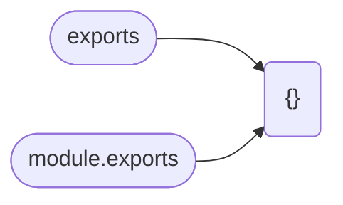
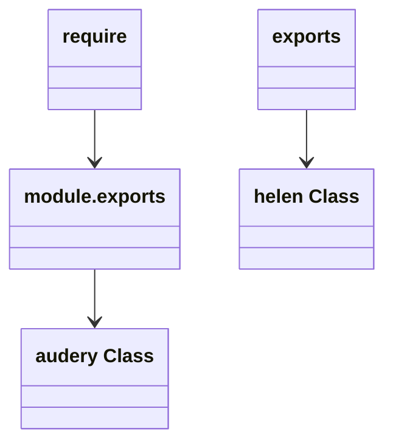
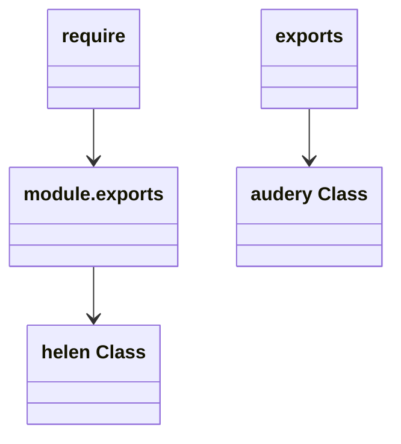
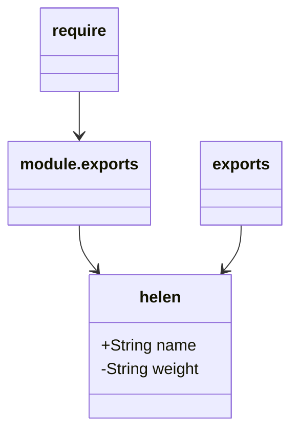
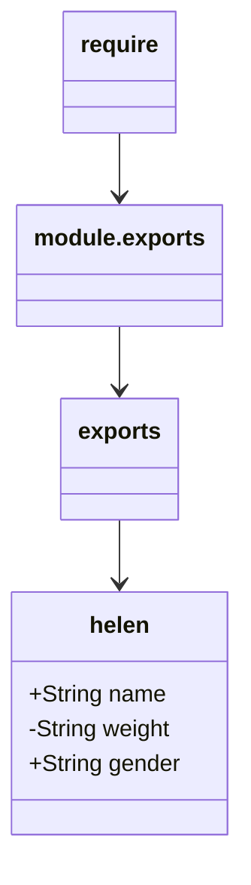
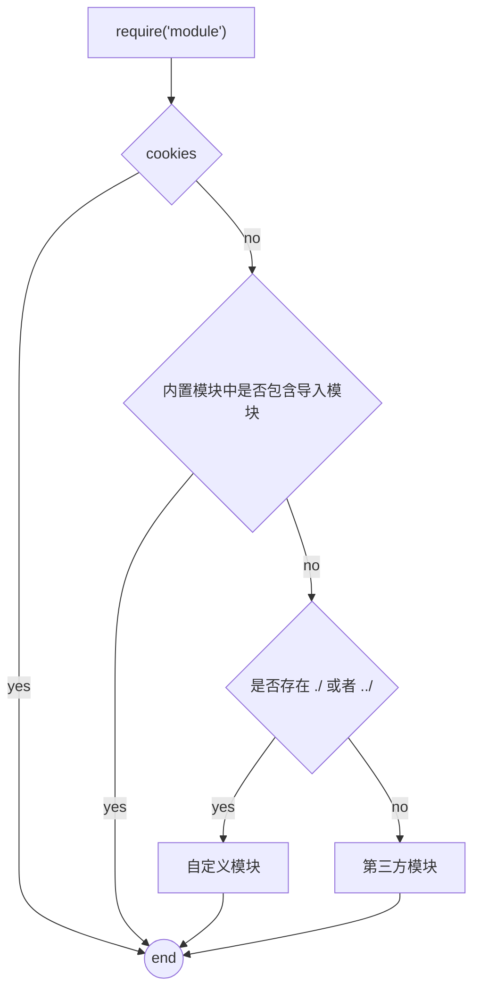

> 参考：
> *	[Nodejs](http://nodejs.cn/api/modules.html#modules_exports_shortcut)
> * [tutorials](https://www.tutorialsteacher.com/nodejs/nodejs-module-exports)

## CommonJS 模块 
Node.js 打包 JavaScript 代码的原始方式
> Node.js 中每个文件都被视为一个单独的模块

NodeJs 环境运行以下代码，测试代码保存在 index.js 文件下
```JavaScript
var a = 1
console.log(global.a)
```
```bash
$ node index.js
undefined
```
以上代码若运行在浏览器环境，`widnow.a` 必定输出 1，浏览器中默认绑定在全局 `window` 对象上。但在 NodeJs 环境中 <span class="custom-box custom-box-933">在 NodeJs 中，存在模块化，它会将当前文件，按模块的方式进行加载或导出</span>相当于：
```JavaScript
(function() {
	var a = 1
	console.log(window.a)
})()
```
即在函数环境中访问全局环境的变量。<span class="custom-box custom-box-939">NodeJs 环境下，若想在全局环境下访问变量 a，需要显式将 a 绑定在 global 对象上。</span>
```JavaScript
global.a = 1
```
### arguments 函数实参
> [有关函数实参的介绍](/2023/02/03/Javascript-函数参数/)
NodeJs 环境中，js 文件直接打印 `arguments` 对象
```JavaScript
console.log(arguments)
```
```bash
$ node index.js
[Arguments] {
  '0': {},
  '1': [Function: require] {
    resolve: [Function: resolve] { paths: [Function: paths] },
    main: Module {
      id: '.',
      path: '/Users/.../Desktop/node/src',
      exports: {},
      filename: '/Users/.../Desktop/node/src/index.js',
      loaded: false,
      children: [],
      paths: [Array]
    },
    extensions: [Object: null prototype] {
      '.js': [Function (anonymous)],
      '.json': [Function (anonymous)],
      '.node': [Function (anonymous)]
    },
    cache: [Object: null prototype] {
      '/Users/.../Desktop/node/src/index.js': [Module]
    }
  },
  '2': Module {
    id: '.',
    path: '/Users/.../Desktop/node/src',
    exports: {},
    filename: '/Users/.../Desktop/node/src/index.js',
    loaded: false,
    children: [],
    paths: [
      '/Users/.../Desktop/node/src/node_modules',
      '/Users/.../Desktop/node/node_modules',
      '/Users/.../Desktop/node_modules',
      '/Users/.../node_modules',
      '/Users/node_modules',
      '/node_modules'
    ]
  },
  '3': '/Users/.../Desktop/node/src/index.js',
  '4': '/Users/.../Desktop/node/src'
}
```
<span class="custom-box custom-box-933">以上代码的执行，充分验证了，在 NodeJS 中，每个文件都是一个函数。</span>，那么这些实参代表哪些行参呢？
```bash
[Arguments] {
  # module,exports
  '0': {},
  # require
  '1': [Function: require] {
    resolve: [Function: resolve] { paths: [Function: paths] },
    ...
  },
  # module
  '2': Module {
    id: '.',
    ...
  },
  # __filename
  '3': '/Users/.../Desktop/node/src/index.js',
  # __dirname
  '4': '/Users/.../Desktop/node/src'
}
```
即：`module.exports, require, exports, __filename, __dirname`


### 通过 `this` 认识 exports && module.exports
```JavaSript
console.log(this)
```
运行结果：
<span class="custom-box custom-box-339">浏览器器下运行：</span>`this`指针指前当调用环境对象，即 `window`
<span class="custom-box custom-box-393">NodeJs 环境下运行：</span>`this`指针指向`{}`，似乎并不明白，可以通过如下代码验证：
```JavaScript
console.log(this === module.exports) // true
console.log(this === exports) // true
```
<span class="custom-box custom-box-933">所以在 NodeJs 文件中，`this` 指针，指向的是 `module.exports or exports`</span>如下

即
```JavaScript
exports.a = 1
console.log(module.exports === exports, module.exports, exports) // true {a:1} {a:1}
exports = 1
// require 取的 module.exports 的值
console.log(module.exports === exports, module.exports, exports) // false {a:1} 1
```
也就是说 `exports` 和 `module.exports` 指向同一个引用地址。或者可以理解为 `exports` 是 `module.exports` 的简写或引用。<span class="custom-box custom-box-933">注意：如果给 `exports` 重新赋值会切断指向 `module.exports` 的指针。</span>
```JavaScript
// a.js
exports = 1

// b.js
const obj = require('./a')
console.log(obj) // {}
```
> 正确的方式是
```JavaScript
// a.js
exports.a = 1

// b.js
const obj = require('./a')
console.log(obj) // {a:1}
```
or
```JavaScript
// a.js
module.exports = {
	a: 1
}

// b.js
const obj = require('./a')
console.log(obj) // {}
```

### exports 和 module.exports 的使用误区
```javaScript 
console.log(`module.exports`, module.exports)
console.log(`exports`, exports)

console.log(module.exports === exports)
```
```bash
zhangliping@zhangliingdembp ~/Desktop/node  $ node ./src/demo4/moduleDemo.js 
module.exports {}
exports {}
true
```
> 首先明确一点： exports 和 module.exports 指向同一对象，exports 是 module.exports 的简写。如同一个人，中文名：萍；英文名： Helen

### 常见的不规范代码(1)
```javaScript
// demo.js
exports.name = 'helen'
exports.weight = '50kg'
module.exports = {
  name: 'audery',
  weight: '22kg'
}
```
```javaScript
const pepole = require('demo')
console.log(pepole)
```
> 以上代码运行后，exports 与 module.exports 已经不指向同一个对象了。相当于，将 `module.exports` 这个标签贴到了一个名为 ‘audery’ 的人身上了。那么 `require(‘demo’)` 取的是名为 helen 这个对象，还是 名为 audery 这个对象呢？
```bash
zhangliping@zhangliingdembp ~/Desktop/node  $ node ./src/demo4/index.js     
{ name: 'audery', weight: '22kg' }
```

### 常见的不规范代码(2)
```javaScript
// demo.js
module.exports.username = 'helen'
exports = {
  weight: '22kg',
  name: 'audery'
}

// index.js
const pepole = require('demo')
console.log(pepole) 
```
```bash
zhangliping@zhangliingdembp ~/Desktop/node  $ node ./src/demo4/index.js
{ username: 'helen' }
```

> require 导入的对象 ==> module.exports 所指的对象
### 常见的不规范代码(3)
```javaScript
// demo.js
exports.name = 'helen'
module.exports.weight = '50kg'

// index.js
const pepole = require('demo')
console.log(pepole)
```
```bash
zhangliping@zhangliingdembp ~/Desktop/node  $ node ./src/demo4/index.js
{ name: 'helen',  weight: '50kg'}
```

> module.exports 与 exports 修改的是同一对象
### 常见的不规范代码（4）
```javaScript
exports = {
  name: 'helen',
  weight: '50kg'
}
module.exports = exports
module.exports.gender = 'female'

// index.js
const pepole = require('demo')
console.log(pepole)
```
```bash
zhangliping@zhangliingdembp ~/Desktop/node  $ node ./src/demo4/index.js
{ name: 'helen', weight: '50kg', gender: 'female' }
```

<span class="custom-box custom-box-933">不要在同一个模块中同时使用 exports 与 module.exports</span>

## CommonJS 规定
* 每个模块内部，module 变量代表当前模块
* module 变量是一个对象，它的 exports 属性是对外接口
* 加截某个模块，其实是加载该模块的 module.exports 属性。 require() 方法用于加截模块。

## 模块的加载机制
`If the exact filename is not found, then Node.js will attempt to load the required filename with the added extensions: .js,.json,.node`
* <span class='custom-box custom-box-933'>模块在第一次加载后被缓存</span>，也就是说多次调用 `require()` 不会导致模块代码执行多次。不论是内置模块、用户自定义模块、第三方模块，优先从缓存中加载，<span class='custom-box custom-box-393'>从而提高模块的加载效率。</span>
  ```javaScript
    // test.js
    console.log('require 是否从缓存中读取')
    // index.js
    require('test')
  ```
  ---
  ```bash
    zhangliping@zhangliingdembp ~/Desktop/node/src  $ node demo6/index.js 
    加载几次该模块呢？
  ```
* 内置模块是由 Node.js 官方提供的模块，<span class='custom-box custom-box-933'>内置模块的加载优先级最高</span>
* 使用 require() 加载自定义模块时，必须指定以 `./ or ../` 开头的路径标识符。在加载自定义模块时，如果没有指定 `./ or ../` 这样的路径标识符，则 node 会把它当作 <span class='custom-box custom-box-393'>内置模块或第三方模块进行加载</span>
> 在使用 `require()` 导入自定义模块时，如果省略了文件的扩展名，则 Node.js 会 <span class='custom-box custom-box-933'>按顺序</span> 分别尝试加载以下文件
  ```mermaid
    flowchart LR
    id1[按确切的文件名进行加载] --> id2[补全 .js 扩展名进行加载] 
    id2 --> id3[补全 .json 扩展名进行加载]
    id3 --> id4[补全 .node 扩展名进行加载]
    id4 --> id5((加载失败))
  ```
* 第三方模块加载机制的加载机制
  如果传递给 require() 的模块标识符不是一个内置模块，也不是自定义模块，没有 `./` 或 `../` 开头，则 `Node.js` 会从当前模块的父目录开始，尝试从 `/node_modules` 文件夹中加载第三方模块。<span class='custom-box custom-box-933'>如果没有找到对应的第三方模块，则移动到再上一层父目录中，进行加载，走到文件系统的根目录。</span>
  ```
    if  require('foo'); 查找 ./node_modules/foo
    no  ../node_modules/foo
    no  /users/node_modules/foo
  ```

* 当把目录作为模块标识符，传递给 require() 进行加载，有三种加载方式：
1.  在被加载的目录下查的 package.json 文件，进而在 package.json 文件下找 main 属性，作为 require() 加载入口；
2.  目录里没有 package.json 或 main 入口不存在或无法解析，则 Node.js 会试图解析 index.js;
3.  如果以上两步都失败，返回 Error: Cannot find module 'xxx';


<!-- ## exports 和 module.exports -->
<!-- nodeJS 官网中对 require() 有一段假设实现，如下： -->
<!-- ```JavaScript -->
<!-- function require() {
  const module = { exports: {} };
  ((module, exports) => {
    function sFn() {}
    exports = sFn
    module.exports = sFn
  })(module, module.exports);
  return module.exports;
} -->
<!-- ```
#### 回过头来看定义
1.  exports
```JavaScript -->
<!-- // utils.js
exports.cssLoaders = function (options) {
  options = options || {}

  var cssLoader = {
    loader: 'css-loader',
    options: {
      minimize: process.env.NODE_ENV === 'production',
      sourceMap: options.sourceMap
    }
  }
}

// vue.loader.config.js
var utils = require('./utils')
var config = require('../config')
var isProduction = process.env.NODE_ENV === 'production'

module.exports = {
  loaders: utils.cssLoaders({
    sourceMap: isProduction
      ? config.build.productionSourceMap
      : config.dev.cssSourceMap,
    extract: isProduction
  }),
  postcss: [
    require('autoprefixer')({
      browsers: ['iOS >= 7', 'Android >= 4.1']
    })
  ]
}
``` -->
<!-- > exports 导出的是函数，引入文件 require() 之后直接调用
> module.exports 导出的是一个对象

### export && export default -->
