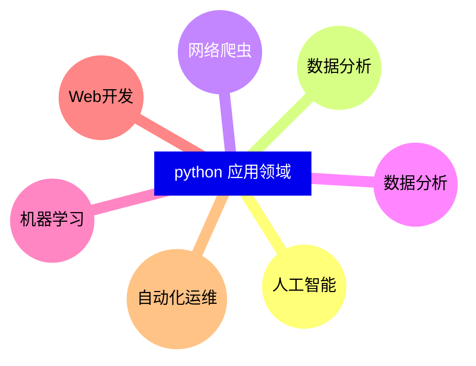
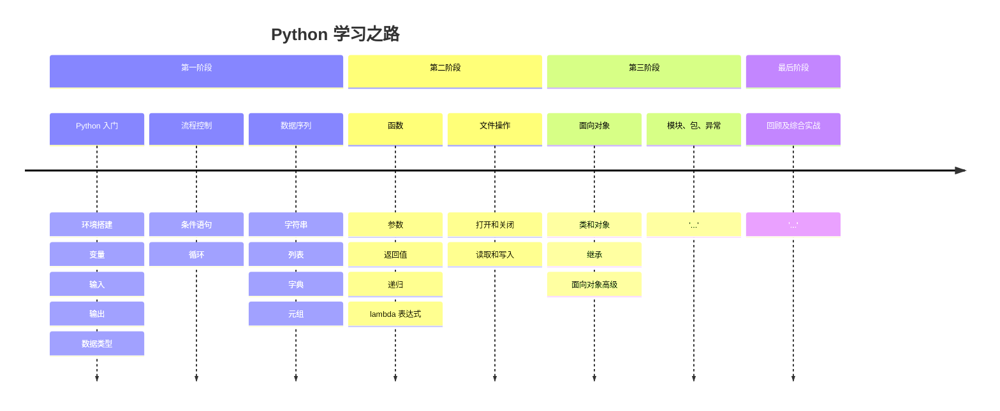

## Python 应用领域

## 创始人 —— 吉多•范罗苏姆[Guido van Rossum]
[更多关于吉多•范罗苏姆](https://mp.weixin.qq.com/s?__biz=MzkyOTQ0NTU5NA==&mid=2247483710&idx=1&sn=21553e069686d22b43ceea92ea563a4e&chksm=c208228bf57fab9d67ae3cec69c5d11d70d0cd3a27afe68b08179a37e452fe54f27982bd58f4&token=167694193&lang=zh_CN#rd)

## Python 学习之路

## 计算机基础

# 
启蒙阶段(1)——熟悉键盘

## 第一课 Python 环境安装与键盘熟悉
> Python 环境课前准备<b><u>【课上安装】</u></b>
1.  下载 Visual Studio Code，下载地址 https://code.visualstudio.com/
2.  下载 Python 解释器，下载地址 https://www.python.org/downloads/release/python-352/
3.  下载安装聊天沟通工具，下载地址 https://weixin.qq.com/cgi-bin/readtemplate?lang=zh_CN&t=page/faq/win/390/index&faq=win_390

## 计算机中的领军人物
|称呼|中文音译|领域|
|--|--|--|
|AlanMathisonTuring|艾伦图灵|计算机科学之父|
|John von Neumann|约翰·冯·诺依曼|计算机科学之父|