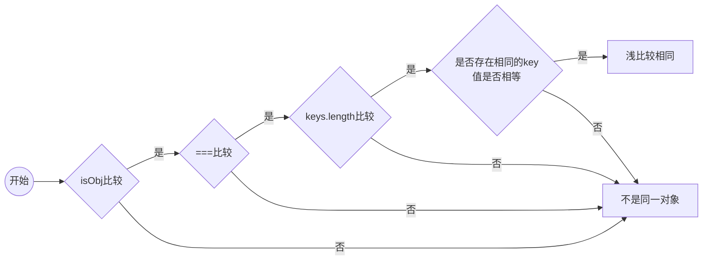

> Object.keys(obj) 与 Reflect.ownKeys(obj) 获取 对象 keys

## 浅比较
> 只比较对象的第一级，第一级以下，深层不进行比较
```JavaScript 
/**
 * @param {*} obj 
 * @return Boolean
 */
function isObj(obj) {
  return obj !== null && /^object|function$/.test(typeof obj)
}
```

```JavaScript
/**
* 浅比较函数
* @param {*} obj1 
* @param {*} obj2 
* @returns 
*/
function shallowEqual(obj1, obj2) {
  // 1. obj1,obj2 是否都是对象类型
  if(!isObj(obj1) || !isObj(obj2)) return false
  // 2. obj1 是否等于 obj2
  if(obj1 === obj2) return true
  // 3. keys.length 是否一致
  let obj1Keys = Reflect.ownKeys(obj1),
      obj2Keys = Reflect.ownKeys(obj2)
  if(obj1Keys.length !== obj2Keys.length) return false
  for (var i=0; i<obj1Keys.length; i++) {
    let element = obj1Keys[i]
    // obj2.hasOwnProperty(element) 对象自身属性中是否具体指定的属性 element
    // Object.is(obj1[element], obj2[element]) 元素值是否相同
    console.log(element, !obj2.hasOwnProperty(element) , !Object.is(obj1[element], obj2[element]))
    if(!obj2.hasOwnProperty(element) || !Object.is(obj1[element], obj2[element])) return false
  }
  return true
}
```
---
```JavaScript
// obj1 与 ojb2 比较
/**
 * 普通类型——属性相同，值不同
 * 引用类型
 */
let obj1, obj2
let obj = {
  a: 'a'
}

obj1 = {
  x: 'obj',
  obj: obj,
  // arr: [1,2]
}
console.log(obj1.obj, 'obj1') // {a: 'a'} 'obj1'

let o = obj
obj2 = {
  x: 'obj',
  obj: o
  // arr: [1,2]
}
obj2.obj.ccc = 111
console.log(obj2.obj, 'obj2') // {a: 'a', ccc: 111} 'obj2'

console.log(shallowEqual(obj1, obj2)) // true
```
> obj2.obj 与 obj1.obj 具有相同的 key，值都是对象类型，虽然引用地址不同，但因为只作了第一级只比较，所以浅比较认为他们是相同的对象。

## React.Component 与 React.PureComponent 的区别
> PureComponent 会给类组件默认加一个 shouldComponentUpdate 周期函数，在该生命周期中，会对新老属性、状态做浅比较，比较结果返回 false，视图不会更新。
[如 Demo](https://github.com/HelenZhangLP/react-18/blob/master/src/Component/pureComponent.jsx)
```JavaScript
addBox = () => {
    let {boxs} = this.state
    boxs.push(4)
    this.setState({
        boxs
    })
}
```
<span class='custom-box custom-box-933'>通过 setState ，boxs 会被认为是相同的引用地址。shouldComponentUpdate，同一个 boxs 引用地址不变，shouldComponentUpdate 返回 false 不能实现视图更新</span>

```JavaScript
addBox = () => {
    this.state.boxs.push(4)
    this.forceUpdate()
}
```
<span class='custom-box custom-box-393'>采用 this.forceUpdate 跳过 shouldComponentUpdate 检验，实现视图更新</span>

```JavaScript
addBtn = () => {
    const {boxs} = this.state
    boxs.push(4)
    this.setState({boxs: [...boxs]})
}
```
<span class='custom-box custom-box-393'>`this.setState({boxs: [...boxs]})` 通过解构，定义一个同样值的新数组，作为对象属性 boxs 的值，数组虽然值相同，但引用地址不同。shouldComponentUpdate 校验返回 true，实现了视图更新</span>