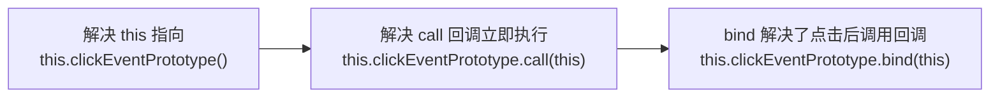
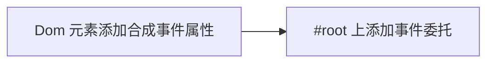
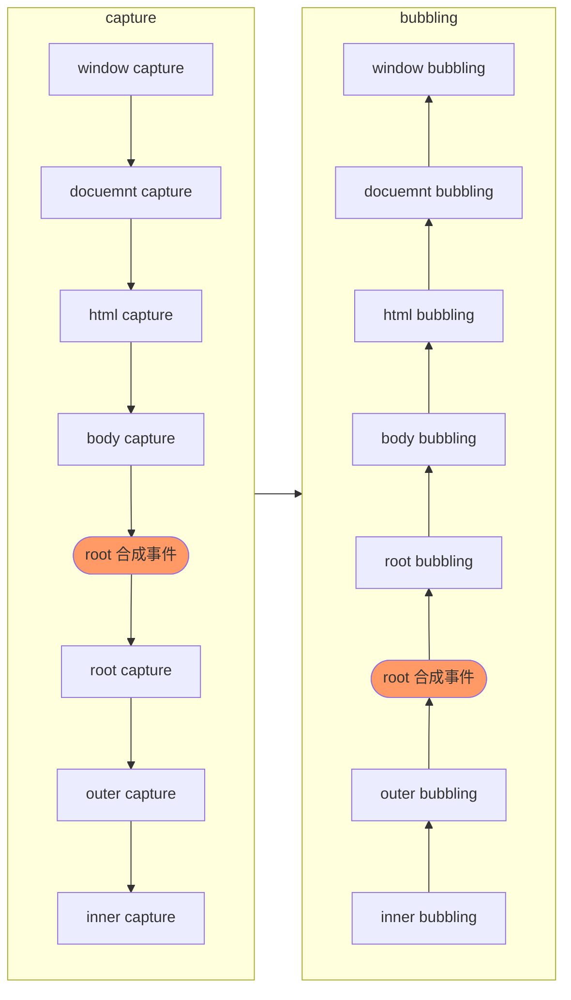
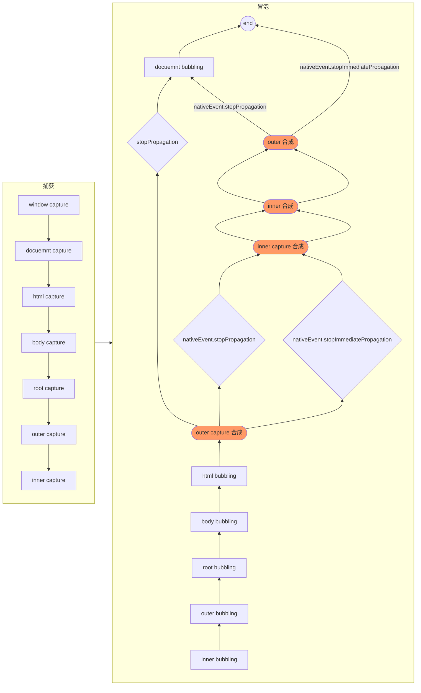

## 事件绑定
```JavaScript
import React from "react";

export default class Demo extends React.Component {
    state = {
        x: 0
    }

    clickEventPrototype() { // Demo 类的原型方法，相当于 Demo.prototype => Demo.prototype.handle = function handle() {}
        console.log('clickEvent',this) // undefined
    }

    render() {
        console.log('render', this) // Demo {props: {…}, context: {…}, refs: {…}, updater: {…}, state: {…}, …}
        return <>
            <button onClick={this.clickEventPrototype()}>btn</button>
        </>
    }
}
```
> `this` 需要指向 Demo 实例，获取 state。<span class='custom-box custom-box-933'>通过 call 或 bind 让 this 指向当前对象</span>

### 通过 bind() 继承 Demo 实例属性，方法
```JavaScript
import React from "react";

export default class Demo extends React.Component {
    state = {
        x: 0
    }

    clickEventPrototype() {
        console.log('clickEvent',this) // Demo {props: {…}, context: {…}, refs: {…}, updater: {…}, state: {…}, …} 
    }

    render() {
        console.log('render', this) // Demo {props: {…}, context: {…}, refs: {…}, updater: {…}, state: {…}, …}
        return <>
            <button onClick={this.clickEventPrototype.call(this)}>btn</button>
        </>
    }
}
```
> `this.clickEventPrototype.call(this)` 立即调用，`bind` this 预处理，运行后返回回调函数，点击后执行回调事件。
```JavaScript
import React from "react";

export default class Demo extends React.Component {
    state = { x: 0 }

    clickEventPrototype(x, y, evt) {
        console.log('clickEvent',this) // Demo {props: {…}, context: {…}, refs: {…}, updater: {…}, state: {…}, …} 
    }

    render() {
        console.log('render', this) // Demo {props: {…}, context: {…}, refs: {…}, updater: {…}, state: {…}, …}
        return <>
            <button onClick={this.clickEventPrototype.bind(this, 1, 2)}>btn</button>
        </>
    }
}
```

### 箭头函数继承 this 实例属性，方法
```JavaScript
import React from "react";

export default class Demo extends React.Component {
    state = { x: 0 }

    // 原型属性
    clickEventPrototype() {
        console.log('clickEvent',this) // Demo {props: {…}, context: {…}, refs: {…}, updater: {…}, state: {…}, …} 
    }

    // 实例属性
    eventArrowFn = () => {} // Demo {context : {} eventArrowFn : () => { console.log(this, 'eventArrowFn'); }[ props : {} refs : {} state : {x: 0} updater : {isMounted: ƒ, enqueueSetState: ƒ, enqueueReplaceState: ƒ, enqueueForceUpdate: ƒ} _reactInternalInstance : {_processChildContext: ƒ} _reactInternals : FiberNode {tag: 1, key: null, stateNode: Demo, elementType: ƒ, type: ƒ, …} isMounted : (...) replaceState : (...) [[Prototype]] : Component clickEventPrototype : ƒ clickEventPrototype()

    render() {
        console.log('render', this) // Demo {props: {…}, context: {…}, refs: {…}, updater: {…}, state: {…}, …}
        return <>
            <button onClick={this.clickEventPrototype}>btn</button>
        </>
    }
}
```

## 合成事件[SyntheticBaseEvent]
它是围绕浏览器的原生事件，充当**浏览器包装器对象**；<u>它们将不同浏览器的行为合并为一个 API，为了确保事件在不同浏览器中显示一致的属性。</u>
### 合成事件原理

#### DOM 元素添加合成事件属性
<span class='custom-box custom-box-393'>`<button onClick={this.clickEventPrototype.bind(this)}>btn</button>`</span> 并不是给 `button` 添加了 addEventListener 事件，而是做了 <span class='custom-box custom-box-933'>给 #root 根容器（React17 以后的版本，React17 以前是给 docuemnt 容器）做的事件委托</span>

在组件渲染阶段，jsx 会把 onXXX 或 onXXXCapture 赋给元素相关属性，并没有做事件绑定。
```JavaScript
// babel-compile.js
React.createElement("div", {
  className: "inner",
  onClick: function onClick() {
    console.log('inner click event bubbling [合成]');
  },
  onClickCapture: function onClickCapture() {
    console.log('inner click event capture [合成]');
  }
});
// 查看需拟 Dom
console.log(React.createElement("div", {...}))
// {...props : {className : "inner" onClick : ƒ onClick() onClickCapture : ƒ onClickCapture() }...}
```

#### #root上添加事件委托
react 合成事件源码实现
```JavaScript
var root = document.getElementById('root'),
    outer = document.getElementById('outer'),
    inner = document.getElementById('inner')

    inner.onClick = (evt) => {console.log('inner click 冒泡合成'); evt.stopImmediatePropagation()}
    inner.onClickCapture = () => {console.log('inner click 捕获合成')}
    outer.onClick = () => {console.log('outer click 冒泡合成')}
    outer.onClickCapture = () => {console.log('outer click 捕获合成')}

    // 事件捕获
    root.addEventListener("click", (evt) => {
        let path = evt.composedPath(); // 事件传播路径

        [...path].reverse().forEach(element => {
            if (element.onClickCapture) element.onClickCapture(handler(evt))
        });
    },true) // useCapture 是否触发捕获

    // 事件冒泡
    root.addEventListener("click", evt => {
        let path = evt.composedPath(); // 获取事件传播路径
        [...path].forEach(element => {
            if (element.onClick) element.onClick(handler(evt))
        })
    })

    root.addEventListener('click', function() {
        console.log('root click 冒泡')
    })
    root.addEventListener('click', function() {
        console.log('root click 捕获')
    },true)

    inner.addEventListener('click', function(){
        console.log('inner click 冒泡')
    })
    inner.addEventListener('click', function(){
        console.log('inner click 捕获')
    },true)

    outer.addEventListener('click', function() {
        console.log('outer click 冒泡')
    })
    outer.addEventListener('click', function() {
        console.log('outer click 捕获')
    },true)
```
> `outer click 捕获合成` -> `inner click 捕获合成` -> `root click 捕获` -> `outer click 捕获` -> `inner click 捕获` -> `inner 冒泡` -> `outer 冒泡` -> `inner 冒泡合成` -> `outer 冒泡合成` -> `root 冒泡`

### 事件触发后 react 执行原理


### 阻止事件传播
#### evt.stopPropagation
> 阻止 root 之后的事件传播，原生和合成事件传播都会阻止

#### evt.nativeEvent.stopPropagation
> 阻止 root 之后的原生事件传播
#### evt.nativeEvent.stopImmediatePropagation 
> 立即阻止原生事件传播，当前 DOM 绑定的同类其它事件不是执行

## react 16 事件传播机制

<span class='custom-box custom-box-939'>React17 以上，捕获阶段 root 事件执行处理事件委托中的捕获，冒泡阶段处理冒泡合成事件；React 17 以下版本，React 冒泡阶段处理 document 上委托的捕获、冒泡合成事件。</span>

## React16 事件缓存池 
当生成的实例或者对象使用完毕之后，React就会将其所有属性置为null，然后丢进一个缓存池（Pool）中，后续再需要生成实例的时候，就不需要使用new再去创建一个对象了，直接从缓存池中拿一个置空后的实例/对象赋值之后使用就可以了，所以此处getPool就是判断缓存池是否有缓存，有的话就pop()出来一个赋值后使用，没有的话就new一个
> React的源码中处处都有性能优化的影子。你可能会问，用完了不回收不会浪费内存么？确实会有这样的情况，但是这个缓存池的容量一般比较小，大多是10个左右，所以并不会占用太多空间

```html
<div className="inner" onClick={(evt) => {
    evt.stopPropagation()
    evt.persist() // 可以把合成事件对象中的信息保留下来
    setTimeout(()=>{
        // Class {dispatchConfig: null, _targetInst: null, _dispatchListeners: null, _dispatchInstances: null, …} null, inner click 合成
        console.log(evt, evt.type, 'inner click 合成') 
    },0)
}} onClickCapture={(evt) => {
    console.log('inner capture 合成')
}}></div>
```
