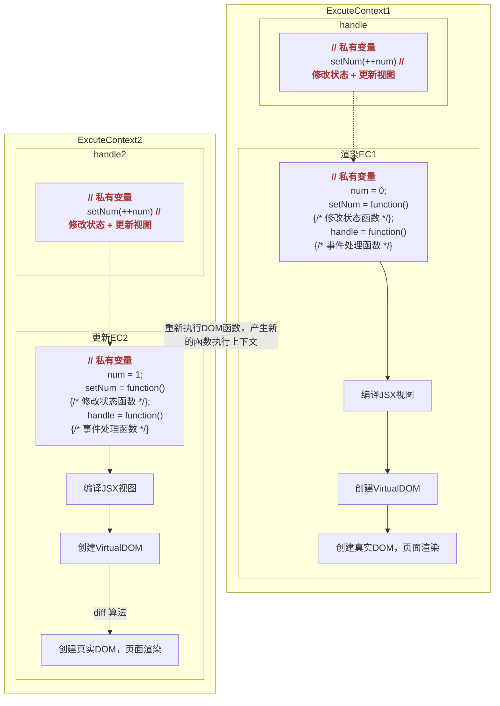
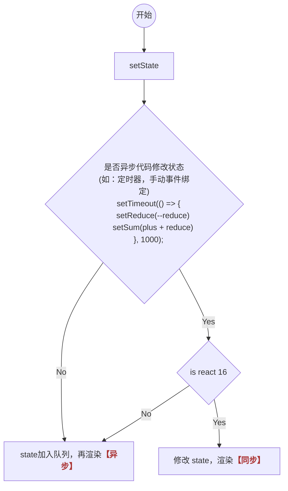

函数组件实现动态组件类组件的功能
React 最新版本 v18.2，Hook 是 React 16.8 新增特性。可以在不编写 class 的情况下使用 state 以及其他 React 特性。
引入 Hook 的动机——解决看起来不相关的问题
Hoos 是执行函数，产生函数上下文

## useState
在函数组件中使用状态，并且后期基于状态修改，进而更新组件
```JavaScript
/**
 * initailValue 执行 useState 传递初始状态值
 * useState 返回一个数组，包括两个元素 [状态值，修改状态值的方法]
 *  attribute 获取的状态值
 *  setAttribute 修改状态值的方法
 *      setAttribute(value)
 *          修改状态值
 *          更新视图
 */ 
let [attribute, setAttribute] = useState(initailValue)
```
### Demo
```JavaScript
// 函数组件中使用状态，更新视图
export default function Demo() {
    let [num, setNum] = useState(0)

    function handleBtn() {
        setNum(++num)
    }
    // 函数组件不需要创建实例，没有 this
    return <Button type="primary" onClick={handleBtn}>按钮{num}</Button>
}
```
### 关于函数组件渲染更新

#### 疑问
<span class='custom-box custom-box-939'>点击按钮 3 秒钟之后，num 输出是几？？？</span>
<span class='custom-box custom-box-393'>答案是 0。在 ExcuteContext1 作用域下，按照作用域链，访问的到的是 num = 0；不会访问 ExcuteContext2 作用域，所以 num 也不会为1。 </span>

```JavaScript
export default function Demo() {
    let [num, setNum] = useState(0)

    function handleBtn() {
        setNum(++num)
        setTimeout(() => {
            console.log(num) // 0
        }, 3000);
    }
    // 函数组件不需要创建实例，没有 this
    return <Button type="primary" onClick={handleBtn}>按钮{num}</Button>
}
```

### useState 源码分析
```JavaScript
/**
 * @initailValue 初值
 * @return [state, setState]
 */
var _state;
function useState(initialValue) {
    if (typeof _state === 'undefined') {
        typeof initailValue === 'function' ? initailValue() : _state = initailValue // 赋初值
    }
    function setState(value) { 
        if(Object.is(_state, value)) return // 更新值与 state 相同，返回
        if(typeof value === "function") {
            _state = value(_state) // 更新队列中保存的函数
        } else {
            _state = value // 修改 state
        }
        ... // 更新视图
    }
    return [_state, setState]
}
```

### hooks 多状态
* 方法一，useState 不能部分修改状态
```javascript
let [state, setState] = useState({
    deprecation: 1,
    approve: 2
})

const handle = () => {
    setState({
        ...state,
        approve: 3
    })
}
```
* 方法二，useState 分别初始化多个状态 <span class='custom-box custom-box-933'>【官方推荐】</span>
```javascript
let [deprecation, setDeprecation] = useState(1)
let [approve, setApprove] = useState(2)

const handle = () => {
    setDeprecation(5)
}
```

### useState 参数为函数
> 业务处理逻辑仅在第一次组件渲染时触发，更新不使用。可以对赋初值的动作进行【惰性处理】，如下代码
```JavaScript
...
let [number, setNumber] = useState(() => {
    let {num, frequency} = props, total = 0
    if (!frequency) return 0
    for (let index = num; index < frequency; index++) {
        total += +String(Math.random()).substring(2)
    }
    return total
})
...
```

### setState 是同步还是异步
<span class='custom-box custom-box-393'>React 18中，无论是使用 Hook 函数 useState 设置更新状态还是类组件 this.setState，多个状态修改是异步的；而在 React 16 中，异步操作中（如：定时器，手动事件绑定）修改状态为同步的。</span>

[具体的 DEMO 案例](https://github.com/HelenZhangLP/react-18/blob/master/src/Hooks/Demo2/index.jsx)

### setState 的性能优化机制
```JavaScript
export default function Demo() {
    console.log('render 渲染')
    let [state, setstate] = useState(NaN)
    handle() {
        setstate(NaN)
    }
    return <div onClick={handle}></div>
}
```
> 不会再次渲染，因为每次修改状态值时，会拿最新修改的值与之前的状态值基于 Object.is 比较，Object.is(NaN, NaN) 返回 true; 两次修改值相同，则不会修改状态，视图也不会更新。[类似于 PureComponent 中，在 shouldComponent 中作了浅比较优化](/2021/05/11/React-Component-pureComponent/)。

#### [思考](https://github.com/HelenZhangLP/react-18/blob/master/src/Hooks/Demo3/index.jsx)
> 以下代码会渲染几次，最终结果是几
```JavaScript
...
let [x, setX] = useState(10)
handle() {
    for(let i=0; i<10; i++) {
        setX(x + 1)
    }
}
...
```
<span class='custom-box custom-box-393'>点击后渲染 1次，最终渲染结果是 11.</span>

> 以下代码会渲染几次，最终结果是几
```JavaScript
...
let [x, setX] = useState(10)
handle() {
    for(let i=0; i<10; i++) {
        flushsync(()=>{
            setX(x + 1)
        })
    }
}
...
```
<span class='custom-box custom-box-393'>点击后渲染 2，最终渲染结果是 11. 原因：优化机制，消息队列中按照优化机制，不会多次渲染相同的值</span>

> 以下代码会渲染几次，最终结果是几
```JavaScript
...
let [x, setX] = useState(10)
handle() {
    for(let i=0; i<10; i++) {
        setx(prev => {
            return prev + 1
        })
    }
}
...
```
<span class='custom-box custom-box-393'>点击后渲染 1，最终渲染结果是 20. updater 队列中存储的是 10 个回调函数，每次执行回调时，拿到的是上一个计算出的 x 的值。合并处理后，渲染一次，值为 20</span>


### 在组件之间复用状态逻辑很难附加到组件的途径
没有提供将可复用性行为
<u>React 需要为共享状态逻辑提供更好的原生途径</u>

### 复用组件难以理解

### 难以理解的 class
