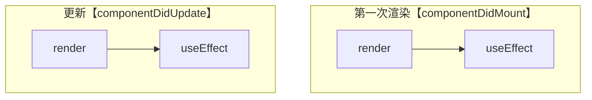
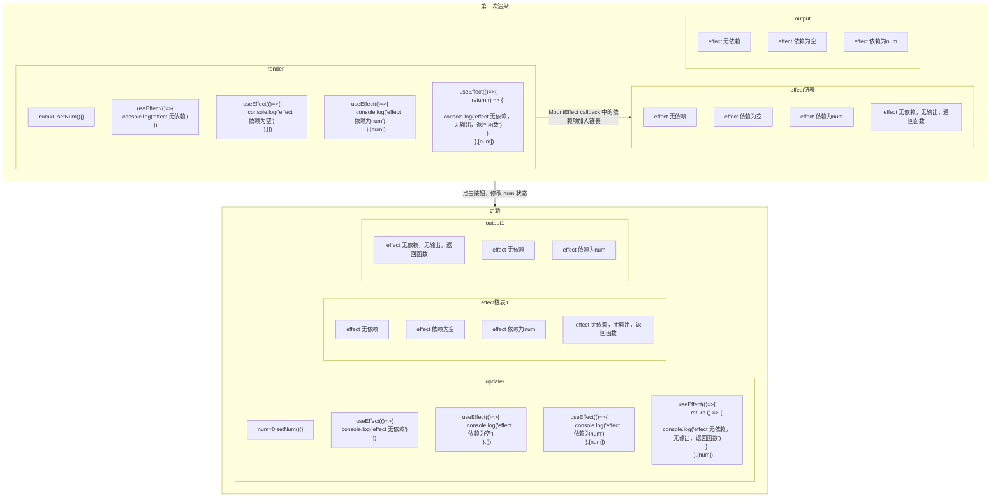
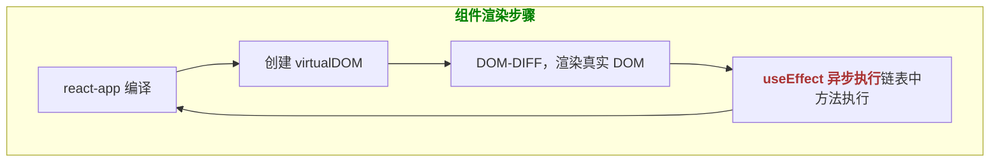

函数组件实现动态组件类组件的功能
React 最新版本 v18.2，Hook 是 React 16.8 新增特性。可以在不编写 class 的情况下使用 state 以及其他 React 特性。
引入 Hook 的动机——解决看起来不相关的问题
Hoos 是执行函数，产生函数上下文

## useState
在函数组件中使用状态，并且后期基于状态修改，进而更新组件
```JavaScript
/**
 * initailValue 执行 useState 传递初始状态值
 * useState 返回一个数组，包括两个元素 [状态值，修改状态值的方法]
 *  attribute 获取的状态值
 *  setAttribute 修改状态值的方法
 *      setAttribute(value)
 *          修改状态值
 *          更新视图
 */ 
let [attribute, setAttribute] = useState(initailValue)
```
### Demo
```JavaScript
// 函数组件中使用状态，更新视图
export default function Demo() {
    let [num, setNum] = useState(0)

    function handleBtn() {
        setNum(++num)
    }
    // 函数组件不需要创建实例，没有 this
    return <Button type="primary" onClick={handleBtn}>按钮{num}</Button>
}
```
### 关于函数组件渲染更新

#### 疑问
<span class='custom-box custom-box-939'>点击按钮 3 秒钟之后，num 输出是几？？？</span>
<span class='custom-box custom-box-393'>答案是 0。在 ExcuteContext1 作用域下，按照作用域链，访问的到的是 num = 0；不会访问 ExcuteContext2 作用域，所以 num 也不会为1。 </span>

```JavaScript
export default function Demo() {
    let [num, setNum] = useState(0)

    function handleBtn() {
        setNum(++num)
        setTimeout(() => {
            console.log(num) // 0
        }, 3000);
    }
    // 函数组件不需要创建实例，没有 this
    return <Button type="primary" onClick={handleBtn}>按钮{num}</Button>
}
```

### useState 源码分析
```JavaScript
/**
 * @initailValue 初值
 * @return [state, setState]
 */
var _state;
function useState(initialValue) {
    if (typeof _state === 'undefined') {
        typeof initailValue === 'function' ? initailValue() : _state = initailValue // 赋初值
    }
    function setState(value) { 
        if(Object.is(_state, value)) return // 更新值与 state 相同，返回
        if(typeof value === "function") {
            _state = value(_state) // 更新队列中保存的函数
        } else {
            _state = value // 修改 state
        }
        ... // 更新视图
    }
    return [_state, setState]
}
```

### 函数组件处理多状态
* 方法一，useState 不能部分修改状态
```javascript
let [state, setState] = useState({
    deprecation: 1,
    approve: 2
})

const handle = () => {
    setState({
        ...state,
        approve: 3
    })
}
```
* 方法二，useState 分别初始化多个状态 <span class='custom-box custom-box-933'>【官方推荐】</span>
```javascript
let [deprecation, setDeprecation] = useState(1)
let [approve, setApprove] = useState(2)

const handle = () => {
    setDeprecation(5)
}
```

### useState 参数为函数
> 业务处理逻辑仅在第一次组件渲染时触发，更新不使用。可以对赋初值的动作进行【惰性处理】，如下代码
```JavaScript
...
let [number, setNumber] = useState(() => {
    let {num, frequency} = props, total = 0
    if (!frequency) return 0
    for (let index = num; index < frequency; index++) {
        total += +String(Math.random()).substring(2)
    }
    return total
})
...
```

### setState 是同步还是异步
<span class='custom-box custom-box-393'>React 18中，无论是使用 Hook 函数 useState 设置更新状态还是类组件 this.setState，多个状态修改是异步的；而在 React 16 中，异步操作中（如：定时器，手动事件绑定）修改状态为同步的。</span>

[具体的 DEMO 案例](https://github.com/HelenZhangLP/react-18/blob/master/src/Hooks/Demo2/index.jsx)

### setState 的性能优化机制
```JavaScript
export default function Demo() {
    console.log('render 渲染')
    let [state, setstate] = useState(NaN)
    handle() {
        setstate(NaN)
    }
    return <div onClick={handle}></div>
}
```
> 不会再次渲染，因为每次修改状态值时，会拿最新修改的值与之前的状态值基于 Object.is 比较，Object.is(NaN, NaN) 返回 true; 两次修改值相同，则不会修改状态，视图也不会更新。[类似于 PureComponent 中，在 shouldComponent 中作了浅比较优化](/2021/05/11/React-Component-pureComponent/)。

#### [思考](https://github.com/HelenZhangLP/react-18/blob/master/src/Hooks/Demo3/index.jsx)
> 以下代码会渲染几次，最终结果是几
```JavaScript
...
let [x, setX] = useState(10)
handle() {
    for(let i=0; i<10; i++) {
        setX(x + 1)
    }
}
...
```
<span class='custom-box custom-box-393'>点击后渲染 1次，最终渲染结果是 11.</span>

> 以下代码会渲染几次，最终结果是几
```JavaScript
...
let [x, setX] = useState(10)
handle() {
    for(let i=0; i<10; i++) {
        flushsync(()=>{
            setX(x + 1)
        })
    }
}
...
```
<span class='custom-box custom-box-393'>点击后渲染 2，最终渲染结果是 11. 原因：优化机制，消息队列中按照优化机制，不会多次渲染相同的值</span>

> 以下代码会渲染几次，最终结果是几
```JavaScript
...
let [x, setX] = useState(10)
handle() {
    for(let i=0; i<10; i++) {
        setx(prev => {
            return prev + 1
        })
    }
}
...
```
<span class='custom-box custom-box-393'>点击后渲染 1，最终渲染结果是 20. updater 队列中存储的是 10 个回调函数，每次执行回调时，拿到的是上一个计算出的 x 的值。合并处理后，渲染一次，值为 20</span>

## useEffect
```JavaScript
import React, {useEffect, useState} from "react"

function Demo() {
    let [num, setNum] = useState(0)
    useEffect(() => {
        console.log('effect', document.getElementsByTagName('div'))
    })
    console.log('render')
    return <div>useEffect,{num}</div>
}

export default Demo
```

> `useEffect(callback)` 第一次渲染完后，执行 callback。更新完成后，同样再次执行 callback

### 依赖项为空
```JavaScript
...
useEffect(() => {
    console.log('effect', document.getElementsByTagName('div'))
},[])
...
```

### 多个依赖项
> 任一依赖项变化，触发 callback 执行
```JavaScript
...
useEffect(() => {
    console.log('effect', document.getElementsByTagName('div'))
},[ids, name])
...
```
<span class='custom-box custom-box-933'>依赖项类似与 ComponentShouldUpdate</span>

### effect 第一渲染不执行，更新的时候运行 callback 返回的函数
```JavaScript
...
useEffect(() => {
    return ()=>{
        console.log('effect', document.getElementsByTagName('div'))
    }
})
...
```

### useEffect 原理分析
```JavaScript
import React, {useEffect, useState} from "react"

function Demo() {
    let [num, setNum] = useState(0)
    useEffect(() => {
        console.log('effect', '无依赖')
    })

    useEffect(()=>{
        console.log('effect', '依赖为空')
    },[])

    useEffect(()=>{
        console.log('effect', '依赖 num 的变化')
    },[num])

    useEffect(()=>{
        return () => {
            console.log('effect', '返回函数')
        }
    })

    function handle() {
        setNum(1)
    }

    console.log('render')
    return <button onClick={handle}>useEffect,{num}</button>
}
```
---


### Error - 1
<font color='red'>Line 26:9:  React Hook "useEffect" is called conditionally. React Hooks must be called in the exact same order in every component render  react-hooks/rules-of-hooks</font>
<span class='custom-box custom-box-393'>每次渲染 react hooks 都要以相同的顺序在组件中调用</span>

```JavaScript
if(num > 5) {
    useEffect(() => {
        console.log(`${num} > 5`)
    })
}
```
/** 正确方式 **/
```JavaScript
useEffect(() => {
    if(num > 5) {
        console.log(`${num} > 5`)
    }
},[num])
```
### Error - 2
<font color='red'>react-dom.development.js:86 Warning: useEffect must not return anything besides a function, which is used for clean-up.
It looks like you wrote useEffect(async () => ...) or returned a Promise. Instead, write the async function inside your effect and call it immediately:
useEffect(() => {
  async function fetchData() {
    // You can await here
    const response = await MyAPI.getData(someId);
    // ...
  }
  fetchData();
}, [someId]); // Or [] if effect doesn't need props or state</font>

```JavaScript
useEffect(() => {
  async function fetchData() {
    // You can await here
    const response = await MyAPI.getData(someId);
    // ...
  }
  fetchData();
}, [someId]); 
```

### Error-3 <font color='red'>快速点击 btn 后，样式或内容会有短暂的闪烁</font>
```JavaScript
export default function Demo() {
    let [num, setNum] = useState(0)
    useLayoutEffect(()=>{
        if(!num) setNum(10)
    },[num])
    function handleIncremental() {
        setNum(0)
    }
    console.log('render')
    return <div style={{backgroundColor: num === 0 ? 'red' : 'lightgreen'}}>
        <p>{num}</p>
        <Button type="primary" onClick={handleIncremental}>Incremental</Button>
    </div>
}
```
> 原因分析：

> 那么真实 DOM 会渲染两次，所以会有内容和样式上的闪烁，使用 useLayoutEffect 解决：
```mermaid
%%{init: {"flowchart": {"htmlLabels": true}} }%%
 flowchart LR
 subgraph "<b style="color: green; padding:10px">组件渲染步骤</b>"
    step1["babel-preset-react-app 编译 createElement"]
    step2["createElement 创建 virtualDOM"]
    step3["root.render 把 virtualDOM 变为真实 Diff 运算"]
    step4["<b style="color: #a33">useLayoutEffect</b>阻塞渲染，<b><U>同步执行</U></b>EFFECT 链表中方法"]
    step5["渲染真实 DOM"]

    step1 --> step2
    step2 --> step3
    step3 --> step4
    step4 --> step5
 end
 ```
 <span class='custom-box custom-box-339'>使用 useLayoutEffect 可以解决闪烁问题，如上图真实 dom 只渲染一次，所以不会闪烁</span>

 ### useEffect 与 useLayoutEffect 区别
 useLayoutEffect 会阻塞浏览器真实 DOM，优先执行 Effect 链表中的 callback；
 useEffect 不会阻塞浏览器渲染真实 DOM，在渲染真实 DOM 的同时，去执行 Effect 链表中的 callback.
 useLayoutEffect 优先于 useEffect 执行
 都可以获取 DOM 元素，原因在于真实 DOM 已经生成，区别只是 useLayoutEffect 在执行完 effect 链表后渲染 DOM 到浏览器
 useEffect 会渲染两次，useLayoutEffect 会合并真实 DOM 渲染。
 
## useRef