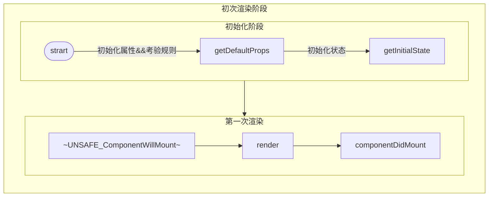
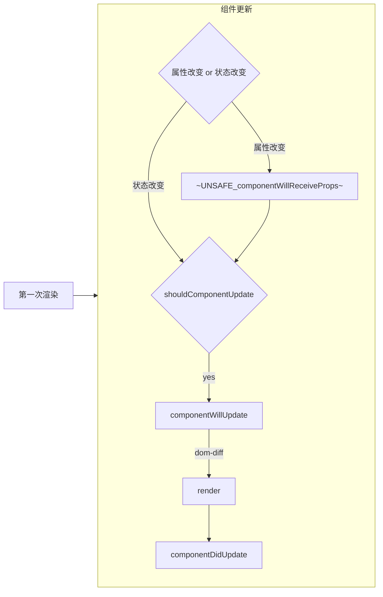
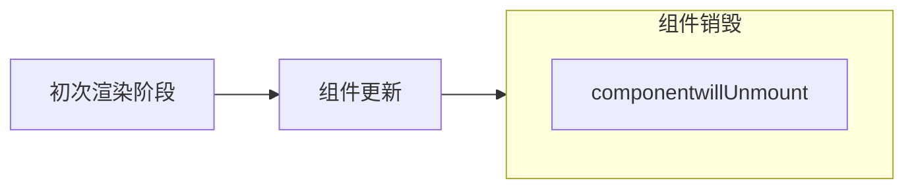
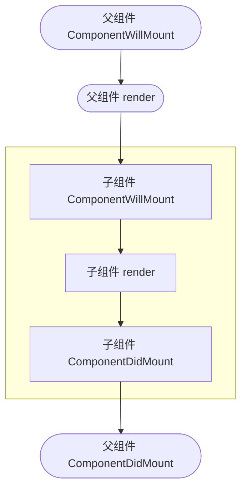
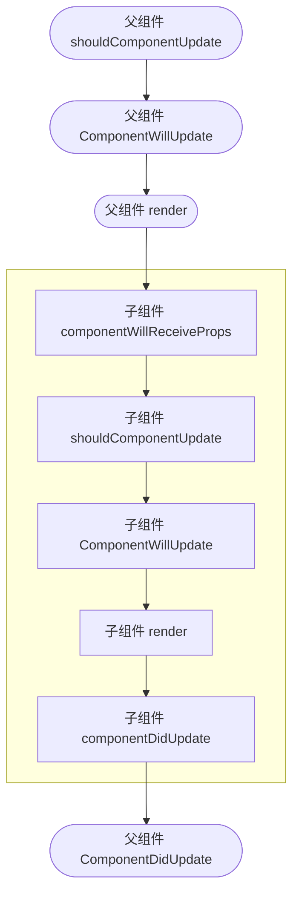
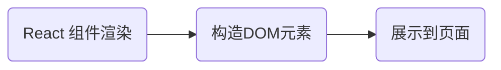

> UNSAFE_* 屏蔽 warning

## <font color='red'>the components is not recommended</font>
|serial number|component name|
|---|---|
|1|ComponentWillMount|
|2|componentWillUpdate|

## 第一次渲染
### step1 —— 初始化属性&&考验规则
```JavaScript
class Vote extends React.Component {
  /**
   * method1: handle init props in constructor function(在 constructor 中初始化属性)
    constructor(props) {
      super(props) // 把传递进来的 {...props} 挂载到 this
    }
  */
 /**
  * method2: 不通过显式声明 constructor 初始化属性，react 内部机制会处理
  */
}
```
### step2 —— 初始化状态
状态修改，触发视图更新，`React.Component.prototype.setState` 与 `React.Component.prototype.forceUpdate` 都可以更新视图。
<span class='custom-box custom-box-933'>`React.Component.prototype.forceUpdate` 这种方式不推荐使用，因为：</span>
<span class='custom-box custom-box-939'>`React.Component.prototype.forceUpdate` 不会触发 shouldComponentUpdate 生命周期更新。</span>

```JavaScript
class Vote extends React.Component {
  state = {
    supportVote: 0,
    nagativeVote: 0
  } // 默认值为 null

  render() {
    let {supportVote, nagativeVote} = this.state
    return <>
      <button onClick={()=>{
        this.setState({
          supportVote: ++supportVote
        })
      }}>赞成{supportVote}</button>
      <button onClick={()=>{
        this.state.nagativeVote++
        this.forceUpdate()
      }}>反对{nagativeVote}</button>
    </>
  }
}
```

### step3 —— ComponentWillMount
非严格模式下：<font color='#ffa'>Warning: componentWillMount has been renamed, and is not recommended for use. See https://reactjs.org/link/unsafe-component-lifecycles for details.</font>`componentWillMount`已被重命名，不推荐使用。
严格模式下：<font color='red'>react-dom.development.js:86 Warning: Using UNSAFE_componentWillMount in strict mode is not recommended and may indicate bugs in your code. See https://reactjs.org/link/unsafe-component-lifecycles for details.</font>
```JavaScript
class Vote extends React.Component {
  state = {
    supportVote: 0,
    nagativeVote: 0
  } // 默认值为 null

  componentWillMount() {
    console.log('组件渲染前 componentWillMount')
  }

  render() {
    let {supportVote, nagativeVote} = this.state
    return <>
      <button onClick={()=>{
        this.setState({
          supportVote: ++supportVote
        })
      }}>赞成{supportVote}</button>
      <button onClick={()=>{
        this.state.nagativeVote++
        this.forceUpdate()
      }}>反对{nagativeVote}</button>
    </>
  }
}
```

### step4 —— render
组件渲染阶段

### step5 —— componentDidMount
第一次渲染结束，virtualDOM 已经更新成完真实 DOM，可以进行 DOM 操作

## 组件更新
### step6 —— shouldComponentUpdate
是否允许组件更新，<span class='custom-box custom-box-933'>`react.component.forceUpdate` 不会触发 shouldComponentUpdate 生命周期更新。</span>
```javascript
class Vote extends React.Component {
  state = {
    supportVote: 0,
    nagativeVote: 0
  } // 默认值为 null

  componentWillMount() {
    console.log('组件渲染前 componentWillMount')
  }

  componentDidMount() {
    console.log('componentDidMount：组件已挂载至页面')
  }

  /**
   * 状态修改，触发组件更新
   * @param {*} nextProps 要修改的属性
   * @param {*} nextState 要修改的状态
   * @returns boolean 是否允许更新
   */  
  shouldComponentUpdate(nextProps, nextState) {
    console.log('shouldComponentUpdate: 是否允许组件更新',this.state, nextState)

    /**
     * return true 允许更新，执行下一个操作
     * return false 不允许更新
     */
    return true
  }

  render() {
    let {supportVote, nagativeVote} = this.state
    return <>
      <button onClick={()=>{
        this.setState({
          supportVote: ++supportVote
        })
      }}>赞成{supportVote}</button>
      <button onClick={()=>{
        this.state.nagativeVote++
        this.forceUpdate()
      }}>反对{nagativeVote}</button>
    </>
  }
}
```
### step7 —— componentWillUpdate
<font color='#ffa'>Warning: componentWillUpdate has been renamed, and is not recommended for use. See https://reactjs.org/link/unsafe-component-lifecycles for details.
</font>
> 这个阶段状态未更新

```javascript
class Vote extends React.component {
  ...
  componentWillUpdate(){
    console.log('componentWillUpdate:', this.state) // {
    //    "supportVote": 0,
    //    "nagativeVote": 0
    // }
  }
  render() {
    return <>...</>
  }
}
```
### step8 —— render
### step9 —— componentDidUpdate
组件更新完毕

## 父子组件渲染
React 组件更新遵循深度优先原则，父组件在操作中遇到子组件，一定是把子组件处理完后，才继续处理父组件。
### 父组件第一次渲染


### 父组件更新



@startuml
|#pink|创建时|
:constructor;
:getDerivedStateFromProps(o)|
|更新时|
:getDerivedStateFromProps(o)|
|卸载时|
@enduml


React 组件中，生命周期可基本分为三个状态

### Mounting 组件的挂载

<!--more-->
如上过程称为**组件挂载**
执行的相关生命周期方法：
1.  getDerivedStateFromProps

Mounting：已开始挂载 DOM
Updating：重新渲染组件 DOM
UnMounting：已卸载真实的 DOM

关于生命周期的方法
ComponentWillMount()：在渲染前调用，可以在客户端，也可以在服务端
ComponentDidMount()：第一次渲染后调用，只作用于客户端
ComponentWillUpdate()/UNSAFE_componentWillUpdate
<font color="Orange">
  `componentWillUpdate has been renamed，and is not recommended for use
  Move data fetching code or side effects to ComponentDidUpdate
  Rename componentWillUpdate to UNSAFE_componentWillUpdate to suppress this warning in non-strict mode，In React 18.x, only the UNSAFE_ name will work. to rename all deprecated lifecycles to their new names, you can run 'npx react-codemod rename-unsafe-lifecycles' in your project source folder.`
</font>
> 在组件接收到新的 props 参数或者 State 状态，<u>渲染之前调用</u>。**该方法初始化时不会被调用**
  ComponentWillUpdate 未来会废弃
  平缓过渡 React 16.3 版本中，为不安全的生命周期引入别名 UNSAFE_componentWillUpdate
  废弃旧版本的生命周期保留至 React 17

UNSAFE_componentWillUpdate + getDerivedStateFromProps
<font color="red">
  `Unsafe legacy lifecycles will not be called for components using new components APIs
  App uses getDerivedsTATEfromProps() but also contains the following legacys UNSAFE_componentWillUpdate`
</font>

getDerivedStateFromProps()
><u>在组件实例化及接收到新的 props 后调用</u>，返回一个对象去更新 state，或者返回 null 不更新，<u>用于确认当前组件**是否需要重新渲染**</u>这个生命周期将作为 componentWillReceiveProps() 的安全替代者

getSnapshotBeforeUpdate()
><u>更新之前被调用</u>**这个生命周期返回值将作为第3个参数传递给 componentDidUpdate() 方法**<font color="red">对于保存滚动位置有用</font>

<font color="red">Warning: App: getSnapshotBeforeUpdate should be used with ComponentDidUpdate(). This component defines getSnapshotBeforeUpdate() only</font>

ComponentDidUpdate()：组件完成更新后会立即调用，另外该方法。**该方法初始化时不会被调用**
ComponentWillMount()：在组件从 Dom 中移除之前会被立刻调用。
