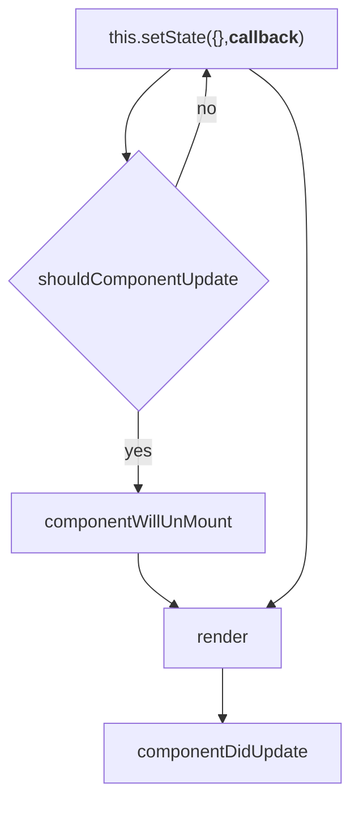
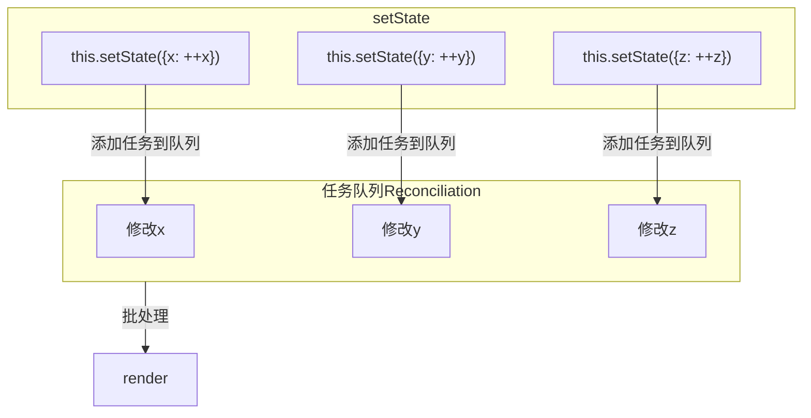
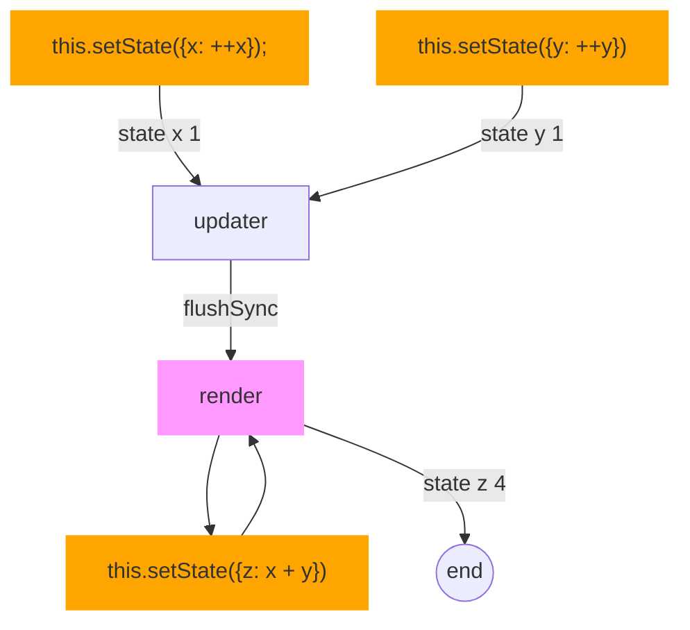
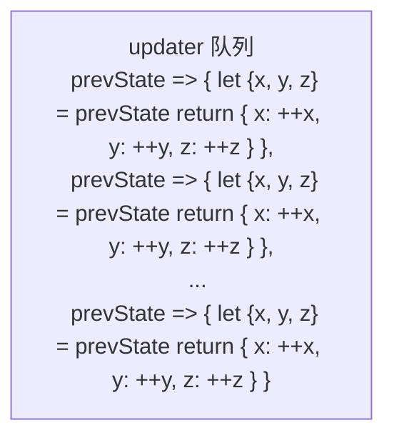

* React 是单向数据流，自顶向下数据流，由父节点向子节点由上到下传递，通过更新 React 组件状态，实现重新渲染用户界面操作。
* React 组件可以看成一个*** 状态机 ***（组件通过与用户交互，实现不同的状态，然后通过渲染 UI 保证用户界面和数据的一致性）。
* React 通过 setState() 方法来更新状态（state）

## state 初始化
### state 设计的几点原则；
  * state 代表一个组件 UI 呈现的完整的最小状态集，是渲染组件时所用到的数据的来源
  * 用作组件 UI 展现形式的判断依据，反应组件的 UI 变化<font color="red">没有任何中间状态，也不存在通过其他状态计算来的中间状态</font>
  <!-- * 组件的整个生命周期中保持不变，若是，则不是一个状态 -->
### React16 
```JavaScript
  import React,{Component} from 'react';

  export default class pop extends Component {
    // construct 用于初始化组件的 state及绑定事件
    construct(props) {
      // 调用父类的 construct 方法，即调用 react.Component 的构造方法。用于完成 react 组件的初始化工作，保证 props 传入组件
      super(props);
      this.state = {
        isShow: false, // 展现形式的判断依据
        pop: '弹层', // 渲染时所用到的数据
        purchaseList: [],
        totalCost: 0 // 根据 purchaseList 中 的 price 计算得来的，属性于中间多余属性。
      }
    }

    render() {
      const {isShow, pop} = this.state;
      return (
        isShow ? <div>{pop}</div> : null
      )
    }
  }
```
### React18
```JavaScript
export default class Demo extends React.Component {
    state = {
        x: 0,
        y: 0,
        z: 0
    }

    render() {
        return <>...</>
    }
}
```

## setState
```JavaScript
/**
 * partialState 支持部分状态，this.setState({x: 1}) 支持仅修改多个属性中的某几个，不影响其它属性状态
 * callback componentDidUpdate 之后执行，componentDidUpdate 在任何状态更改后触发，回调函数，可以在指定状态更新后处理
 */ 
this.setState(partialState, [callback])
```
```JavaScript
Component.prototype.setState = function (partialState, callback) {...}
```
### setState 回调函数 callback 的执行机制
<span class='custom-box custom-box-393'>无论 shouldComponentUpdate 返回 `true` 还是 `false`，callback 都会执行</span>



### setState 执行是异步还是同步
使用 React 内置的 setState() 修改 state，<span class='custom-box custom-box-393'>每当使用 setState() 时，React 会将需要更新的 state 合并后放入状态队列，触发调和过程（Reconciliation），每当使用 setState() 时，React 会将需要更新的 state 合并后放入状态队列，触发调和过程（Reconciliation）</span>，再根据新的状态结构重新渲染 UI 界面，React 会根据差异对界面进行最小化重新渲染
#### React18 中
```JavaScript
export default class Demo extends React.Component {
    state = {
        x: 0,
        y: 0,
        z: 0
    }

    btnEvent = () => {
        let {x,y,z} = this.state
        this.setState({x: ++x})
        console.log('state x', x) // setState --> render1 异步
        this.setState({y: ++y})
        console.log('state y', y) // setState --> render1 异步
        setTimeout(() => {
            this.setState({z: ++z}) 
            console.log('state z', z) // setState --> render2 异步
        });  
    }

    render() {
        const {x,y,z} = this.state
        console.log('Render:', x, y, z)
        return <>
            <div>x:{x}</div>
            <div>y:{y}</div>
            <div>z:{z}</div>
            <button onClick={this.btnEvent}>按钮</button>
        </>
    }
}
```
> React18 中，setState 执行是 <span class='custom-box custom-box-933'>异步操作</span>
React18 的更新队列处理机制，基于异步操作，<span class='custom-box custom-box-393'>最终实现批处理</span>从而减少更新次数，降低性能消耗。

#### React16 中
```JavaScript
export default class App extends React.Component {
  state = {
      x: 0,
      y: 0,
      z: 0
  }

  btnEvent = () => {
      let {x,y,z} = this.state
      this.setState({x: ++x})
      console.log('setState x:', x) // setState --> render1 异步
      this.setState({y: ++y})
      console.log('setState y:', y) // setState --> render1 异步
      setTimeout(() => {
        this.setState({z: ++z})   
        console.log('setState z:', z) // render2 --> setState 同步
      });
  }

  render() {
      const {x,y,z} = this.state
      console.log('Render:', x, y, z)
      return <>
          <div>x:{x}</div>
          <div>y:{y}</div>
          <div>z:{z}</div>
          <button onClick={this.btnEvent}>按钮</button>
      </>
  }
}
```
> React16 对于异步操作（如：定时器，通过 addEventListener 手动绑定 Dom 事件） setState 的处理方式与 React18 不同，它会变成同步

## flushSync
### 依赖当前的 state 计算下一个 state
> 采用 `flushSync` 强制刷新执行渲染
```JavaScript
import {flushSync} from 'React-dom'
export default class Demo extends React.Component {
    state = { x: 0, y: 0, z: 0 }

    btnEvent = () => {
        let {x,y,z} = this.state
        flushSync(() => {
            this.setState({x: ++x})
            console.log('state x', x)
            this.setState({y: ++y})
            console.log('state y', y)
        })
        this.setState({z: x + y}) 
        console.log('state z', z)
    }

    render() {
        const {x,y,z} = this.state
        console.log('Render:', x, y, z)
        return <>
            <div>x:{x}</div>
            <div>y:{y}</div>
            <div>z:{z}</div>
            <button onClick={this.btnEvent}>按钮</button>
        </>
    }
}
```
<span class='custom-box custom-box-939'>代码执行顺序</span>


### 点击一次 btn，页面渲染 20 次
```JavaScript
export default class Demo extends React.Component {
    state = {
        x: 0,
        y: 0,
        z: 0
    }

    btnEvent = () => {
        let {x, y, z} = this.state
        for(var i=0; i<20; i++) {
            flushSync(() => {
                this.setState({
                    x: ++x,
                    y: ++y,
                    z: ++z
                })
            })
        }
    }

    render() {
        const {x,y,z} = this.state
        console.log('Render:', x, y, z)
        return <>
            <div>x:{x}</div>
            <div>y:{y}</div>
            <div>z:{z}</div>
            <button onClick={this.btnEvent}>按钮</button>
        </>
    }
}
/**
 *index.jsx:33 Render: 1 1 1
  index.jsx:33 Render: 2 2 2
  index.jsx:33 Render: 3 3 3
  index.jsx:33 Render: 4 4 4
  index.jsx:33 Render: 5 5 5
  index.jsx:33 Render: 6 6 6
  index.jsx:33 Render: 7 7 7
  index.jsx:33 Render: 8 8 8
  index.jsx:33 Render: 9 9 9
  index.jsx:33 Render: 10 10 10
  index.jsx:33 Render: 11 11 11
  index.jsx:33 Render: 12 12 12
  index.jsx:33 Render: 13 13 13
  index.jsx:33 Render: 14 14 14
  index.jsx:33 Render: 15 15 15
  index.jsx:33 Render: 16 16 16
  index.jsx:33 Render: 17 17 17
  index.jsx:33 Render: 18 18 18
  index.jsx:33 Render: 19 19 19
  index.jsx:33 Render: 20 20 20
  */
```

### 更新一次，渲染结果 20

```JavaScript
this.setState(prevState => {
    let {x, y, z} = prevState
    return {
        x: ++x,
        y: ++y,
        z: ++z
    }
})
```
```JavaScript
export default class Demo extends React.Component {
    state = { x: 0, y: 0, z: 0 }

    btnEvent = () => {
        for(var i=0; i<20; i++) {
            this.setState(prevState => {
                let {x, y, z} = prevState
                return {
                    x: ++x,
                    y: ++y,
                    z: ++z
                }
            })
        }
    }

    render() {
        const {x,y,z} = this.state
        console.log('Render:', x, y, z)
        return <>
            <div>x:{x}</div>
            <div>y:{y}</div>
            <div>z:{z}</div>
            <button onClick={this.btnEvent}>按钮</button>
        </>
    }
}
```

## 关于 state props 与使用普通属性的一些忠告
> 触发渲染的属性是 props 和 state，props 来自父级，只读属性，不能修改。如果需要修改须在父级 setState 修改，state 维护组件内部属性。
1.  变量是否从 props 中获取，若是，则不是一个属性；
2.  变量是否在组件的整个生命周期中保持不变，若是，则不是一个状态；
3.  状态是否是从在组件 render 中使用，未使用，则不是一个状态，适合用普通属性。

```JavaScript
import React, {Component} from 'react';

export default class timer extends Component {
  construct(props) {
    super(props);
    this.state = {
      date: new Date()
    }
    this.timer = null; // 非 props 或 state，是一个普通属性
  }

  componentDitMount() {
    // timer 不用于渲染
    this.timer = setInterval(() => {
      this.setState({
        date: newDate()
      })
    }, 1000)
  }

  componentWillUnMount() {
    if (this.timer) {
      clearInterval(this.timer)
    }
  }

  render() {
    return (
      <div>{this.state.date.toString()}</div>
    )
  }
}
```

<font color="red">简而言之，就是 state 如同函数内的变量，props 如同入参，state 和 props 共同触发 ui 渲染</font>
<font color="darkgreen">this.setState({...}) 修改 state，获取 state 属性 this.state.xx</font>
setState() 两个参数， prevState 和 props 分别用于传递前一个 state 和 props 参数

### react 官方建议把 state 当作不可变对象
state 中包含的所有状态都应该是不可变对象，state 中的某个状态发生变化时，应该重新创建这个状态对象，并非是修改原来的状态。将状态类型分为三种情况创建新的状态对象：
1.  状态类型是数字、字符串、布尔值、null、undefined
直接给修改状态赋新值
```JavaScript
this.setState({
  quantity: 1,
  title: 'react',
  success: true
})
```
2.  状态类型是数组
> 状态发生变化时重新创建状态对象，数组方法中，push, pop, shift, unshift, splice 都是 `在原数组的基础上修改的`，concat、slice、filter 是`返回一个新数组`。
```javascript
/* books 是要修改的状态，类型为数组 */

// 使用 preState、concat 创建新数组
// 箭头之后的圆括号用来实现换行（MDN）
this.setState((preState) => ({
  books: preState.books.concat(['react guide'])
}))

// ES6 spread syntax
this.setState((preState) => ({
  books: [...preState.books, 'react guide']
}))
```
用 `slice` 从数组中截取一部分元素作为新状态；用`filter` 过滤部分元素作作为新状态
```javascript
this.setState((preState) => ({
  books: preState.books.slice(1,3)
}))

this.setState(preState => ({
  books: preState.books.filter(item => {
    return item !== 'react'
  })
}))
```

3.  状态类型是不包含字符串、数组的普通对象
避免修改原对象的方法，使用返回一个新对象的方法
```javascript
// 使用 ES6 Object.assgin 方法
this.setState(preState => ({
  owner: Object.assgin({}, preState.owner, {name: 'helen'})
}))

// 使用对象扩展语法 object spread properties
this.setState(preState => ({
  owner: {...preState.owner, {name: 'helen'}}
}))
```
react 推荐组件状态不可变的原因在于，返回新对象可以避免原有对象组件状态不小心情况下修改，导致错误，方便管理、调试。还有出于性能考虑，当组件对象不可变时，在组件的 shouldComponentUpdate 方法中仅需要对比前后对象的引用便可以判断是否发迹，避免不必要的 render.

