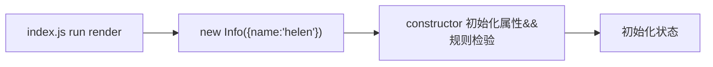

## 类组件
  * 具备“状态，[ref](2021/05/11/React-Refs/)，属性、插槽“ 等，可灵活控制组件更新，基于钩子函数也可灵活掌控不同阶段处理不同事项；
  * 渲染流程繁琐，渲染速度慢；
  * 基于 OOP（面向对象）思想设计，更方便实现继承

### 构造方法
```javascript
  class User extends React.Component {
    constructor() {}
  }
```
<font color='red'>Uncaught ReferenceError: Must call super constructor in derived class before accessing 'this' or returning from derived constructor</font>
<span class='custom-box custom-box-933'>引用错误：在访问 `this` 或从派生构造函数返回之前，必须调用派生类中调用 super 构造函数</span>

```javascript
  class User extends React.Component {
    constructor() {
      // super 关键字调用父类构造函数
      // 相当于 React.Component.call(this)
      super()
    }
  }
```
<span class='custom-box custom-box-933'>为什么呢？</span><span class='custom-box custom-box-393'>super() 相当于 React.Component.call(this) 继承父类的 props, context, updater, refs 属性</span>

### 继承
React 类组件是基于 `extends` 实现继承

```javascript
  class User extends React.Component {}
```
#### React.Component 源码
构造函数 Component 中包含四个实例（私有）属性：props/context/refs/updater
```javascript
  function Component(props, context, updater) {
    this.props = props
    this.context = context
    this.refs = emptyObject
    this.updater = updater || ReactNoopUpdateQueue
  }
```
`class User extends React.Component {}` 是基于 `call` 继承父类私有方法属性
```javascript
  let user = new User()
  Component.call(user)
  console.log(user)
  /**
   * {
   *  "context": undefined 
   *  "props" : undefined
      "refs": {},
      "updater": {}
    }   
    [[Prototype]] : Object
    * /
```
再基于原型继承，继承原型属性 <span class='custom-box custom-box-939'>`Info.prototype => Component.prototype => Object.prototype`</span>
```javascript
  Class Info extends React.Component {}
  let info = Info()
```
那么 Info 的实例 info 具备了 React.Component 与 Object 上的原型方法

### 内部原理
```javascript
  // index.js
  root.render(<Info name="hel"/>)
```
----
```javascript
  Class Info extends React.Component {
    /* 属性规则检验 */
    static defaultProps = {
      num: 0
    }
    static propsType = {
      title: PropTypes.string.isRequired,
      num: PropTypes.number
    }
    constructor(props) {
      super()
      console.log(Object.isFrozen(props)) // true
    }
  }
```
