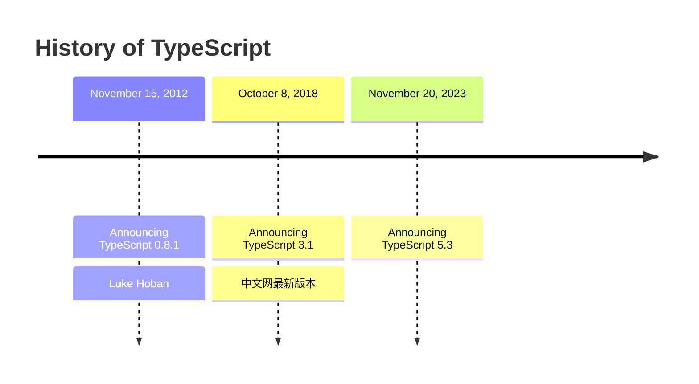

微软公司研发
2012 年 TypeScript 0.8.1 Luke Hoban



## 变量
```JavaScript
// 声明变量
let variable: number

variable = 1
// variable = 'hello' // Type 'string' is not assignable to type 'number'.[不能将类型“string”分配给类型“number”。ts(2322)]

let _variable = true // 变量声明的同时赋值，TS 可以自动对变量进行类型检测
_variable = 1 // // Type 'string' is not assignable to type 'number'.[不能将类型“string”分配给类型“number”。ts(2322)]
```
> 变量声明的同时赋值，TS 可以自动对变量进行类型检测

```JavaScript
declare function getPublicUrlOrPath(
    isEnvDevelopment: boolean,
    homepage: string | undefined,
    envPublicUrl: string | undefined,
): string;
```

## 数据类型
|类型|例子|描述|
|---|---|---|
|number|let n=1,u=Ob0001,m=Oxf00d,o=Oo744,big=10n|任意类型数字|
|string|let s='string'|任意字符串|
|boolean|let a=true,b=false|布尔值|
|字面量|其本身|限制字面量的值是该值|
|any|任何类型|可以赋值给其它的变量，赋值后当前变量值修改，但类型未修改|
|unknown|未知类型|一个安全的 any 类型，不能赋值给其它变量|
|void|空值(undefined)|没有值(或undefined)|
|never|没有值|不能是任何值|
|object|{name: 'moses'}|任意 JS 对象|
|array|[]|JS 数组|
|tuple|[]||
|enum|enum(A,B)||

### 字面量
<span class='custom-box custom-box-939'>以下情况类似于常量，值不能修改。</span>
```JavaScript
let variable_: 1 // 这种情况下类似于常量
// variable_ = 2 // 不能将类型“2”分配给类型“1”。ts(2322)
```

### 联合类型 |
<span class='custom-box custom-box-939'>以下情况，变量的值可以多个</span>
```JavaScript
    let _var: "string" | 2 // 联合类型，_var 的值既可以是字符串 string，又可以是 2
    let var_: boolean | string
```

### any
<span class='custom-box custom-box-939'>任意类型，变量设置为 any 类型相当于对该变量关闭了 TS 的类型检测</span>
<span class='custom-box custom-box-933'>使用 TS 时，不建议使用 any 类型</span>

```JavaScript
    // let var_any: any
    // 隐式 any：声明变量时不指定类型，则 TS 解析器会自动判断变量类型为 any
    let var_any // TS7043: Variable 'var_any' implicitly(含蓄地；暗中地) has an 'any' type,
                // but a better type may be inferred(推断) from usage（使用）.
        var_any = 1
        var_any = 1n
        var_any = 'string'
        var_any = true
```

#### <font color='red'>BigInt literals are not available when targeting lower than ES2020.</font>
这里需要 ts 编译时，编译为 es2020 及以上版，[【具体操作见】](/2022/03/06/TS-编译/)

### unknown 类型
在变量类型不确定时建议使用 `unknown` 类型
<span class='custom-box custom-box-393'>unknown 是一个安全类型的 any</span>
<span class='custom-box custom-box-339'>不能直接赋值给其它变量</span>

```JavaScript
    let var_unknown: unknown
    var_unknown = Number.MAX_VALUE

    variable = var_unknown // TS2322 Type 'unknown' is not assignable to type number【不能将类型“unknown”分配给类型“number”。ts(2322)】

    // ’unknown‘ 类型的值不能直接赋值给任何变量
    if (typeof !=== 'unknown') {...}
```

#### 断言
> 解决 'unknown' 类型变量赋值问题
断言有两种写法，如下：

```JavaScript
// 断言 可以用来告诉解析器变量实际类型
variable = var_unknown as number // TS2322 Type 'unknown' is not assignable to type number【不能将类型“unknown”分配给类型“number”。ts(2322)】
variable = <number>var_unknown
console.log(variable)
```

### void
> 函数没有返回值
```JavaScript
    function fn(): void {} 
    function fnUndefined(): void {return undefined}
    function fnNull(): void {return null}
```

### never
> 永远不会有返回值，可以在定义错误问题报错
```JavaScript
    function fn(): never {
        throw Error('错了')
    } 
```

### object
以下方式声明 `object` 对象类型，对于对象赋值没有任何约束作用。
```JavaScript
let obj: object
obj = {}
obj = []
obj = function(){}
```

#### object 对象类型的声明与赋值 
```JavaScript
let _obj: { name: string }
// TS2741: Property 'name' is missing in type '{}', but required in type {name: string}
// 类型 "{}" 中缺少属性 "name"，但类型 "{ name: string; }" 中需要该属性。ts(2741)
// _obj = {} 
_obj = { name: 'moses' }
```
> 不能添加不存在的属性给已声明的对象，赋值过程中也不能缺少属性
```JavaScript
// _obj = { name: 'moses', age: 33 } // 对象字面量只能指定已知属性，并且“age”不在类型“{ name: string; }”中。ts(2353)

let obj_: { name: string, age: number }
// obj_ = { name: 'moses' } // 类型 "{ name: string; }" 中缺少属性 "age"，但类型 "{ name: string; age: number; }" 中需要该属性。ts(2741)
obj_ = { name: 'moses', age: 33 }
```
> 可以通过 ? 语法声明非必填，或不一定有的属性，具体如下：
```JavaScript  
// 对象属性非必须，非必填
let _obj_: { name: string, age?: number }
_obj_ = { name: 'moses', age: 33 }
_obj_ = { name: 'moses' }
```
> 通过以下语法可设置多个非必填属性，具体如下：
```JavaScript
// 存在多个非必填属性
let _object: { name: string, [propertyName: string]: any }
_object = { name: 'moses', age: 33, hobbies: ['reading', 'cooking', 'studing'] }
```
#### 函数结构声明
```JavaScript
// 设置函数结构声明
let fn: (argments1: number, argments2: number) => number

fn = function (n1, n2) {
    return n1 + n2
}
```

### array
#### 数组声明
> 数组声明方式1
```JavaScript
// 数组声明
let arr_Array: Array<number>
arr_Array = []
arr_Array = [1, 2]
// arr_Array = ['arr'] // 不能将类型“string”分配给类型“number”。ts(2322)
```
> 数组声明方式2
```JavaScript
 let arr: [] // 声明了一个空数组
// 空数组赋值时不能有元素
// arr = [1] // 不能将类型“[number]”分配给类型“[]”。
```
#### 数组赋值
> 数组元素需要按指定类型赋值
```JavaScript
let arr_str: string[] // 字符串数组，数组元素只能为字符串
arr_str = ['a', 'r', 'r']
// arr_str = ['a', 'r', 'r', 1] // 不能将类型“number”分配给类型“string”。ts(2322)

let arr_num: number[]
arr_num = [1, 2]
// arr_num = [1, 2, true] // 不能将类型“boolean”分配给类型“number”。ts(2322)
```

### 元组
> 固定长度的数组，数组元素固定类型
```JavaScript
    let _tuple: [string, number, boolean]
    _tuple = ['1',1,true]
```

### 枚举类型
```JavaScript
    let p :{name: string, gender: string}
    p = {name: 'moses', gender: 'male'}
```
> gender 为字符串不得于数据库存储，<span class='custom-box custom-box-933'>所以这里将 gender 定义为数字类型，0 表示 male, 1表示 female</span>
```JavaScript
    let p :{name: string, gender: 0 | 1} // 采用联合类型给变量设置多个值
    p = {name: 'moses', gender: 1} 
```
> 问题：不利于代码维护，阅读性差，<span class='custom-box custom-box-933'>采用枚举类解决可读性问题</span>

#### 枚举定义
```JavaScript
    enum Gender {
        male,
        female
    }
```
> 案例中 gender 声明为枚举类型
```JavaScript
    let p: {name: string, gender: Gender}
    p = {name: 'moses', gender: Gender.male} // 加强可读性
```

## 补充
### 联合类型 &
```JavaScript
    let union :{a:object} & {b:string}
    // union = { a: null, b: '1' } //不能将类型“null”分配给类型“object”。ts(2322)
    union = {a: {}, b: '1'}
```

### 类型别名
```JavaScript
type mytype = 1 | 2 | 3 | 4
let a: mytype

a = 1
a = 3
a = 8 //不能将类型“8”分配给类型“mytype”。ts(2322)
```