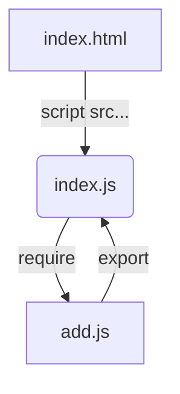

## 认识 webpack
> `Webpack 是一个**模块打包器**`。
  > <u>能够根据模块的依赖关系递归地构建一个依赖关系图（Dephendency Graph）</u>，
    当中包含了应用程序的所有模块，最后打包成一个或多个bundle

## webpack 功能
  Webpack 打包出的静态资源在 HTML 中引用。 
  * Webpack 能将 CSS 和图片等打包到同一个包；
  * Webpack 打包前还能对文件进行预编译；
  * Webpack 可以配置多个入口，将包拆分;
  * Webpack 还能进行热替换。

## [手写 Webpack——实现代码见 git hub](https://github.com/HelenZhangLP/Handwriting-webpack)
### 代码结构
使用 CommonJS 编写代码，组件化编码
```
├── README.md
└── src
    ├── add.js
    ├── index.html
    └── index.js
```



### 模拟 export 模块导出
```JavaScript
// add.js
export.default = function(argument1, argument2) {return argument1 + argument2}
```

### 模拟 require 导入模块
```JavaScript
// index.js
var add = require('add.js').default
add(1,2)
```

## 实现思路解析
1.  index.js 中需要拿到 add.js 代码得到 add function
2.  require 需要返回 add function 或 export 对象，如下伪代码
```JavaScript
// require 方法实现
function require(file) {
    return add
}
```
2-1.  require 通过参数 file 文件名，读取 add.js 的文件信息。方法如下：(以下代码有点矛盾，伪代码，只为方便理解)
```JavaScript
const fs = require('fs')

function require(file) {
  /**
   * content 为字符串
   */
  const content = fs.readFile(file, 'utf-8') 
    return add || export
}

reqiure('add.js')
```
2-2.  eval 运行解析字符串，并且用自运行函数触发 eval 在 require 执行时被调用
```JavaScript
const fs = require('fs')

function require(file) {
  /**
   * content 为字符串
   */
  const content = fs.readFile(file, 'utf-8')
  let exports = {}   // add.js 中 add function 为 export 中的一个属性，所以这里需要定义 export     
  (function(exports, content){
    eval(content)
  })(exports, content)
  
  return exports
}

reqiure('add.js')
```
可以运行以下代码测试：
```JavaScript
function require(file) {
  /**
   * content 为字符串
   */
  const content = "export.default = function(argument1, argument2) {return argument1 + argument2}"
  // add.js 中 add function 为 export 中的一个属性，所以这里需要定义 export  
  let exports = {}   
  (function(exports, content){
    eval(content)
  })(exports, content)

  return exports
}

var add = require('add.js')
add(1,2)
```

### 扩展 —— 递归解决嵌套 require
```JavaScript
(function(list){
    function require(file) {
        var exports = {};
        (function(exports, code) {
            eval(code)
        })(exports, list[file])
        return exports
    }
    require('index.js')
})({
    'index.js': `var add = require('add.js').default; console.log(add(2,3))`,
    'add.js': `exports.default = function(a,b){return a+b}`
})
```

## ES6 modules 改造 CommonJs 实现
### 代码改造
```JavaScript
// add.js
export default (a,b) => a + b
// index.js
import add from 'add.js'
add(2,3)
```

### 环境配置
` npm i @babel/core @babel/preset-env @babel/parser @babel/traverse -D`
* @babel/core 是调用 babel 的 API 进行转码的包
* @babel/preset-env 一个新的 preset，根据配置目标运行环境启用需要的 babel 插件
* babel/parser 解析代码中生成的 AST(Abstract Syntax Tree, AST) 抽象语法树
* @babel/traverse 遍历抽象语法树节点 AST

**以下两个暂不需要安装**
* babel-preset-react 用于转义 react 的 JSX 语法
* babel-loader 执行转义的核心包

### 实现思路[具体代码见 github](https://github.com/HelenZhangLP/Handwriting-webpack/blob/main/webpack.js)

skinparam backgroundColor #000
skinparam state {
  startColor #a6e22e
  endColor #62ab00
  BackgroundColor aliceBlue
  BorderColor lightBlue
}
hide empty description
state "function bundle" as fnBundle

[*] --> getModuleInfo
getModuleInfo --> parseModules
parseModules --> fnBundle
fnBundle: JSON.stringify(parseModules(file))
fnBundle: return...
fnBundle --> output
output --> [*]
output : !fs.existsSync('./dist) && fs.mkdirSync('./dist')
output : fs.writeFileSync('./dist/bundle.js', content)


> node webpack.js
> 验证当前文件生成的 bundle.js
> index.html 引入 `<script src="./bundle.js"></script>`
> 验证输出结果
