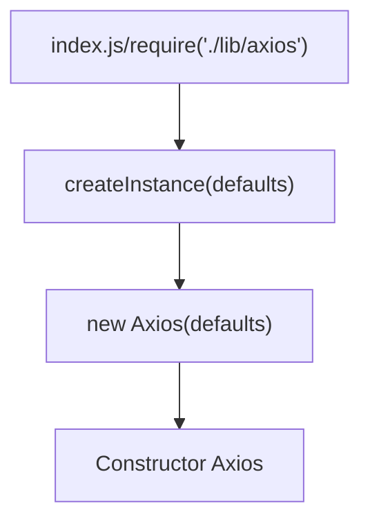

```
├── /dist/                     # 项目输出目录
├── /lib/                      # 项目源码目录
│ ├── /cancel/                 # 定义取消功能
│ ├── /core/                   # 一些核心功能
│ │ ├── Axios.js               # axios的核心主类
│ │ ├── dispatchRequest.js     # 用来调用http请求适配器方法发送请求
│ │ ├── InterceptorManager.js  # 拦截器构造函数
│ │ └── settle.js              # 根据http响应状态，改变Promise的状态
│ ├── /helpers/                # 一些辅助方法
│ ├── /adapters/               # 定义请求的适配器 xhr、http
│ │ ├── http.js                # 实现http适配器
│ │ └── xhr.js                 # 实现xhr适配器
│ ├── axios.js                 # 对外暴露接口
│ ├── defaults.js              # 默认配置
│ └── utils.js                 # 公用工具
├── package.json               # 项目信息
├── index.d.ts                 # 配置TypeScript的声明文件
└── index.js                   # 入口文件
```


