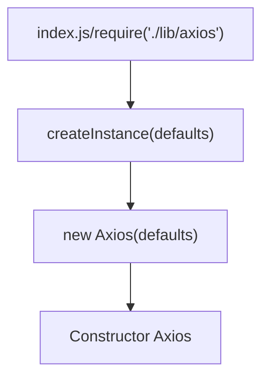

<center>Getting Started(入门)</center>
Promise based HTTP client (基于 Promise 的 HTTP 客户端)，for the browser and node.js.(用于浏览器和 nodeJS)

## What is Axios?
Axios ia a promise-based HTTP Client for node.js and the browser.
Axios 是一个 HTTP Client，用于 node.js 和 浏览器。
it is isomorphic(同构的)（=it can run in the browser and node.js with the same codebase）.
On the server-side it uses the native node.js http module, while on the client it uses XMLHTTPRequests.

## Features
* Make XMLHttpRequests from the browser 从浏览器端发送 XMLHttpRequest 请求
* Make http requests from node.js 从 node.js 端发送 http 请求
* Supports the Promise API 支持 Promise API
* Intercept request and response 拦截请求和响应
* Transform request and response data 转换请求和响应数据
* Cancel requests
* Timeouts
* Query parameters serialization with support for nested(嵌套) entries 支持嵌套的查询参数序列化嵌套条目
* Automatic request body serialization to: 自动将请求体序列化为：
  * json( application/json )
  * Multipart / FormData( multiple/form-data )
  * URL encoded form( application/x-www-form-urlencoded )
* Posting HTML forms as JSON 以 JSON 形式发布 HTML 表单
* Automatic JSON data handling in response 响应时自动处理 JSON 数据
* Progess capturing for browser and node.js with extra info(speed rate, remaining time) 携带额外信息的浏览器和 node.js 的进度捕获。
* Setting bandwidth limits for node.js 设置 node.js 带宽限制。
* Compatible with spec-compliant FormData and Blob (including node.js) 兼容数据规范和 Blob
* Client side support for protecting against XSRF 客户端支持防止XSRF


```
├── /dist/                     # 项目输出目录
├── /lib/                      # 项目源码目录
│ ├── /cancel/                 # 定义取消功能
│ ├── /core/                   # 一些核心功能
│ │ ├── Axios.js               # axios的核心主类
│ │ ├── dispatchRequest.js     # 用来调用http请求适配器方法发送请求
│ │ ├── InterceptorManager.js  # 拦截器构造函数
│ │ └── settle.js              # 根据http响应状态，改变Promise的状态
│ ├── /helpers/                # 一些辅助方法
│ ├── /adapters/               # 定义请求的适配器 xhr、http
│ │ ├── http.js                # 实现http适配器
│ │ └── xhr.js                 # 实现xhr适配器
│ ├── axios.js                 # 对外暴露接口
│ ├── defaults.js              # 默认配置
│ └── utils.js                 # 公用工具
├── package.json               # 项目信息
├── index.d.ts                 # 配置TypeScript的声明文件
└── index.js                   # 入口文件
```


