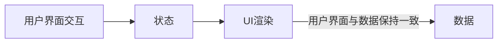

## hexo-filter-sequence
用于画时序图的，使用比较麻烦，[参考1](https://github.com/bubkoo/hexo-filter-sequence)[参考2](https://helenzhanglp.github.io/2019/01/31/hexo-%E5%9D%91/) 如果要画时序图，可以采用下面两种插件替换

## hexo-tag-plantuml
画各种图形，种类多。[使用方法具体参考文档](https://plantuml.com/zh/sequence-diagram)
安装方法，[见 github](https://github.com/two/hexo-tag-plantuml)

## hexo-filter-mermaid-diagrams
可以用来画流程图、时序图等，但文档不全。[安装参考](https://github.com/webappdevelp/hexo-filter-mermaid-diagrams)
使用方法见以下 demo.

<!--more-->

### hexo-filter-mermaid-diagrams 坑

```mermaid
graph TD
Constructor[构造函数&#58;来初始化相关特性&#44;对象特性因对象传参而异&#44;可能包含私有属性]
Prototype(原型上定义共有属性)
style Prototype fill: aliceblue
```

1.   流程图名称写单词时，首字母大宝。如：Constructor

2.   流程图中标点符号使用转义字符
2-1. 流程图中特殊符号可以采用`""`包裹

|名称|转义字符|描述|
|---|-------|---|
|：|\&#58;|冒号(colon)|
|,|\&#44;|逗号(comma)|
