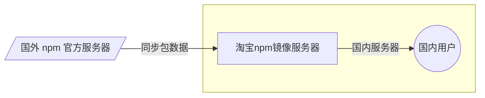

[参考 npmjs 官方文档](https://docs.npmjs.com/cli/v7/configuring-npm/package-json/#private)

```bash
zhangliping@zhangliingdembp ~/Documents/vite  $ npm install # 安装 package.json > dependencies 节点下的所有包
zhangliping@zhangliingdembp ~/Documents/vite  $ npm install moment # 安装指定包 moment
zhangliping@zhangliingdembp ~/Documents/vite  $ npm uninstall moment # 卸载 moment 包，卸载后，package.json > dependencies 节点中移除 moment 记录信息
zhangliping@zhangliingdembp ~/Documents/vite  $ npm install package -g # -g 代表安装全局包
zhangliping@zhangliingdembp ~/Documents/vite  $ npm uninstall package -g # -g 删除全局包
```
> 工具性质的包，提供了好用的终端命令，安装在全局；参考官方说明，决定是否将包安装到全局

### 包结构
一个规范的包结构必须符合以下 3 点要求：
* 包必须以<b><u>单独的目录</u></b>存在；
* 包的顶级目录下必须包含 <b><u>package.json</u></b> 这个包管理配置文件；
* package.json 中必须包含 <b><u>name（包的名称）, version（包的版本）, main（包的入口）</u></b> 这三个属性

```javascript
//package.json
{
  "name": "axios", // 包的名称
  "version": "1.0.0",
  "description": "",
  /* "main": "index.js", 移除，防止意外发布代码 */
  // If you set `private: true` in your package.json, then npm will refuse to publish it.
  // this is a way to prevent accidental publication of private repositories
  "private": true, // 确保安装包是私有的，防止不小心执行了 `npm publish` 发布到 npm 服务器
  "scripts": {
    "test": "echo \"Error: no test specified\" && exit 1"
  },
  "author": "",
  "license": "ISC",
  "dependencies": { // 依赖包
    "webpack": "^5.43.0"
  },
  "devDependencies": {
    "webpack-cli": "^4.7.2"
  },
  "config": {
    "server": 9000, // api 服务器端口号 [0-65525]
    "cros": {
      "open": false,
      "safeList": [] // 基于 CROS 跨域请求，React/Vue 中，一般基于 Proxy 实现跨域
    }
  }
}
```
场景描述：在日常开发中，我们通常需要多人协作开发。举个例子，通常我们整个项目体积为 30M，其中，第三方包的体积是 28M，项目源码也就只有 2M。<div class="custom-box custom-box-933">第三方体积过大，不方便团队成员间共享源码</div><div class="custom-box custom-box-393">解决方法：共享时删除 node_modules</div>，安装到 node_modules 下的包都称为<b>项目包</b>

### dependencies 节点
专门用来记录用户使用 `npm install` 命令安装了哪些包，<span class="custom-box custom-box-933">未安装任意包前，没有该节点</span>，安装到当前节点中的包称为<span class="custom-box custom-box-393">核心依赖包</span>

### devDependencies 节点
仅在项目开发阶段会用到的包，建议使用 `npm i packageName --save-dev` 简写为 `npm i packageName -D` 安装到 devDependencies 节点下
如果某些包在开发环境与生产环境都用得到，则安装到 dependencies 节点下。 安装到当前节点下的包称为<span class="custom-box custom-box-393">开发依赖包</span>

### .gitignore 忽略文件
<div class="custom-box custom-box-933">开发过程中，要将 node_modules 添加到 .gitignore 忽略文件中</div>

###　browserslist [参考文档](https://cli.vuejs.org/zh/guide/browser-compatibility.html#browserslist)
#### browserlist 具体描述 [参考文档](https://github.com/browserslist/browserslist)
```json
"browserslist": [
  "> 1%",
  "last 2 versions"
]
```

### Error
```bash
zhangliping@zhangliingdembp ~/Desktop/node/src/demo5/中文  $ npm init -y
npm ERR! Invalid name: "中文"
```
```bash
zhangliping@zhangliingdembp ~/Desktop/node/src/demo5/中文/leave a blank space  $ npm init -y
Wrote to /Users/zhangliping/Desktop/node/src/demo5/中文/leave a blank space/package.json:

{
  "name": "leave-a-blank-space",
  "version": "1.0.0",
  "description": "",
  "main": "index.js",
  "scripts": {
    "test": "echo \"Error: no test specified\" && exit 1"
  },
  "keywords": [],
  "author": "",
  "license": "ISC"
}
```
> npm init -y 只能在英文目录下运行，Invalid name ‘中文’，中文名称不可以，同时，也不建议使用带有空格的英文名称的目录下运行

### Error 下载包速度慢

#### npm 镜像
> 镜像（Mirroring）一种文件存储形式，一个磁盘上的数据在另一个磁盘上存在相同的副本，即为镜像

淘宝把 npm 官方国外服务器上的包同步到国内的服务器，同时在国内提供下包服务，提高了下包速度


* 每隔一段时间，淘宝服务器自动同步 npm 官方服务器的包数据到国内；
* 淘宝镜像服务器对国内的用户提供下载包

#### 切换 npm 下包源（下包的服务器地址）
```bash
zhangliping@zhangliingdembp ~/Documents/vite  $ npm config get reigstry # 查看当前下包的镜像源
zhangliping@zhangliingdembp ~/Documents/vite  $ npm set registry=https://registry.npm.taobao.org/ # 将下包的镜像源切换为淘宝的镜像源
zhangliping@zhangliingdembp ~/Documents/vite  $ npm config get registry # 查看镜像源是否下载成功
```

