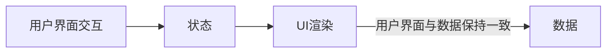

## index.jsx 
vscode 支持 jsx 方法高亮，快捷输入，emmet
```javaScript
// index.jsx
import React from 'react' // React 语法核心库
import ReactDOM from 'react-dom/client' // 构建 HTML(WebApp) 的核心

// 获取模板中 #root 容器，作为 根 容器
const root = ReactDOM.createRoot(document.getElementById('root'))
// 基于 render 方法渲染视图
root.render(
  <div> hello React </div>
)
```

## problem
### react 渲染实体字体 &#247; &#215;
```JavaScript
{key: String.fromCharCode(215), id: 'times'},
```
### react Error(1)
<font color="red">Warning: render(): Rendering components directly into document.body is discouraged, since its children are often manipulated by third-party scripts and browser extensions. This may lead to subtle reconciliation issues. Try rendering into a container element created for your app</font>
> 是在创建ReactDOM.render()时,放置的容器使用了document.body || document.getElementsByTagName('body')[0]等引起的错误，这样写会把第三方其他js给覆盖掉。
**public/index.html 里面加入一个 div, 给出唯一的 id，避免覆盖，webpack 中 htmlWebpackPlugin 中加入这个模板**
<span class='custom-box custom-box-933'>ReactDOM.createRoot() 不能把HTML/BODY 作为根容器，必须额外指定一个盒子</span>

### react Error(2)
<font color="red">Adjacent JSX elements must be wrapped in an enclosing tag. Did you want a JSX fragment <>...</>?</font>
> 每一个构建视图只能有一个根节点，可以使用 React.Fragment 空文档标签 <></>，不增加新的 html 结构

### react Error(3)
<font color="red">Objects are not valid as a React child (found: object with keys {}). If you meant to render a collection of children, use an array instead.</font>
> 表达式不能使用普通对象

### react Error(4) —— 表达式不能使用函数 
<font color="red">Warning: Functions are not valid as a React child. This may happen if you return a Component instead of <Component /> from render. Or maybe you meant to call this function rather than return it</font>
```javaScript
{fn()}
<Fn />
```

### react Error(5) —— 不能修改 props 属性值
<font color="red">Cannot assign to read only property 'title' of object '#<Object>'</font>

```javaScript
// 返回 JSX 视图
function demo1(props) {
    props.title = 'modify props attribute'
    // props.title = 'modify props attribute'
    /**
     * {
            "value": "function component demo",
            "writable": false,
            "enumerable": true,
            "configurable": false
        }
     */
    console.log(Object.getOwnPropertyDescriptor(props, 'title'))
    console.log(Object.isFrozen(props)) // true
    console.log(Object.isExtensible(props)) // false
    console.log(Object.isSealed(props)) // true
    return <>
        <h3>这是一个函数组件</h3>
    </>
}
export default demo1
```
> props.title 不可重写，不能枚举，也不能配置。props 已冻结，已密封，不能扩展
[关于对象属性，参考](/2019/03/21/JavaScript-Object-Oriented/)

## React 列表渲染
### keys
React 中使用 keys 标识列表中元素的删除、添加或移除。React Diff 算法中借助 key 标识同级元素是新增还是移动，避免不必要的渲染。

```JavaScript
  items.map((item, index) => {
    <li key={item.id}>{item.text}</li>
    {/* <li key={index}>{item.text}</li> 没有 id 用索引赋 key */}
  })
```
`注意：`最好不要用索引（index）作 key 值，因为一旦有新增、删除或移动等变化，会导致大量元素失效。进而造成不必要的重新渲染，损耗性能。可以使用 item.id 作为 key 值

### React state
React 中把组件看成一个状态机（state machines）。React 中，constructor 是最先执行，且执行一次。state 在 constructor 构造函数中初始化。其它地方采用 `this.setState()` 更新组件状态。
React 里，通过更新组件 state 重新渲染用户界面，不需要操作 DOM，类组件使用 props 调用基础构造函数。
```JavaScript
import React, {Component} from 'react';

export default class Test extends Component {
  constructor(super) {
    super();
    // 初始化 state
    this.state = {}
  }
}
```


this.setState 之后发生了什么？
调用 setState 函数后，React 将 setState 参数与组件当前状态合并，触发调和过程（Reconciliation）. 经过调和过程，React 会以相对高效的方式构建 React Dom 树，得到 Dom 树后，React 会将新树与老树进行对比，找出差异节点，从而根据差异最小化渲染。

重新构造 dom ，并将新老状态进行对比，最小化渲染。

### React 生命周期渲染
```mermaid
graph TM;
  componentWillMount-->render;
  render-->componentDidMount;
  componentDidMount-->render
```
