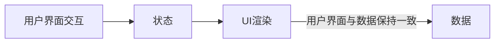

### React 列表渲染

#### keys
React 中使用 keys 标识列表中元素的删除、添加或移除。React Diff 算法中借助 key 标识同级元素是新增还是移动，避免不必要的渲染。

```Javascript
  items.map((item, index) => {
    <li key={item.id}>{item.text}</li>
    {/* <li key={index}>{item.text}</li> 没有 id 用索引赋 key */}
  })
```
`注意：`最好不要用索引（index）作 key 值，因为一旦有新增、删除或移动等变化，会导致大量元素失效。进而造成不必要的重新渲染，损耗性能。可以使用 item.id 作为 key 值

### React state
React 中把组件看成一个状态机（state machines）。React 中，constructor 是最先执行，且执行一次。state 在 constructor 构造函数中初始化。其它地方采用 `this.setState()` 更新组件状态。
React 里，通过更新组件 state 重新渲染用户界面，不需要操作 DOM，类组件使用 props 调用基础构造函数。
```Javascript
import React, {Component} from 'react';

export default class Test extends Component {
  constructor(super) {
    super();
    // 初始化 state
    this.state = {}
  }
}
```

this.setState 之后发生了什么？
调用 setState 函数后，React 将 setState 参数与组件当前状态合并，触发调和过程（Reconciliation）. 经过调和过程，React 会以相对高效的方式构建 React Dom 树，得到 Dom 树后，React 会将新树与老树进行对比，找出差异节点，从而根据差异最小化渲染。

重新构造 dom ，并将新老状态进行对比，最小化渲染。

### React 生命周期渲染
```mermaid
graph TM;
  componentWillMount-->render;
  render-->componentDidMount;
  componentDidMount-->render
```
