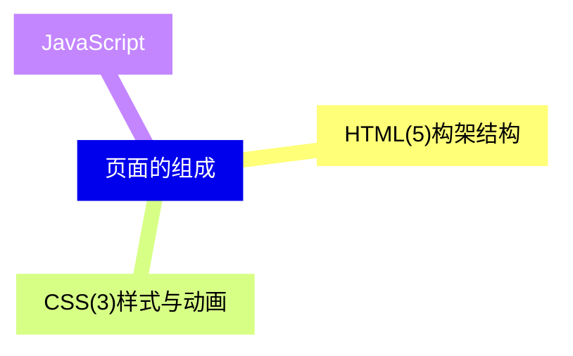
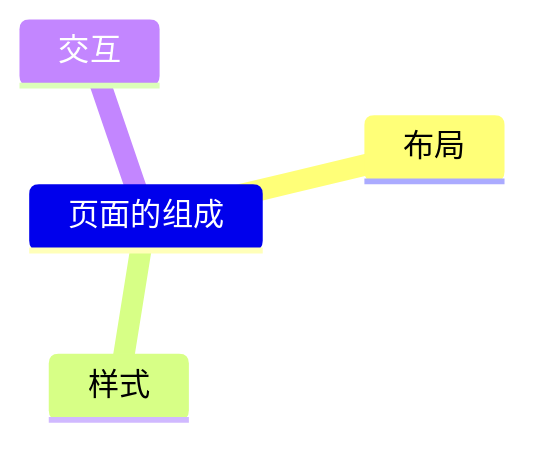
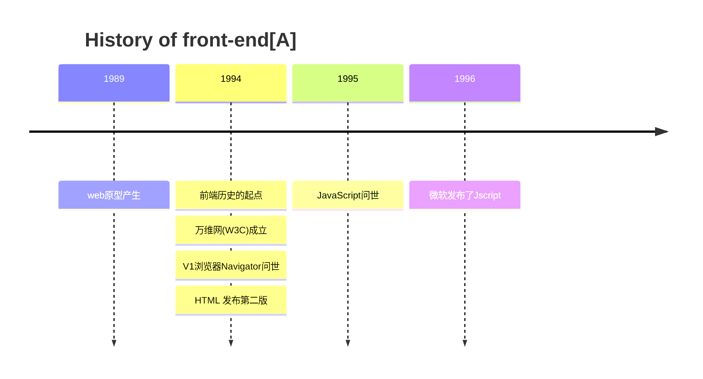
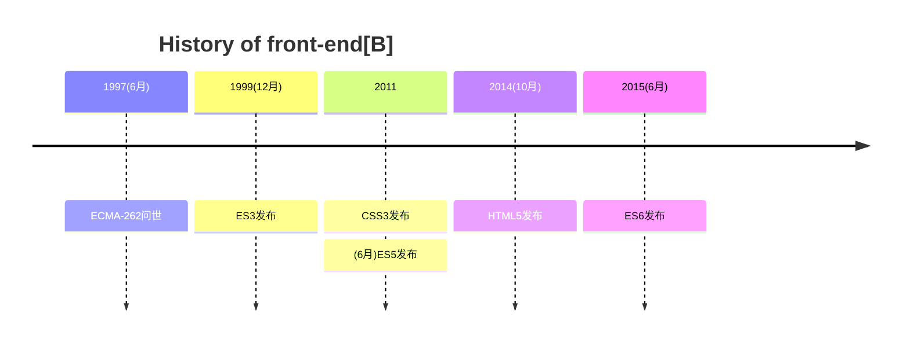

# 页面的组成

* 1989 年Tim Berners-lee 提出个人计算机访问大量科研文献，建议在文档中链接其它文档，自此 web 原型
* 1995 年网景公司程序员 Brendan Eich 花了10天设计出了 JavaScript 语言。

* ECMA(European Computer Manufactures Association : 欧州计算机制造联合会)在 1997年6月以 JavaScript语言为基础制定了ECMAScript标准规范 ECMA-262，浏览器厂商按此标准开发自己的浏览器。