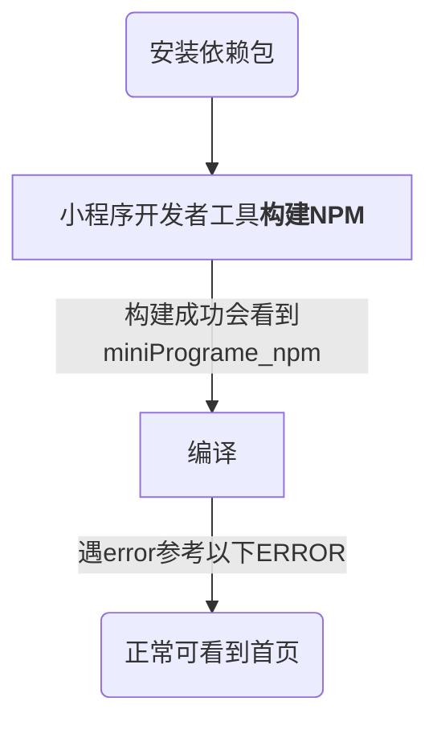
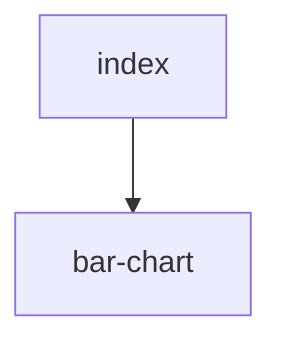

## vant 小程序环境搭建
1.  `git clone` clone 代码到本地
2.  `npm i` 安装 @vant/weapp 依赖包
3.  小程序开发者工具导入项目生成 `project.config.json`;
4.  小程序开发者工具 -> 工具 -> `npm 构建`

### 流程图


### ERROR
### <font color="#f33">[ app.json 文件内容错误] app.json: ["usingComponents"]["van-icon"]: "@vant/weapp/icon/index" 未找到(env: Windows,mp,1.05.2107090; lib: 2.18.0)</font>

> npm install 安装 vant
> 微信开发者工具导入项目，会新增 `project.config.json` 文件
> 微信开发者工具 -> 详情 -> 本地设置 —> "勾选 将 JS 编译成 ES5/ 勾选 使用 npm 模块"


### <font color="#f33">VM254:5 app.js错误:
TypeError: Cannot read property 'develop' of undefined</font>

> 确认是否是当前小程序的开发者，叵不是联系管理员在管理后台添加
> 查看开发者工具中详情 -> 配置 -> AppId 是否与`project.config.json` 中的 appId 一致</br>
> <font color="#f99">即： 开发者工具 appId 与 project.config.json appId 一致 + 你本人是当前小程序的开发者</font>

## <font color="#f33">小程传参注意事项</font>
```html
<popup showGY></popup>
/*
 * 如上，传参默认为 true
 * 正确传参如下
 */
<popup showGY="{{showGY}}"></popup>
```

## input + text 扩展热区包含 text 部分
> 将 text 部分内容提出文档流（position: absolute）

## <font color="#f33">安卓端 wx.redirectTo() 跳转后，当前页面 wx.redirectTo() 之后的代码还会继续执行</font>
```javascript
// 处理不同渠道的业务逻辑
this.resolve26711(source, res, res1);

// 处理不同 type 类型的业务逻辑
this.resolveForType(res, type);
}

resolve26711() { 
  ...
  wx.redirectTo(...);
}

resolveForType() {
  wx.redirectTo(...)
}
```

## <font color="#f33">小程序连接开发本地服务器调试</font>
> 解决方式： 开发工具 -> 本地设置 —> 不勾选 “不校验合法域名、web-view(业务域名)、TLS 版本以及 HTTPS 证书”

## <font color="#f33">因 **tip : input 组件是一个原生组件，字体是系统字体，所以无法设置 font-family** 导致，input 字体样式，不同于表单 picker 的样式，</font>
> 解决方式：表单字体样式设置为 font-family: UICTFontTextStyleBody

## <font color="#f33">wx.chooseImg，真机上是返回前缀为wxfile://的文件路径，图片无法再次读取</font>
> 解决方式，图片读取时，取图片服务器存储的图片地址

## <font color="#f33">微信发事件是在 wx.navigateTo 的成功回调中添加，如下</font>
```wxmljs
wx.navigateTo({
    url:
      "/pages/addRecord/addRecord?index=" +
      this.data.index +
      "&isBloodSugarPage=true",
    success(res) {
      res.eventChannel.emit("dataFromList", {
        data: e.detail.item,
        list: _this.data.lists[_this.data.index],
      });
    },
})

/**
 * onLoad 中，监听获取
 */
onLoad: function () {
  const eventChannel = this.getOpenerEventChannel();
  eventChannel.on("dataFromList", (data) => {...})
}
```
> 如果通过发射事件，可以采用 wx.setStorageSync 存入缓存处理，但缓存记得删除哦

### <font color="#f33">[ app.json file content error] app.json: ["tabBar"]["list"] must contain at least 2 items(env: Windows,mp,1.05.2109222; lib: 2.10.4)</font>
> 使用自定义的 tabbar 时，内部 app.json 中的 tabbar 不能为空，至少包含两项，list 中 item 要与自定义的 item 一一对应，目的是为了 点击后 switchTo 指定页面

### <font color="#f33">ios端，弹层事件冒泡至下层页面</font>
> `catch` 事件阻止冒泡，`bind` 事件允许冒泡
```weapp-wxml
<view catchtachmove="return"></view>
```

## 小程序调试
### wx.getRealtimeLogManager() 获取实时日志管理对象
> 返回 RealtimeLogManager 对象
日志可以上传至运维后台，可从小程序管理后台“开发->运维中心->实时日志”进入小程序端日志查询页面，或从“小程序插件->实时日志”进入插件端日志查询页面，进而查看开发者打印的日志信息


## 小程序画柱状图

> 使用选择器选择组件实例节点，返回匹配到的第一个组件实例对象（会被 `wx://component-export` 影响）
> this.selectComponent

## Vant Weapp 1.3.3 与 Vant Weapp 1.7.1

[comment]: <> (## 业务流)

[comment]: <> (```mermaid)

[comment]: <> (graph TD)

[comment]: <> (start&#40;admin<b>小程序码管理</b>&#41; -->|下载不同渠首的二维码| step1[admin<b>批量个人码管理</b>])

[comment]: <> (step1 --> step1wechat[小程序扫码])

[comment]: <> (```)

[comment]: <> (### 注意事项)

[comment]: <> (1.  管理平台下载二维时注意区分不同渠道，下载或生成相应渠道的二维码)

[comment]: <> (2.  目前有三个不同的 appId，不同的环境采用不同的 appId，注意区分当前测试的二维码与测试的 appId 对应（具体见：ssc-patient-fe/env.js）)

[comment]: <> (3.  不同环境 sceneId 不同，具体使用哪个 sceneId，@杨化现 确认。注：目前开发环境的是 scene=BHWS000000mQxciPJv)

[comment]: <> (4.  目前开发进入小程序的入口是通过扫码进入，小程序编译模式需要设置 1047 场景)

[comment]: <> (## ssc-patient-fe 代理梳理)

[comment]: <> (### onLoad 参数 options 为小程序开发者工具中的编译配置或页面跳转参数)
