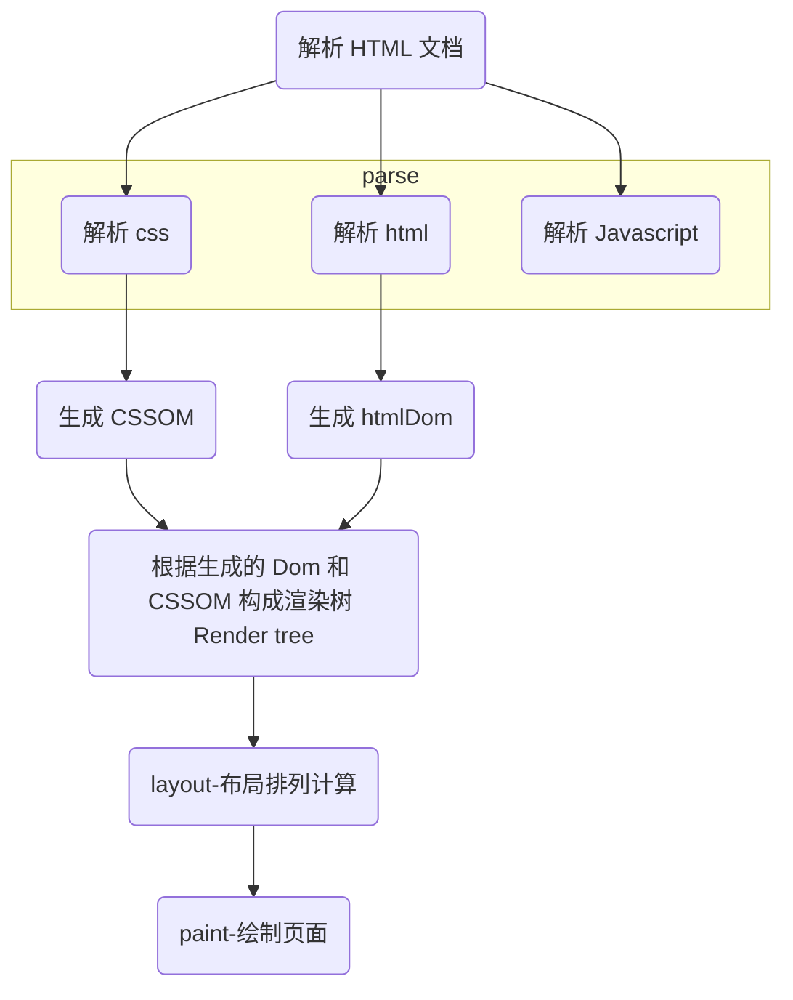

## 浏览器渲染过程

即：html 文档，浏览器解析为 CSSOM + HtmlDom，再由 CSSOM + HtmlDom 构建 renderTree, 浏览器再根据渲染树重新计算、布局，最后渲染到屏幕上。

### 重排
> 浏览器第一次页面渲染后，后续操作引起页面各个元素节点在页面所处位置的重新计算、重新布局的行为叫重排
### 重绘
> 布局计算完成后，页面重新绘制，浏览器遍历渲染树，使用 UI 后端层绘制每个节点，这种行为要重绘

### 引起重排或重绘的一些属性
|Attribute Name	|Interetation																								|
|--				|---																										|
|offsetTop		|read-only,当前元素的上边框相对于`offsetParent`元素内上边框的距离											|
|offsetLeft		|read-only,当前元素左边框相对于`offsetParent`元素内左边框的距离												|
|offsetWidth	|read-only,返回当前元素的布局宽度。paddingleft + paddingRight + borderLeftWidth + borderRightWidth + width	|
|offsetHieght	|read-only,返回当前元素的布局高度。paddingTop + paddingBottom + borderTopWidth + borderBottomWidth + height	|
|scrollTop		|获取或设置元素的内容垂直滚动的像素数																		|
|scrollLeft		|获取或设置元素内容水平滚动的像素数据																		|
|scrollWidth	|read-only,元素内容宽度的一种度量，包括因 overflow 溢出而不可见内容											|
|scrollHeight	|read-only,元素内容的高度的一种度量，包括因 overflow 溢出而不可见内容										|
|clientTop		|read-only, 返回当前元素上边框高度																			|
|clientLeft		|read-only, 返回当前元素左边框的宽度																		|
|clientWidth	|read-only,内联元素返回0；paddingLeft + width - scrollbarWidth + paddingRight								|
|clientHeight	|read-only,内联元素返回0；paddingTop + height - scrollbarHeight + paddingBottom								|

